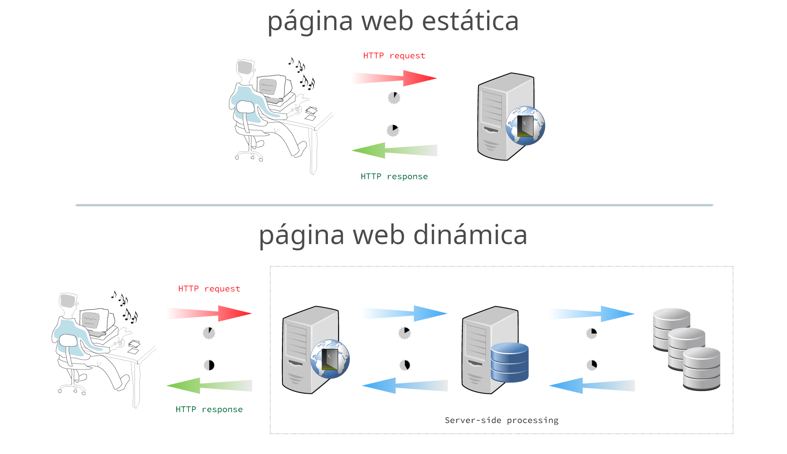

# 1.2. Client/Servidor
Uno o varios clientes acceden a un servidor. 

Las nuevas arquitecturas sustituyen el servidor por un balanceador de carga de manera que N servidores dan respuesta a M clientes.

<figure><figcaption style="font-size: 13px; color: #bd8f04;">Modelo Cliente-Servidor</figcaption></figure>

En las aplicaciones web, el cliente es el navegador web.

El cliente hace la petición (*request* normalmente mediante el protocolo *GET* mediante el puerto *80*/*443*) y el servidor responde (*response*).

## 2.1. Página web dinámica
Si la página web únicamente contiene HTML + CSS se considera una página estática. Para generar una página dinámica, donde el contenido cambia, a día de hoy tenemos dos alternativas:

​	a) Utilizar un lenguaje de servidor que genere el contenido, ya sea mediante el acceso a una BD o servicios externos.

​	b) Utilizar servicios *REST* de terceros invocados desde *JS*.

<figure><figcaption style="font-size: 13px; color: #bd8f04;">Diferencia gráfica entre página estática y página dinámica</figcaption></figure>

Las tecnologías empleadas (y los perfiles de desarrollo asociados) para la generación de páginas dinámicas son:

<table>
<tr>
	<th>perfil</th>
	<th>herramienta</th>
    <th>tecnología</th>
</tr>
<tr>
	<td><b>Front-end </b>/ cliente</td>
	<td>Navegador Web</td>
	<td>HTML + CSS + JavaScript /td>
</tr>
<tr>
	<td><b>Back-end </b>/ servidor</b></td>
	<td>Servidor Web + BBDD</td>
    <td>PHP, Python, Ruby, Java / JSP, .Net / .asp</td>
</tr>    
</table>

!!!info "Perfil full-stack"
 	En las ofertas de trabajo, cuando hacen referencia a un *Full-stack developer*, están buscando un perfil que domina tanto el *front-end* como el *back-end*.

## 2.2. Single Page Application
A día de hoy gran parte del desarrollo web está transitando de una arquitectura web cliente-servidor clásica, donde el cliente realiza una llamada al *backend*, por una **arquitectura SPA** (arquitectura de una sola página) donde el cliente gana mucho mayor peso y sigue una programación reactiva que accede a servicios remotos *REST* que realizan las operaciones (comunicándose mediante *JSON*).

<figure><figcaption style="font-size: 13px; color: #bd8f04;">Diferencia entre ciclo de vida tradicional de una página y el ciclo de vida de la arquitectura SPA</figcaption></figure>

