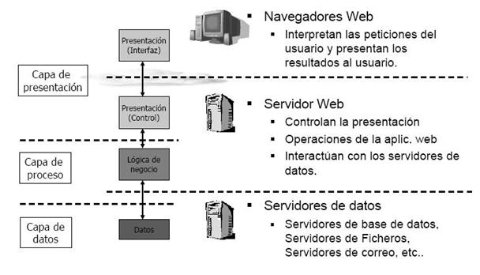

# 1.3. Arquitectura de 3 capes

Hay que distinguir entre capas físicas (*tier*) y capas lógicas (*layer*).

##  3.1. Tier

Capa física (*tiers*) de una arquitectura. Supone un nuevo elemento hardware separado físicamente. Las capas físicas más alejadas del cliente están más protegidas, tanto por *firewalls* como por *VPN*.

Ejemplo de arquitectura en tres capas físicas (*3 tier*):

- Servidor Web
- Servidor de Aplicaciones
- Servidor de base de datos

<figure><figcaption style="font-size: 13px; color: #bd8f04;">Capas físicas (tiers)</figcaption></figure>

!!!note "Clúster en *tiers*"
 	No confundir las capas con la cantidad de servidores. Actualmente se trabaja con arquitecturas con múltiples servidores en una misma capa física mediante un clúster, para ofrecer tolerancia a errores y escalabilidad horizontal.

## 3.2. Layer

En cambio, las capas lógicas (*layers*) organizan el código respecto a su funcionalidad:

- Presentación
- Negocio / Aplicación / Proceso
- Datos / Persistencia

Como se observa, cada una de las capas se puede implementar con diferentes lenguajes de programación y/o herramientas.

<figure><figcaption style="font-size: 13px; color: #bd8f04;">Capas lógicas (layers)</figcaption></figure>

