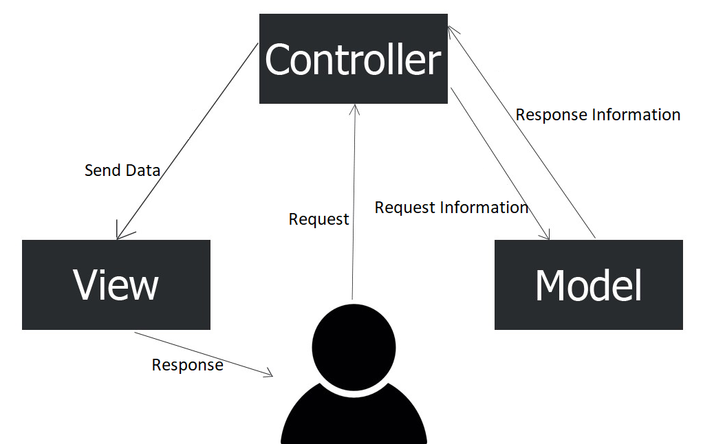

# 1.4. MVC

**Model-View-Controller** o Modelo-Vista-Controlador es un modelo de arquitectura que separa los datos y la lógica de negocio respecto a la interfaz de usuario y el componente encargado de gestionar los eventos y las comunicaciones.

Al separar los componentes en elementos conceptuales permite reutilizar el código y mejorar su organización y mantenimiento. Sus elementos son:

- **Modelo**: representa la información y gestiona todos los accesos a ésta, tanto consultas como actualizaciones provenientes, normalmente, de una base de datos. Se accede vía el *controlador*.
- **Vista**: Presenta al usuario de forma visual el *modelo* y los datos preparados por el *controlador*. El usuario interactúa con la vista y realiza nuevas peticiones al *controlador*.
- **Controlador**: Responde a las acciones del usuario, y realiza peticiones al *modelo* para solicitar información. Tras recibir la respuesta del *modelo*, le envía los datos a la *vista*.

<figure><figcaption style="font-size: 13px; color: #bd8f04;">Modelo-Vista-Controlador (MVC)</figcaption></figure>

