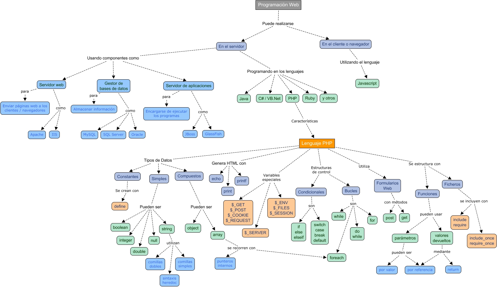

# 1.6. Ferramentes

Software que recibe peticiones HTTP (*GET*, *POST*, *DELETE*, ...). Devuelve el recurso solicitado (*HTML*, *CSS*, *JS*, *JSON*, imágenes, etc...)

El producto más implantando es *Apache Web Server* ([https://httpd.apache.org](https://httpd.apache.org/){:target="_blank"}), creado en 1995.

- Software libre y multiplataforma.
- Sistema de módulos dinámicos → *PHP*, *Python*, *Perl*.
- Utiliza el archivo `.htaccess` para su configuración.

En la actualidad, *Apache* está perdiendo mercado respecto a ***Nginx*** ([https://www.nginx.com](https://www.nginx.com/){:target="_blank"}). Se trata de un producto más moderno (2004) y que en determinados escenarios tiene mejor rendimiento que *Apache*.

En este enlace podemos observar una comparativa de servidores web: [https://w3techs.com/technologies/history_overview/web_server/ms/q](https://w3techs.com/technologies/history_overview/web_server/ms/q){:target="_blank"}.

##  2. Servidor de Aplicaciones

Software que ofrece servicios adicionales a los de un servidor web:

- *Clustering*.
- Balanceo de carga.
- Tolerancia a fallos.

***Tomcat*** ([http://tomcat.apache.org/](http://tomcat.apache.org/){:target="_blank"}) es el servidor de aplicaciones *open source* y multiplataforma de referencia para una arquitectura *Java*. Contiene un contenedor Web Java que interpreta *Servlets* y *JSP*.

!!!info "Estudio de servidores web y servidores de aplicaciones"
 	Tanto los servidores web como los servidores de aplicaciones los estudiaremos en profundidad en el módulo de "*Despliegue de Aplicaciones Web*".

## 3. Lenguajes en el servidor

Las aplicaciones que generan las páginas web se programan en alguno de los siguientes lenguajes:

- *PHP*
- *JavaEE*: *Servlets* / *JSP*
- *Python*
- *ASP.NET* → *Visual Basic .NET* / *C#*
- *Ruby*
- ...

#### JavaEE

*Java Enterprise Edition* es la solución Java para el desarrollo de aplicaciones enterprise. Ofrece una arquitectura muy completa y compleja, escalable y tolerante a fallos. Planteada para aplicaciones en grandes sistemas.

<figure><figcaption style="font-size: 13px; color: #bd8f04;">Capas del lenguaje Java Enterprise Edition.</figcaption></figure>

#### PHP

- Lenguaje de propósito general diseñado para el desarrollo de páginas web dinámicas.
- En un principio, lenguaje no tipado.
- Actualmente se encuentra en la versión 8; se recomienda al menos utilizar una versión superior a la 7.0.
- Código embebido en el HTML.
- Instrucciones entre etiquetas **`<?php`**  y  **`?>`**  ; para generar código dentro de *PHP*, podemos usar la instrucción **`echo`**.
- Multitud de librerías y *frameworks* (***Laravel***, *Symfony*, *Codeigniter*, *Zend*, ...).

Su documentación es bastante completa:   [https://www.php.net/manual/es/index.php](https://www.php.net/manual/es/index.php){:target="_blank"}.

<figure><figcaption style="font-size: 13px; color: #bd8f04;">Mapa mental de resumen de elementos del lenguaje PHP.</figcaption></figure>

Durante las siguientes unidades vamos a estudiar *PHP* en profundidad.
