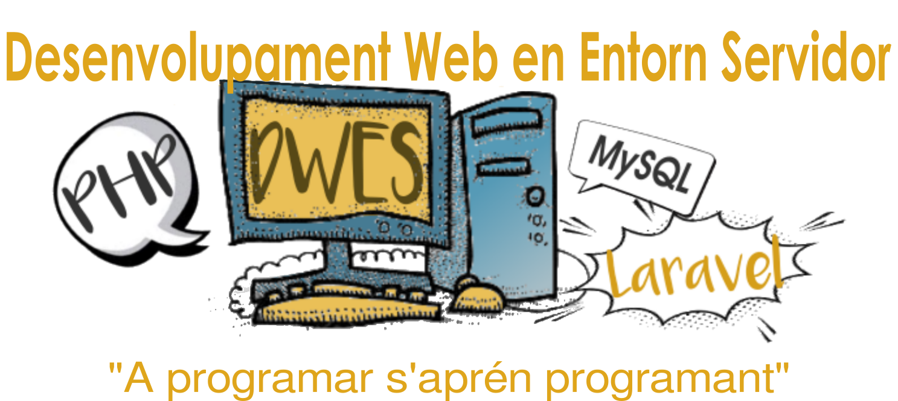

# Inicio

<table>
<tr>
	<th colspan="3"><h2 style="font-weight: 500;">Índice de unidades temáticas</h2></th>
</tr>
<tr>
	<th>bloque</th>
	<th colspan=2>unidad temática</th>
</tr>
<tr>
	<td rowspan=5>bloque I PHP</td>
	<td>UT 01</td>
	<td>Arquitectura Web</td>
</tr>
<tr>
	<td>UT 02</td>
	<td>Lenguaje PHP</td>
</tr>    
<tr>
	<td>UT 03</td>
	<td>PHP Orientado a Objetos</td>
</tr>  
<tr>
	<td>UT 04</td>
	<td>Programación Web</td>
</tr>  
<tr>
	<td>UT 05</td>
	<td>Acceso a base de datos</td>
</tr>     
<tr>
	<td rowspan=7>bloque II Laravel</td>
	<td>UT 06</td>
	<td>Herramientas Web</td>
</tr>
<tr>
	<td>UT 07</td>
	<td>Framework Laravel</td>
</tr>    
<tr>
	<td>UT 08</td>
	<td>Laravel: controladores</td>
</tr>  
<tr>
	<td>UT 09</td>
	<td>Laravel: modelo de datos</td>
</tr>  
<tr>
	<td>UT 10</td>
	<td>Laravel: formularios y validaciones</td>
</tr>   
<tr>
	<td>UT 11</td>
	<td>Laravel: servicios REST</td>
</tr>  
<tr>
	<td>UT 12</td>
	<td>Laravel: autenticación de usuarios</td>
</tr>   
</table>

!!!cc "Licencia"
	{ align=left width=150 height=150}Uso de estos materiales sujeto a una licencia Creative Commons CC [BY-NC-SA](https://creativecommons.org/licenses/by-nc-sa/4.0/deed.es){:target="blank"}. Derivado a partir de materiales: 
	&nbsp;&nbsp;&nbsp;&nbsp;- [Curso Desarrollo Web en Entorno Servido, de Aitor Medrano y Luis Alemañ](https://aitor-medrano.github.io/dwes2122/index.html){:target="blank"}. 
	&nbsp;&nbsp;&nbsp;&nbsp;- [Curso de Laravel, de Nacho Iborra](https://nachoiborraies.github.io/laravel){:target="blank"}.

