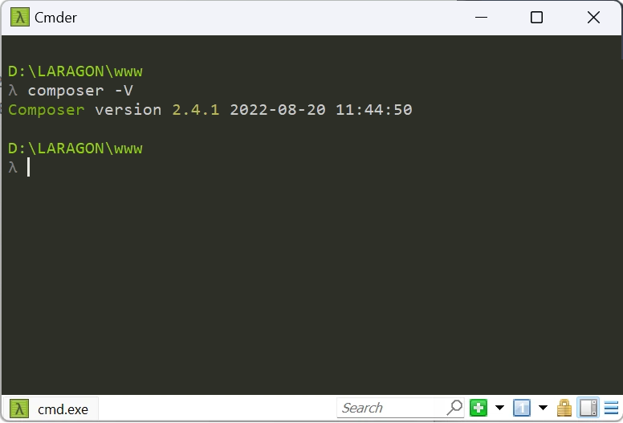
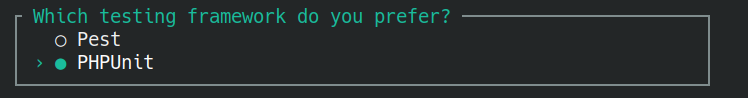

## ==Proyecto Gestión de Compras y Productos==

Este proyecto consiste en desarrollar una aplicación web con *Laravel* que permita gestionar **roles**, **usuarios**, **productos** y **compras**. La aplicación permitirá que los usuarios se registren, inicien sesión, visualicen productos disponibles, realicen compras y consulten su historial de pedidos. Se implementarán relaciones entre las entidades para gestionar la información de manera eficiente.

### Objetivos

1. Implementar un sistema de autenticación de usuarios con Laravel.
2. Crear y administrar productos con información relevante como nombre, descripción, precio y stock.
3. Permitir que los usuarios realicen compras, agregando productos al carrito y confirmando la compra.
4. Implementar una relación muchos a muchos entre compras y productos mediante una tabla intermedia.
5. Gestionar los datos de las compras realizadas por los usuarios.


### Entrega

El proyecto debe estar alojado en un repositorio de GitHub o GitLab, con instrucciones claras para su instalación y ejecución en un archivo `README.md`.


### Aspectos Técnicos

- **Framework:** Laravel (versión 9 o superior).
- **Base de datos:** MySQL o PostgreSQL.
- **Autenticación:** Laravel Breeze o Laravel Jetstream.
- **Interfaz:** Blade Templates o Vue.js para la parte frontend.
- **Control de versiones:** GitHub/GitLab.

Para el *framework*, tendremos instalado *Laravel* (cuando se crea esta actividad es la versión 11) a partir de *Composer*.

Para la gestión de *base de datos*, tendremos instalado *XAMPP*, docker o (como será en el que se sigue toda la explicación de la actividad) **Laragon**.


### 1º. Crear proyecto

Para la realización del proyecto seguiremos estos pasos:

| paso |                                                             |
| ---- | ----------------------------------------------------------- |
| 1º   | Crear el proyecto laravel **`gestories`**                   |
| 2º   | Crear modelos                                               |
| 3º   | Crear migragaciones                                         |
| 4º   | Crear factories                                             |
| 5º   | Crear seeders                                               |
| 6º   | Ejecutar *migrate* (**`php artisan migrate:fresh --seed`**) |
| 7º   | Crear controladores                                         |
| 8º   | Crear rutas                                                 |

Lo primero será crear nuestro proyecto laravel de nombre **gestories**.

???note "En clase se instalará desde Laragon"
	Desde de su Terminal
	
	{width=450 height=450}
	
	{width=450 height=450}

```bash
laravel new gestories
```

1º. Instalaremos **Laravel Breeze**

{width=450 height=450}

2º. Instalación del paquete: **Blade with Apline**

{width=450 height=450}

3º. Soporte a modo oscuro: **No**

{width=450 height=450}

4º. Test unitario: **PHPUnit**

{width=450 height=450}

5º. Inicializar un repositorio git en el proyecto: **Sí**

{width=450 height=450}

Instalación ...

{width=450 height=450}

6º. Base de datos del proyecto: **MySQL**


{width=450 height=450}

7º. Ejecutar las migraciones de la base de datos: **Sí**

{width=450 height=450}

8º. Crear conexión mysql a la base de datos (*gestories*): **Sí**

{width=450 height=450}

Instalación ...

{width=450 height=450}

9º. **Instalación completada**. Nos indica que, para lanzar el proyecto en desarrollo, debemos acceder a la carpeta del proyecto (cd gestories) y después lanzar **`php artisan serve`**. 

{width=450 height=450}

<hr>
### Base de datos

#### Explicación del Modelo

- **Usuarios**: Almacena la información de los usuarios que realizan compras.
- **Productos**: Contiene los productos disponibles para la venta.
- **Compras**: Registra las transacciones de compra realizadas por los usuarios.
- **Detalle_Compra**: Permite registrar los productos específicos que se incluyen en cada compra, junto con la cantidad y el precio unitario.

#### Entidades y Atributos

- **Roles** (*roles*)

&nbsp;&nbsp;&nbsp;&nbsp;&nbsp;&nbsp;&nbsp;&nbsp; - `id` (PK): Identificador único del rol.

&nbsp;&nbsp;&nbsp;&nbsp;&nbsp;&nbsp;&nbsp;&nbsp; - `description`: Descripción del rol.

- **Usuarios** (*users*)

&nbsp;&nbsp;&nbsp;&nbsp;&nbsp;&nbsp;&nbsp;&nbsp; - `id` (PK): Identificador único del usuario

&nbsp;&nbsp;&nbsp;&nbsp;&nbsp;&nbsp;&nbsp;&nbsp; - `name`: Nombre del usuario.

&nbsp;&nbsp;&nbsp;&nbsp;&nbsp;&nbsp;&nbsp;&nbsp; - `email`: Correo electrónico del usuario.

&nbsp;&nbsp;&nbsp;&nbsp;&nbsp;&nbsp;&nbsp;&nbsp; - `role_id` (FK): Identificador del rol del usuario.

&nbsp;&nbsp;&nbsp;&nbsp;&nbsp;&nbsp;&nbsp;&nbsp; - `password`: Contraseña del usuario.

&nbsp;&nbsp;&nbsp;&nbsp;&nbsp;&nbsp;&nbsp;&nbsp; - `address`: Dirección del usuario.

&nbsp;&nbsp;&nbsp;&nbsp;&nbsp;&nbsp;&nbsp;&nbsp; - `telephone`: Número de teléfono del usuario.

- **Productos** (*products*)

&nbsp;&nbsp;&nbsp;&nbsp;&nbsp;&nbsp;&nbsp;&nbsp; - `id` (PK): Identificador único del producto.

&nbsp;&nbsp;&nbsp;&nbsp;&nbsp;&nbsp;&nbsp;&nbsp; - `name`: Nombre del producto.

&nbsp;&nbsp;&nbsp;&nbsp;&nbsp;&nbsp;&nbsp;&nbsp; - `description`: Descripción del producto.

&nbsp;&nbsp;&nbsp;&nbsp;&nbsp;&nbsp;&nbsp;&nbsp; - `price`: Precio del producto.


&nbsp;&nbsp;&nbsp;&nbsp;&nbsp;&nbsp;&nbsp;&nbsp; - `stock`: Cantidad disponible en inventario.

- **Compras** (*shoppings*)

&nbsp;&nbsp;&nbsp;&nbsp;&nbsp;&nbsp;&nbsp;&nbsp; - `id` (PK): Identificador único de la compra.

&nbsp;&nbsp;&nbsp;&nbsp;&nbsp;&nbsp;&nbsp;&nbsp; - `user_id` (FK): Identificador del usuario que realiza la compra.

&nbsp;&nbsp;&nbsp;&nbsp;&nbsp;&nbsp;&nbsp;&nbsp; - `date`: Fecha en que se realizó la compra.

&nbsp;&nbsp;&nbsp;&nbsp;&nbsp;&nbsp;&nbsp;&nbsp; - `total`: Monto total de la compra.

- **Detalle_Compra** (Tabla intermedia para la relación muchos a muchos entre Compras y Productos *details*)

&nbsp;&nbsp;&nbsp;&nbsp;&nbsp;&nbsp;&nbsp;&nbsp; - `id` (PK): Identificador único del detalle.

&nbsp;&nbsp;&nbsp;&nbsp;&nbsp;&nbsp;&nbsp;&nbsp; - `shopping_id` (FK): Identificador de la compra.

&nbsp;&nbsp;&nbsp;&nbsp;&nbsp;&nbsp;&nbsp;&nbsp; - `product_id` (FK): Identificador del producto comprado.

&nbsp;&nbsp;&nbsp;&nbsp;&nbsp;&nbsp;&nbsp;&nbsp; - `amount`: Cantidad del producto comprado.

&nbsp;&nbsp;&nbsp;&nbsp;&nbsp;&nbsp;&nbsp;&nbsp; - `unitprice`: Precio unitario del producto al momento de la compra.

### Relaciones

- **users → shoppings**

&nbsp;&nbsp;&nbsp;&nbsp;&nbsp;&nbsp;&nbsp;&nbsp; - Un usuario puede realizar muchas compras.

&nbsp;&nbsp;&nbsp;&nbsp;&nbsp;&nbsp;&nbsp;&nbsp; - Una compra pertenece a un único usuario.

&nbsp;&nbsp;&nbsp;&nbsp;&nbsp;&nbsp;&nbsp;&nbsp; - Relación: **1 a N** (uno a muchos).

- **shoppings → products**

&nbsp;&nbsp;&nbsp;&nbsp;&nbsp;&nbsp;&nbsp;&nbsp; - Una compra puede incluir muchos productos.

&nbsp;&nbsp;&nbsp;&nbsp;&nbsp;&nbsp;&nbsp;&nbsp; - Un producto puede estar en muchas compras.

&nbsp;&nbsp;&nbsp;&nbsp;&nbsp;&nbsp;&nbsp;&nbsp; - Relación: **N a M** (muchos a muchos), resuelta con la tabla intermedia **Detalle_Compra**.

#### **Diagrama Entidad-Relación (Descripción)**


<hr>

## 2º. Crear modelos completos

Crea los modelos de las tablas: `roles`, `products`,  `shoppings` y `details` con todos los parámetros (`--all`)

````bash
php artisan make:model Role --all
````
````bash
php artisan make:model Product --all
````
````bash
php artisan make:model Shopping --all
````
````bash
php artisan make:model Detail --all
````

!!!note "Trabajar en carpeta `app/Models`"
	- Trabajar en carpeta `app/Models`
	- Los modelos, recuerda, como las clases, en *upperCamelCase* y singular.


### modelo Role

````php
class Role extends Model
{
  use HasFactory;

  protected $fillable = ['description',];
}
````


### modelo User

Añadir en la variable **`$fillable`** los campos `address` y `telephone`:
```php


//...
protected $fillable = [
    'name',
    'email',
    'password',
    'address',
    'telephone',
];
public function shoppings()
{
    return $this->hasMany(Shopping::class);
}
```


### modelo Product

````php
class Product extends Model
{
  use HasFactory;

  protected $fillable = ['name', 'price', 'description', 'stock',];
}
````


### modelo Shopping

````php
class Shopping extends Model
{
  use HasFactory;

  protected $fillable = ['user_id', 'total', 'date',];
    
  public function user()
    {
        return $this->belongsTo(User::class);
    }
  public function details()
    {
        return $this->hasMany(Detail::class);
    }
}
````

### modelo Detail

```php
class Detail extends Model
{
    use HasFactory;

    protected $fillable = ['shopping_id', 'product_id', 'amount', 'unitprice'];

    public $timestamps = false; // Deshabilitar timestamps

    public function shopping()
    {
        return $this->belongsTo(Shopping::class);
    }

    public function product()
    {
        return $this->belongsTo(Product::class);
    }
}
```

<hr>

## 3º. Migraciones

### Eliminar migraciones existentes

Desde nuestro proyecto (en *Visual Studio Code*), acceder a **`database/migrations`** y eliminar estos dos ficheros de migraciones que no vamos a usar:

- ~~**`0001_01_01_000002_create_jobs_table.php`**~~

- ~~**`0001_01_01_000001_create_cache_table.php`**~~

### Modificar la migración de la tabla `users`

1. Renombrar el fichero de ~~`0001_01_01_000000_create_users_table.php`~~   a  **`0001_01_01_000001_create_users_table.php`**.

2. Modificar el esquema de creación de la tabla `users` para introducir nuevos campos:

   ```bash
       Schema::create('users', function (Blueprint $table) {
           $table->id();
           $table->string('name');
           $table->string('email')->unique();
           $table->timestamp('email_verified_at')->nullable();
           $table->string('password');
           $table->rememberToken();
           $table->timestamps();
       });
   ```

   por

   ```bash
       Schema::create('users', function (Blueprint $table) {
           $table->id(); // PK
           $table->string('name');
           $table->string('email')->unique();
           $table->timestamp('email_verified_at')->nullable();
           $table->string('password');
           $table->foreignId('role_id')->nullable()->constrained('roles')->onDelete('set null');
           $table->string('address')->nullable();
           $table->string('telephone')->nullable();
           $table->rememberToken();
           $table->timestamps(); // created_at y updated_at
       });
   ```
   


### Migración tabla `roles`

1. Renombrar el archivo generado **`xxxx_xx_xx_xxxxxx_create_roles_table.php`**  por **`0001_01_01_000000_create_roles_table.php`** (para así en el `fresh` de `migrate` se ejecute antes que el fichero de la tabla `users`).

3. Definir la estructura de la tabla `roles` en dicho fichero **`0001_01_01_000000_create_roles_table.php`** :

   ```php
   use Illuminate\Database\Migrations\Migration;
   use Illuminate\Database\Schema\Blueprint;
   use Illuminate\Support\Facades\Schema;
   
   class CreateRolesTable extends Migration
   {
       public function up()
       {
           Schema::create('roles', function (Blueprint $table) {
               $table->id(); // PK
               $table->enum('description',['administrador', 'cliente', 'invitado'])->unique();
               $table->timestamps();
           });
       }
   
       public function down()
       {
           Schema::dropIfExists('roles');
       }
   }
   ```

   

### Migración tabla `products`

1. Definir la estructura de la tabla `roles` en dicho fichero **`xxxx_xx_xx_xxxxxx_create_products_table.php`** :


```php
use Illuminate\Database\Migrations\Migration;
use Illuminate\Database\Schema\Blueprint;
use Illuminate\Support\Facades\Schema;

class CreateProductsTable extends Migration
{
    public function up()
    {
        Schema::create('products', function (Blueprint $table) {
            $table->id(); // PK
            $table->string('name');
            $table->text('description')->nullable();
            $table->decimal('price', 8, 2); // Precio con 8 dígitos y 2 decimales
            $table->integer('stock')->default(0);
            $table->timestamps();
        });
    }

    public function down()
    {
        Schema::dropIfExists('products');
    }
}
```

### Migración tabla `shoppings`

1. Definir la estructura de la tabla `roles` en dicho fichero **`xxxx_xx_xx_xxxxxx_create_compras_table.php`** :

   ```php
   use Illuminate\Database\Migrations\Migration;
   use Illuminate\Database\Schema\Blueprint;
   use Illuminate\Support\Facades\Schema;
   
   class CreateComprasTable extends Migration
   {
       public function up()
       {
           Schema::create('shoppings', function (Blueprint $table) {
               $table->id(); // PK
               $table->foreignId('user_id')->constrained('users'); // FK a usuarios
               $table->dateTime('date');
               $table->decimal('total', 8, 2); // Total de la compra
               $table->timestamps();
           });
       }
   
       public function down()
       {
           Schema::dropIfExists('shoppings');
       }
   
   }
   ```


### Migración tabla details

1. Definir la estructura de la tabla `roles` en dicho fichero **`xxxx_xx_xx_xxxxxx_create_details_table.php`** :

   ```php
   use Illuminate\Database\Migrations\Migration;
   use Illuminate\Database\Schema\Blueprint;
   use Illuminate\Support\Facades\Schema;
   
   class CreateDetalleCompraTable extends Migration
   {
       public function up()
       {
           Schema::create('details', function (Blueprint $table) {
               $table->id(); // PK
               $table->foreignId('shopping_id')->constrained('shoppings'); // FK a compras
               $table->foreignId('product_id')->constrained('products'); // FK a productos
               $table->integer('amount');
               $table->decimal('unitprice', 8, 2); // Precio unitario al momento de la compra
               $table->timestamps();
           });
       }
   
       public function down()
       {
           Schema::dropIfExists('details');
       }
   
   }
   ```


<hr>

## 4º. Crear factories

Para introducir **seeders con factories y Faker** en las tablas `users` , `products` y `shoppings`en el proyecto *gestories* sigue estos pasos:

### Configurar las **Factories** con `Faker`

Abre los archivos generados en **`database/factories`** y configúralos con datos ficticios.

### RoleFactory

El *factory* del modelo `Role` no vamos a modificarlo; pues la información la introducimos directamente en  su *seeder*`RoleSeeder`.

### **UserFactory**

Abre `database/factories/UserFactory.php` y reemplázalo con lo siguiente:

```bash
use App\Models\User;
use Illuminate\Database\Eloquent\Factories\Factory;
use Illuminate\Support\Str;

class UserFactory extends Factory
{
    public function definition()
    {
        return [
            'name' => $this->faker->name(),
            'email' => $this->faker->unique()->safeEmail(),
            'email_verified_at' => now(),
            'password' => bcrypt('password'), // Contraseña genérica
            'address' => $this->faker->address(),
            'telephone' => $this->faker->phoneNumber(),
            'role_id' => rand(1, 3), // Asignar rol aleatorio
            'remember_token' => Str::random(10),
        ];
    }
}
```


### **ProductFactory**

Abre **`database/factories/ProductFactory.php`** y reemplázalo con lo siguiente:

```php
use App\Models\Product;
use Illuminate\Database\Eloquent\Factories\Factory;

class ProductFactory extends Factory
{
    protected $model = Product::class;

    public function definition()
    {
        return [
            'name' => $this->faker->word(),
            'description' => $this->faker->sentence(),
            'price' => $this->faker->randomFloat(2, 1, 100), // Precio entre 1 y 100
            'stock' => $this->faker->numberBetween(1, 100), // Stock entre 1 y 100
        ];
    }
}
```


### ShoppingFactory

```php
use App\Models\Shopping;
use Illuminate\Database\Eloquent\Factories\Factory;

class ShoppingFactory extends Factory
{
    protected $model = Shopping::class;

    public function definition()
    {
        return [
            'user_id' => \App\Models\User::all()->random()->id,
            'date' => $this->faker->dateTimeThisYear(),
            'total' => $this->faker->randomFloat(2, 10, 500),
        ];
    }
}
```


## 5º. Crear seeders

Abre los archivos en `database/seeders` y modifica cada uno.

### RoleSeeder

Abre **`database/seeders/RoleSeeder.php`** y añade dentro del método `run`:

```php
    // ...
	use Illuminate\Support\Facades\DB;
	//...

	public function run(): void
    {
        DB::table('roles')->insert([
            ['description' => 'administrador', 'created_at' => now(), 'updated_at' => now()],
            ['description' => 'cliente', 'created_at' => now(), 'updated_at' => now()],
            ['description' => 'invitado', 'created_at' => now(), 'updated_at' => now()],
        ]);
    }
```

### **UserSeeder**

Abre **`database/seeders/UserSeeder.php`**  (si no está creado:  **`php artisan make:seeder UserSeeder`**) y reemplázalo con:

```php
namespace Database\Seeders;

use Illuminate\Database\Seeder;
use App\Models\User;

class UserSeeder extends Seeder
{
    public function run()
    {
        User::factory(count: 20)->create(); // Crea 20 usuarios
    }
}
```


### **ProductSeeder**

Abre **`database/seeders/ProductSeeder.php`** y reemplázalo con:

```php
use Illuminate\Database\Seeder;
use App\Models\Product;

class ProductSeeder extends Seeder
{
    public function run()
    {
        Product::factory(35)->create(); // Crea 35 productos
    }
}
```


### DetailSeeder

````php
use Illuminate\Database\Seeder;
use App\Models\Detail;
use App\Models\Shopping;
use App\Models\Product;

class DetailSeeder extends Seeder
{
    public function run()
    {
        $shoppings = Shopping::all();
        $products = Product::all();

        foreach ($shoppings as $shopping) {
            $selectedProducts = $products->random(rand(1, 5)); // Seleccionar entre 1 y 5 productos

            foreach ($selectedProducts as $product) {
                Detail::create([
                    'shopping_id' => $shopping->id,
                    'product_id' => $product->id,
                    'amount' => rand(1, 3),
                    'unitprice' => $product->price,
                ]);
            }
        }
    }
}
````

## 6º. Ejecutar migraciones

1. En el archivo **`DatabaseSeeder.php`**, dentro de `database/seeders`, asegúrate de llamar a los *seeders*:

   ```php
   use Illuminate\Database\Seeder;
   
   class DatabaseSeeder extends Seeder
   {
       public function run()
       {
           $this->call([
           	RoleSeeder::class,
               UserSeeder::class,
               ProductSeeder::class,
               ShoppingSeeder::class,
               DetailSeeder::class,
           ]);
       }
   }
   ```

   

2. Ahora, ejecuta los seeders con:

!!!note "borrar tablas, vistas y datos de la bd"
	Si queremos eliminar todos los datos de la bd antes de la migración:
	```bash
	php artisan db:wipe
	```

```bash
php artisan migrate:fresh --seed
```

<hr>

## 7º. Controladores

### UserController

```php
// UserController.php
namespace App\Http\Controllers;
use App\Models\User;
use Illuminate\Http\Request;

class UserController extends Controller {
    public function index() { 
        return response()->json(User::all()); 
    }
    
    public function show(User $user) { 
        return response()->json($user); 
    }
    
    public function store(Request $request) { 
        return response()->json(User::create($request->all())); 
    }
    
    public function update(Request $request, User $user) { 
        $user->update($request->all()); return response()->json($user); 
    }
    
    public function destroy(User $user) {
        $user->delete(); 
        return response()->json(['message' => 'Usuario eliminado']); 
    }
}
```


### ProductController

```php
// ProductController.php
namespace App\Http\Controllers;
use App\Models\Product;
use Illuminate\Http\Request;

class ProductController extends Controller {
    public function index() { 
        return response()->json(Product::all()); 
    }
    
    public function show(Product $product) { 
        return response()->json($product); 
    }
    
    public function store(Request $request) { 
        return response()->json(Product::create($request->all())); 
    }
    
    public function update(Request $request, Product $product) { 
        $product->update($request->all()); 
        return response()->json($product); 
    }
    
    public function destroy(Product $product) { 
        $product->delete(); 
        return response()->json(['message' => 'Producto eliminado']); 
    }
}
```


### DetailController

```php
// DetailController.php
namespace App\Http\Controllers;
use App\Models\Detail;
use Illuminate\Http\Request;

class DetailController extends Controller {
    public function index() { 
        return response()->json(Detail::all()); 
    }
    
    public function show(Detail $detail) { 
        return response()->json($detail); 
    }
    
    public function store(Request $request) { 
        return response()->json(Detail::create($request->all())); 
    }
    
    public function update(Request $request, Detail $detail) { 
        $detail->update($request->all()); 
        return response()->json($detail); 
    }
    
    public function destroy(Detail $detail) { 
        $detail->delete(); 
        return response()->json(['message' => 'Detalle eliminado']); 
    }
}
```


### ShoppingController

```php
// ShoppingController.php
namespace App\Http\Controllers;
use App\Models\Shopping;
use Illuminate\Http\Request;

class ShoppingController extends Controller {
    public function index() { 
        return response()->json(Shopping::all()); 
    }
    
    public function show(Shopping $shopping) { 
        return response()->json($shopping); 
    }
    
    public function store(Request $request) { 
        return response()->json(Shopping::create($request->all())); 
    }
    
    public function update(Request $request, Shopping $shopping) { 
        $shopping->update($request->all()); 
        return response()->json($shopping); 
    }
    
    public function destroy(Shopping $shopping) { 
        $shopping->delete(); 
        return response()->json(['message' => 'Compra eliminada']); 
    }
}

```


<hr>

## 8º. Rutas

```php
<?php

// web.php - Definir rutas para Users, Products, Details y Shoppings
use App\Http\Controllers\UserController;
use App\Http\Controllers\ProductController;
use App\Http\Controllers\DetailController;
use App\Http\Controllers\ShoppingController;
use Illuminate\Support\Facades\Route;

Route::resource('users', UserController::class);
Route::resource('products', ProductController::class);
Route::resource('details', DetailController::class);
Route::resource('shoppings', ShoppingController::class)
```

