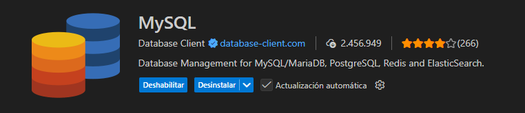

# 2. Controladores y Rutas

## Objetivo de la actividad

<p style="float: left; margin: 0 1rem 1rem 0;">
  
</p>

Implementarás **rutas** y un **controlador** que devuelvan listados ordenados y filtrados, y mostrarás los datos en una **vista Blade** mediante una tabla HTML con columnas homogéneas.

<br/><br/>

Al finalizar, serás capaz de:

* Definir rutas que invocan métodos de un controlador.
* Devolver listados ordenados por diferentes criterios.
* Aplicar filtros sobre consultas de Eloquent.
* Presentar los datos en una vista con una tabla HTML clara y consistente.

---

## Requisitos previos

1) Crea un proyecto laravel de nombre, por ejemplo, **testear**.

???+examplelaravel "Crear proyecto"
    ```
    composer crearte-project laravel/laravel testear
    ```

2) **Base de datos**: acceso a la base `testear`.

???+examplelaravel "Modificar archivo `.env`"
    En la raíz del proyecto, encontramos el fichero de configuración `.env`:
    ```
    DB_CONNECTION=mysql
    DB_HOST=127.0.0.1
    DB_PORT=3307
    DB_DATABASE=testear
    DB_USERNAME=root
    DB_PASSWORD=
    ```

3) **Tabla `employees`** creada mediante migraciones con la siguiente estructura:

| Campo | Tipo | Restricciones |
| --- | --- | --- |
| `id` |  | Clave primaria, no autoincremental, no nulo |
| `firstname` | `string(100)` | No nulo |
| `lastname` | `string(100)` | No nulo |
| `birth_date` | `date` | No nulo |
| `hire_date` | `date` | No nulo |
| `salary` | `decimal(8,2)` | Puede ser nulo |
| `created_at` | `timestamp` | Automático |
| `updated_at` | `timestamp` | Automático |

???+examplelaravel "Crear migración"
    
    ```
    php artisan make:migration create_employees_table
    ```
    Ahora, en la ruta `database/migrations` encontraremos un fichero tal que así **`xxxx_xx_xx_xxxxxx_create_employees_table`**:
    ```
    Schema::create('employees', function (Blueprint $table) {
        $table->id();
        $table->string('firstname', 100);
        $table->string('lastname', 100);
        $table->date('birth_date');
        $table->date('hire_date');
        $table->decimal('salary',10,2)->nullable();
        $table->timestamps();
    });
    ```

    <div class="figure-center">
    <figure>
        
        <figcaption class="figure-caption-small">
            crear migración employees
        </figcaption>
    </figure>
    </div>

    ```
    php artisan migrate
    ```

    <div class="figure-center">
    <figure>
        
        <figcaption class="figure-caption-small">
            ejecutar todas las migraciones
        </figcaption>
    </figure>
    </div>

4) **Modelo `Employee`** configurado y operativo (tabla, clave primaria, tipos y **asignación masiva** coherentes con la estructura anterior).

???+examplelaravel "Crear modelo"
    ```
    php artisan make:model Employee
    ```

5) **Datos de prueba**:
   Carga de datos de prueba: importa el anexo SQL.

!!!tip "Importar datos de prueba"
    Lo más rápido es utilizar alguna extensión para vsCode como "SQLTools" o "**MySQL**" para conectarte a la base de datos y ejecutar el script SQL que se proporciona al final de esta actividad.
    


!!!tip "Datos de prueba"
    En los recursos de esta actividad hay un fichero [`employees.sql`](../sources/employees.sql){:target="blank"} con 100 empleados ficticios para importar en la tabla `employees`.

---

## Instrucciones paso a paso

### 1. Crear el controlador `EmployeeController`

6) Crea un controlador para centralizar la lógica de consulta de empleados. Dentro de él implementarás, como mínimo, los métodos que devuelvan colecciones de empleados según los criterios indicados más abajo. Cada método debe:

???+examplelaravel "Crear controlador"
    ```
    php artisan make:controller EmployeeController
    ```

* Obtener los empleados aplicando el **criterio de ordenación o filtrado** correspondiente.
* Enviar el resultado a una **vista Blade** común (ver punto 3) mediante una variable llamada exactamente `employees`.

Métodos a implementar:

- **Listado por ID ascendente** (nombre **`byId`**): devuelve todos los empleados ordenados por `emp_id` de menor a mayor.
- **Listado por apellidos y nombre** (nombre **`byLastName`**): devuelve todos los empleados ordenados por `lastname` (ascendente) y, en caso de empate, por `firstname` (ascendente).
- **Subconjunto por letra inicial de apellido** (nombre **`lastNameStartsWith`**): devuelve solo los empleados cuyo `emp_lastname` **empiece por una letra** (si no se pasa ninguna letra, el sistema asume la letra “*A*” por defecto), ordenados por `lastname` y `emp_firstname` (ascendente).
- **Subconjunto por año de nacimiento** (nombre **`bornIn`**): devuelve solo los empleados **nacidos en un año** (si no se pasa ningún año, el sistema asume "*1980*” por defecto), ordenados por `lastname` y `firstname` (ascendente).

Todos los métodos devolverán la misma vista (ver punto 3) y **no** deben repetir lógica de presentación en el controlador.

???+examplelaravel "Métodos del controlador `EmployeeController`"
    ```php
    <?php
    
    namespace App\Http\Controllers;
    
    use Illuminate\Http\Request;
    use App\Models\Employee;
    
    class EmployeeController extends Controller
    {
        public function byId(){
            $employees = Employee::orderBy('id', 'asc')->get();
            return view('employees.index', compact('employees'));
        }

        public function byLastName(){
            $employees = Employee::orderBy('emp_lastname', 'asc')
                                 ->orderBy('emp_firstname','asc')
                                 ->get();

            return view('employees.index', compact('employees'));
        }

        public function lastNameStartsWith(string $letter='B'){
            $employees = Employee::where('emp_lastname', 'LIKE', "$letter%")
                                 ->orderBy('emp_lastname', 'asc')
                                 ->orderBy('emp_firstname','asc')
                                 ->get();

            return view('employees.index', compact('employees'));
        }
    
        public function bornIn(string $year='1980'){
            $employees = Employee::where('emp_birth_date','like', "$year%")
                                 ->orderBy('emp_lastname', 'asc')
                                 ->orderBy('emp_firstname','asc')
                                 ->get();
            
            return view('employees.index', compact('employees'));
         }    
    }
    ```

---

### 2. Definir las rutas

7) Declara rutas **GET** que apunten a los métodos anteriores. Usa exactamente estas URL para homogeneizar correcciones:

| Ruta | Método del controlador | Descripción |
| --- | --- | --- |
| `/employees/by-id` | `byId` | Listado ordenado por `emp_id` ascendente. |
| `/employees/by-lastname` | `byLastName` | Listado ordenado por apellidos y nombre. |
| `/employees/filter-letter` | `lastNameStartsWith` | Subconjunto: apellidos que empiezan por “A”. |
| `/employees/filter-year` | `bornIn` | Subconjunto: nacidos en el año 1990. |

> Requisitos de las rutas:
> 
> * Todas deben retornar **la misma vista** con la variable `employees`.
> * Usa **nombres de ruta** coherentes para cada una (por ejemplo, `employees.byId`, `employees.byLastName`, `employees.starts`, `employees.born`).

???+examplelaravel "Rutas"
    Las rutas se encuentran en la carpeta `routes`, fichero `web.php`:
    ```php
    <?php
    // ...    
    use App\Http\Controllers\EmployeeController;
    
    // ...
    Route::get('employees/by-id', [EmployeeController::class,'byId'])->name('employees.byId');
    Route::get('employees/by-lastname', [EmployeeController::class,'byLastName'])->name('employees.byLastName');
    Route::get('employees/filter-letter/{letter?}', [EmployeeController::class,'lastNameStartsWith'])->name('employees.starts');
    Route::get('employees/filter-year/{year?}', [EmployeeController::class,'bornIn'])->name('employees.born');
    ```
---

### 3. Crear la vista `employees/index.blade.php`

8) Crea una vista única para los cuatro casos. Esta vista debe:

1. Mostrar un **título** claro del listado.
2. Si no hay registros en `employees`, mostrar un **mensaje**: “No hay empleados que cumplan el criterio.”
3. En caso contrario, presentar una **tabla HTML** con las siguientes columnas y en este orden exacto:

| Columna mostrada | Procede del campo |
| --- | --- |
| **ID** | `emp_id` |
| **Apellidos** | `emp_lastname` |
| **Nombre** | `emp_firstname` |
| **Edad** | calculada a partir de `emp_birth_date` |
| **Fecha de contratación** | `emp_hire_date` formateada en `YYYY-MM-DD` |

9) Mostrar, sobre la tabla o como “caption”, el **total de registros** del listado.

???+examplelaravel "Vista `resources/views/employees/index.blade.php`"
    ```php
    @extends('layouts.app')

    @section('title', 'listar empleados')
 
    @section('content')
      <h1>LISTADO DE EMPLEADOS</h1>

      {{-- No hago un @forelse para no sacar primero sí o sí la cabecera de la tabla --}}
      @if ($employees->isEmpty())
         <p class="no-results">No hay empleados que cumplan el criterio.</p>
      @else
         <table border=1>
               <caption>Total de empleados: {{ $employees->count() }}</caption>
               <thead>
                  <tr>
                     <th>id</th>
                     <th>apellidos</th>
                     <th>nombre</th>
                     <th>fecha nacimiento</th>
                     <th>edad</th>
                     <th>fecha de contratación</th>
                  </tr>
               </thead>
               <tbody>
                  @foreach ($employees as $item)
                     @php
                           // utilizamos la librería Carbon para utilizar métodos de fechas
                           // como age() o format()
                           $birthDate = \Carbon\Carbon::parse($item->birth_date);
                           $hireDate  = \Carbon\Carbon::parse($item->hire_date);
                     @endphp
                     <tr>
                           <td>{{ $item->id }}</td>
                           <td>{{ $item->lastname }}</td>
                           <td>{{ $item->firstname }}</td>
                           <td>{{ $birthDate->format('d-m-Y') }}</td>                        
                           <td>{{ $birthDate->age }}</td>
                           <td>{{ $hireDate->format('d-m-Y') }}</td>
                     </tr>
                  @endforeach
               </tbody>
         </table>
      @endif
    @endsection
    ```


> Notas de presentación:
> 
> * La **Edad** debe calcularse a partir de la fecha de nacimiento. Puedes calcularla en el controlador o en la vista, pero debe mostrarse como número entero de años.
> * La **Fecha de contratación** debe mostrarse en formato `YYYY-MM-DD`.
> * Usa una **tabla legible**: cabecera con títulos, filas con celdas alineadas, y un estilo simple pero claro. No es necesario usar CSS avanzado.

---

## Comprobaciones

Verifica manualmente que:

1. **/employees/by-id**
   Muestra todos los registros ordenados por ID ascendente y las 5 columnas requeridas.
2. **/employees/by-lastname**
   Muestra todos los registros ordenados por apellidos y, en empates, por nombre. Se ven las 5 columnas.
3. **/employees/filter-letter**
   Muestra solo apellidos que empiezan por **A**. Ordenación por apellidos y nombre.
4. **/employees/filter-year**
   Muestra únicamente los empleados nacidos en **1990**. Ordenación por apellidos y nombre.
5. En todos los casos:
   
    - Se muestra el **total** de registros listados.
    - Si no hay coincidencias, aparece el **mensaje** de “No hay empleados que cumplan el criterio.”

---

???praclaravel "Práctica a entregar"
    
    <p style="float: left; margin-left: 1rem;">
        
    </p>
    
    1. **Capturas de pantalla** de cada ruta funcionando:
              
         - `/employees/by-id`
         - `/employees/by-lastname`
         - `/employees/filter-letter`
         - `/employees/filter-year`
   
    2. **Listado de rutas** definido (solo nombres y URIs, sin código fuente).
    3. **Descripción breve** de cómo calculas la **Edad** y cómo **formateas** la **Fecha de contratación** (dos o tres líneas).
    4. **Evidencia de datos cargados**: captura del total de filas o vista parcial de la tabla `employees` en tu gestor de BD.

