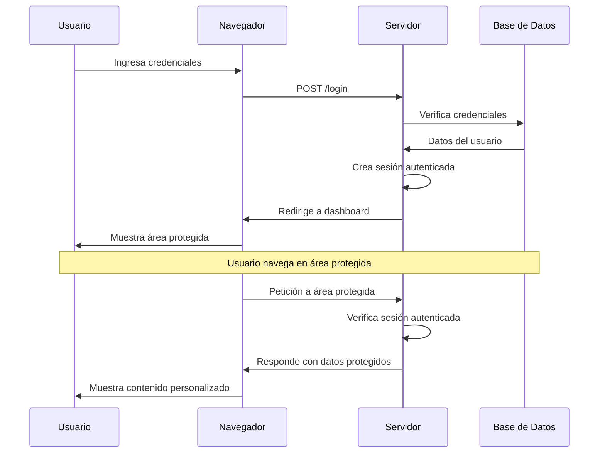

#  6. Autenticación Básica

La autenticación es el proceso de verificar la identidad de un usuario, confirmando que es quien dice ser. En aplicaciones web, esto típicamente involucra un sistema de login y logout que permite a los usuarios acceder a áreas protegidas y mantener su sesión activa. Laravel proporciona un sistema de autenticación robusto y flexible con **Laravel Breeze**.

???warning "¿Se puede combinar el starter kit *Breeze* y `php artisan install:api`?"

    - **No** se deben combinar “a ciegas”.
    - **Sí** pueden usarse en el mismo proyecto solo si sabes qué aporta cada uno**, pero **no ejecutando ambos comandos.

    ---

    **¿Por qué no conviene ejecutarlos juntos?**

    Porque **ambos**:

    - Instalan **Laravel Sanctum**
    - Crean **rutas y lógica de autenticación**
    - Configuran **middleware de auth**

    Ejecutar los dos provoca:

    - Rutas duplicadas
    - Confusión entre auth por **cookies** vs **tokens**
    - Problemas didácticos para el alumnado

    ---

    **Qué es cada cosa (clave para entenderlo)**

    | Herramienta | Qué es | Para qué sirve |
    |-------------|------|----------------|
    | **Breeze** | Starter kit | Genera autenticación completa |
    | **`install:api`** | Scaffolding ligero | Configura Sanctum + API mínima |
    | **Sanctum** | Sistema de auth | Tokens o SPA (cookies) |

    📌 **Breeze YA incluye Sanctum**  
    📌 `install:api` está pensado para proyectos **sin starter kit**

    ---

    **Opción recomendada**

    Usar solo Breeze en modo API

    ```bash
    composer require laravel/breeze --dev
    php artisan breeze:install api
    php artisan migrate
    ```

    Te instala:

    - Sanctum
    - Rutas /api/login, /api/register
    - Controladores API
    - Sin vistas Blade
    - Perfecto para Postman / Vue / React

    ❌ NO ejecutes después:
    ```bash
    php artisan install:api
    ```


## 1. Fundamentos de la autenticación

### 1.1. ¿Qué es la autenticación?

La autenticación es el proceso de verificar la identidad de un usuario mediante credenciales como nombre de usuario y contraseña. Es diferente de la **autorización**, que determina qué acciones puede realizar un usuario autenticado.


### 1.2. Autenticación vs autorización

| Concepto | Descripción | Ejemplo |
| --- | --- | --- |
| **Autenticación** | Verificar "quién eres" | Login con email y contraseña |
| **Autorización** | Determinar "qué puedes hacer" | Acceso a panel de administración |

URLs de interés:

- [Autenticación: Laravel Sanctum (tokens simples o SPA auth)](https://laravel.com/docs/12.x/sanctum?utm_source=chatgpt.com){:target="_blank"}
- [Autorización: Policies + Gates (lo trae Laravel de serie)](https://laravel.com/docs/12.x/authorization?utm_source=chatgpt.com){:target="_blank"}


**Ejemplo práctico:**

```php
<?php
// Autenticación: ¿Quién eres?
if (Auth::attempt(['email' => $email, 'password' => $password])) {
    // Usuario autenticado exitosamente
    
    // autorización: ¿Puedes hacer esto?
    if (Auth::user()->isAdmin()) {
        // Puede acceder al panel de administración
    }
}
```

**En resumen:**

* Primero te **autentican** (demuestras quién eres).
* Después te **autorizan** (verifican qué puedes hacer).

### 1.3. Flujo de autenticación




## 2. Preparar proyecto (OPCIONAL)

> Si tenemos ya el proyecto creado de los puntos anteriores, por ejemplo el proyecto que hemos seguido de nombre `testear` para probar nuestra *api*, NO hará falta realizar este **punto 2**.

#### Creación del proyecto Laravel (base)

Se crea un proyecto Laravel base, sin instalar ningún starter kit (ni Breeze ni Jetstream). Vamos a nombrarlo, por ejemplo, `testapi`:

```bash
composer create-project laravel/laravel testapi
cd testapi
```

En este punto se dispone de:

- Laravel base
- sistema de usuarios (`users`)
- hashing de contraseñas
- estructura estándar del framework


#### Preparación del proyecto como API: `install:api`

Ejecutamos el comando:

```bash
php artisan install:api
```

##### ¿Qué hace este comando?

- Prepara Laravel para funcionar como **API REST**
- Refuerza el uso de respuestas JSON
- Configura middleware y estructura orientada a API
- Instala y configura **Laravel Sanctum**

##### ¿Qué NO hace?

- No crea vistas
- No crea formularios
- No crea endpoints de login
- No crea tokens automáticamente

> `install:api` prepara la infraestructura,  
> pero **la lógica de autenticación se implementa manualmente**.


#### Verificación de Sanctum

Tras ejecutar `install:api`, se debe comprobar que Sanctum está disponible:

- Existe el archivo `config/sanctum.php`
- Existe la tabla `personal_access_tokens`

Si fuera necesario:

```bash
php artisan vendor:publish --provider="Laravel\Sanctum\SanctumServiceProvider"
php artisan migrate
```

> A partir de aquí podremos realizar una instalación para:  
> 
> - punto 3. Autenticación en una API REST con Laravel  
> - punto 4. Autenticación de una API Laravel desde Vue

## 3. Autenticación en una API REST con Laravel  

Este apartado desarrolla un sistema completo de **autenticación en una API REST** utilizando **Laravel Sanctum** y **tokens Bearer**, partiendo de una instalación preparada mediante el comando `php artisan install:api`.

El objetivo es disponer de una **API pura**, sin vistas Blade, sin sesiones y sin cookies, fácilmente testeable con **Rest Client**, y preparada para ser consumida posteriormente por un frontend como **Vue**.


### 3.2. Preparación del modelo `User` para tokens

Para poder generar *tokens Bearer*, el modelo `User` debe usar el trait **`HasApiTokens`**.

Archivo: **`app/Models/User.php`**

```php hl_lines="5"
use Laravel\Sanctum\HasApiTokens;

class User extends Authenticatable
{
    use HasApiTokens, Notifiable;
}
```

Sin este trait:

- no existe el método `createToken()`
- la autenticación por token no funciona


### 3.3. Creación del controlador de autenticación API

En una API REST no se utilizan controladores basados en sesión.  
Se crea un controlador específico para autenticación por token.

```bash
php artisan make:controller Api/AuthController
```

Archivo: **`app/Http/Controllers/Api/AuthController.php`**

```php
<?php

namespace App\Http\Controllers\Api;

use App\Http\Controllers\Controller;
use Illuminate\Http\Request;
use Illuminate\Http\JsonResponse;
use Illuminate\Support\Facades\Auth;

class AuthController extends Controller
{
    public function login(Request $request): JsonResponse
    {
        $credentials = $request->validate([
            'email' => ['required', 'email'],
            'password' => ['required'],
        ]);

        if (!Auth::attempt($credentials)) {
            return response()->json([
                'success' => false,
                'message' => 'Credenciales incorrectas',
            ], 401);
        }

        $user = $request->user();

        $token = $user->createToken('api-token')->plainTextToken;

        return response()->json([
            'success' => true,
            'token_type' => 'Bearer',
            'token' => $token,
        ]);
    }

    public function logout(Request $request): JsonResponse
    {
        $request->user()->currentAccessToken()->delete();

        return response()->json([
            'success' => true,
            'message' => 'Logout correcto',
        ]);
    }
}
```

### 3.4. Definición de rutas API

Todas las rutas de autenticación por token se definen en `routes/api.php`.

```php
use Illuminate\Support\Facades\Route;
use App\Http\Controllers\Api\AuthController;
use App\Http\Controllers\Api\NoteController;

Route::post('/token/login', [AuthController::class, 'login']);

Route::middleware('auth:sanctum')->group(function () {
    Route::post('/token/logout', [AuthController::class, 'logout']);
    Route::apiResource('notes', NoteController::class);
});
```

Características:

- Todas las rutas cuelgan de `/api`
- No se usan sesiones
- No se usa CSRF
- Arquitectura completamente REST


### 3.5. Inserción de un usuario de prueba

Para poder probar la autenticación, debe existir al menos un usuario.

```bash
php artisan tinker
```

```php
use App\Models\User;
use Illuminate\Support\Facades\Hash;

User::create([
    'name' => 'Admin',
    'email' => 'admin@testapi.com',
    'password' => Hash::make('password'),
]);
```


### 3.6. Pruebas con Rest Client (flujo completo)

#### Login (obtención del token)

```http
###
POST http://testapi.test/api/token/login
Accept: application/json
Content-Type: application/json

{
  "email": "admin@testapi.com",
  "password": "password"
}
```

Respuesta esperada:

- Código `200`
- Token Bearer en formato texto

<div class="figure-center">
<figure>
    
    <figcaption class="figure-caption-small">
            Respuesta de login correcto
    </figcaption>
</figure>
</div>

#### Acceso a recurso protegido

```http
###
GET http://testapi.test/api/notes
Accept: application/json
Authorization: Bearer [PEGA_AQUI_EL_TOKEN]
```

- Sin token → `401 Unauthorized`
- Con token válido → acceso correcto

=== "Acceso no autorizado"
    <div class="figure-center">
    <figure>
        
        <figcaption class="figure-caption-small">
                Respuesta de acceso no autorizado
        </figcaption>
    </figure>
    </div>
=== "Acceso autorizado"
    <div class="figure-center">
    <figure>
        
        <figcaption class="figure-caption-small">
                Respuesta de acceso autorizado
        </figcaption>
    </figure>
    </div>


#### Logout (invalidar token)

```http
###
POST http://testapi.test/api/token/logout
Accept: application/json
Authorization: Bearer [PEGA_AQUI_EL_TOKEN]
```

Tras el logout:

- el token deja de ser válido
- cualquier petición posterior devuelve `401`

<div class="figure-center">
<figure>
    
    <figcaption class="figure-caption-small">
            Respuesta de salir de token
    </figcaption>
</figure>
</div>


### 3.7. Qué aporta realmente `install:api`

| Elemento | Responsable |
|--------|------------|
| Infraestructura API | `install:api` |
| Instalación de Sanctum | `install:api` |
| Tokens Bearer | `AuthController` |
| Login | `AuthController` |
| Logout | `AuthController` |
| Protección de rutas | Middleware `auth:sanctum` |
| Pruebas REST | Rest Client |


### 3.8. Conclusión

> `install:api` prepara el terreno,  
> el sistema de autenticación lo diseña el desarrollador.  

&nbsp;

> Para implementar autenticación por *token Bearer* en una API REST con Laravel se utiliza `php artisan install:api` para preparar la infraestructura del proyecto y  
> Laravel Sanctum para generar y validar tokens de acceso,  implementando manualmente los endpoints de login y logout en la API.

Este enfoque permite:

- trabajar APIs REST reales
- evitar dependencias de frontend
- comprender la autenticación moderna
- preparar el salto a frameworks como Vue
- reproducir escenarios profesionales


## 4. Autenticación y consumo de una API desde Vue (SPA con cookies)  

Este apartado extrapola los conceptos de autenticación en APIs y los aplica al escenario más habitual en un proyecto moderno:

- **Backend**: Laravel como API (JSON)
- **Frontend**: Vue como SPA (Single Page Application)
- **Autenticación**: **cookies + sesión** usando **Laravel Sanctum en modo SPA**
- **Objetivo**: que Vue pueda hacer login, mantener sesión y acceder a rutas protegidas sin gestionar tokens manualmente.

> En este enfoque, el navegador gestiona cookies automáticamente (sesión + CSRF).  
> Vue solo necesita hacer peticiones HTTP correctamente configuradas.


### 4.1. ¿Por qué no usar token Bearer en Vue (siendo SPA)?

El *Bearer token* funciona y es fácil de probar con *Rest Client*, pero en una SPA real con navegador hay consideraciones:

- El token debe guardarse (localStorage / memoria) y protegerse.
- Aumenta el riesgo si hay XSS (se puede robar).
- Hay que añadir el token en cada request.

Con Sanctum **modo SPA**:

- Laravel usa **cookies HttpOnly** para sesión (más seguras).
- El navegador envía cookies automáticamente.
- Vue no necesita almacenar tokens.

> Por eso, para un proyecto intermodular con Vue, lo más natural es **Sanctum SPA**.

Este apartado explica **paso a paso** cómo instalar y configurar **Laravel Breeze (API)** para trabajar con un **frontend Vue independiente**, orientado al módulo **DWES (2º DAW)** y a un **proyecto intermodular**.

> **Objetivo final**  
> Disponer de un backend Laravel (API) con autenticación SPA:
> 
> - `/login`, `/logout`, `/register`
> - `GET /sanctum/csrf-cookie`
> - Protección de rutas con `auth:sanctum`
> - Consumo desde Vue mediante cookies (`withCredentials`)


### 4.2 Crear el proyecto Laravel

```bash
composer create-project laravel/laravel testspa
cd testspa
```

Arrancar el servidor para comprobar que funciona:

```bash
php artisan serve
```

### 4.3 Configurar la base de datos

Editar el archivo `.env`:

```env
DB_CONNECTION=mysql
DB_HOST=127.0.0.1
DB_PORT=3306
DB_DATABASE=testspa
DB_USERNAME=root
DB_PASSWORD=
```

Ejecutar las migraciones iniciales:

```bash
php artisan migrate
```

### 4.4 Instalar Laravel Breeze (modo API)

##### Instalar el paquete Breeze
```bash
composer require laravel/breeze --dev
```

##### Ejecutar el instalador en modo API
```bash
php artisan breeze:install api
```

!!!teolaravel "Importante"

     - NO instala vistas Blade  
     - NO instala Vue  
     - NO instala Inertia  
     - Instala únicamente el backend de autenticación para SPA

### 4.5 Ejecutar migraciones adicionales

Breeze y Sanctum añaden nuevas tablas necesarias para la autenticación:

```bash
php artisan migrate
```

### 4.6 Qué instala Laravel Breeze (API)

Tras la instalación se dispone de:

##### Rutas disponibles
- `POST /login`
- `POST /logout`
- `POST /register`
- `GET /sanctum/csrf-cookie`

Comprobación rápida:

```bash
php artisan route:list | findstr login
```

##### Archivos importantes generados
- `routes/auth.php`
- `app/Http/Controllers/Auth/*`
- `app/Http/Requests/Auth/*`
- Integración completa con Sanctum

En `routes/web.php` se añade automáticamente:
```php
require __DIR__.'/auth.php';
```

### 4.7 Configuración de Sanctum para SPA con Vue

Editar `.env`:

```env
APP_URL=http://testspa.test

SANCTUM_STATEFUL_DOMAINS=localhost:5173,localhost:3000
SESSION_DOMAIN=.testspa.test
```

!!!teolaravel "`SANCTUM_STATEFUL_DOMAINS`"

    - Solo dominios  
    - Sin `http://`  
    - Debe coincidir con el dominio/puerto de Vue

### 4.8 Configuración de CORS (Laravel 11 / 12)

En Laravel 11 y 12 el archivo `config/cors.php` **puede no existir**.

Para publicarlo:

```bash
php artisan config:publish cors
```

Editar `config/cors.php`:

```php
return [
    'paths' => ['api/*', 'login', 'logout', 'sanctum/csrf-cookie'],
    'allowed_methods' => ['*'],
    'allowed_origins' => ['http://localhost:5173'],
    'allowed_headers' => ['*'],
    'supports_credentials' => true,
];
```

Esta configuración permite:

- `'paths'`: define qué rutas de Laravel aceptan peticiones CORS.
- `'allowed_methods'`: permite todos los métodos HTTP (GET, POST, PUT/PATCH, DELETE y OPTIONS preflight que evita problemas con peticiones `OPTIONS` del navegador).
- `'allowed_origins'`: indica desde qué origen puede acceder el frontend.
- `'allowed_headers'`: permite cualquier cabecera (`Content-Type`, `X-XSRF-TOKEN`, `Accept` necesarios para CSRF y JSON).
- `'supports_credentials'`: permite enviar cookies, enviar credenciales de sesión y que Sanctum funciones en modo SPA.

```text
    [ Vue (http://localhost:5173) ]
            |
            | 1) GET /sanctum/csrf-cookie   (con credentials)
            |    - Laravel responde con cookie "XSRF-TOKEN"
            |
            v
    [ Navegador guarda cookies ]
    - XSRF-TOKEN
    - (luego) laravel_session

            |
            | 2) POST /login (email+password)
            |    - Vue envía:
            |      - Cookie XSRF-TOKEN
            |      - Header X-XSRF-TOKEN (axios lo añade si está bien)
            |
            v
    [ Laravel ]
    - CORS permite el origen + credentials
    - Middleware web (sesión) crea "laravel_session"
    - Usuario queda autenticado en sesión

            |
            | 3) GET /api/notes (ruta protegida con auth:sanctum)
            |    - Navegador envía cookie "laravel_session"
            |
            v
    [ Sanctum ]
    - Comprueba Origin/Referer
    - Si está en SANCTUM_STATEFUL_DOMAINS => stateful (cookies)
    - Auth::user() ya existe => OK (200)
```

Limpiar caché de configuración:

```bash
php artisan config:clear
php artisan cache:clear
```

### 4.9 Crear un usuario de prueba

```bash
php artisan tinker
```

```php
use App\Models\User;
use Illuminate\Support\Facades\Hash;

User::create([
  'name' => 'Admin',
  'email' => 'admin@testspa.com',
  'password' => Hash::make('password'),
]);
```

### 4.10 Proteger rutas API con Sanctum

Ejemplo en `routes/api.php`:

```php
use Illuminate\Http\Request;
use Illuminate\Support\Facades\Route;
use App\Http\Controllers\Api\NoteController;

Route::middleware('auth:sanctum')->group(function () {
    Route::get('/user', function (Request $request) {
        return $request->user();
    });

    Route::apiResource('notes', NoteController::class);
});
```

Con esto:

- Vue solo accederá a `/api/notes` si está autenticado (cookie de sesión válida).
- Si no lo está: `401 Unauthorized`.


### 4.11 Vistazo desde Vue

#### 4.11.1 Flujo correcto de autenticación desde Vue

El flujo **correcto y obligatorio** es:

##### 1º Obtener cookie CSRF
```http
GET /sanctum/csrf-cookie
```

##### 2º Login
```http
POST /login
{
  "email": "admin@testspa.com",
  "password": "password"
}
```

Respuesta correcta:

- `204 No Content`

##### 3º Acceder a la API protegida
```http
GET /api/user
```
ó

```http
GET /api/notes
```

##### 4º Logout

```http
POST /logout
```
Respuesta correcta:

- `204 No Content`

> Sin el paso 1, el login suele fallar por CSRF (419) en navegador.


#### 4.11.2 Configuración de Axios en Vue (recomendado)

En Vue (con Vite), crea un servicio `src/services/api.js`:

```js
import axios from "axios";

export const api = axios.create({
  baseURL: "http://testspa.test",
  withCredentials: true,   // IMPRESCINDIBLE
  headers: {
    Accept: "application/json",
  },
});
```

#### 4.11.3 Errores típicos y su causa

| Error | Causa |
|-----|------|
| 404 en `/login` | Breeze no instalado |
| 419 CSRF | No se llamó a `/sanctum/csrf-cookie` |
| 401 tras login | Cookies no viajan (`withCredentials`) |
| `Session store not set` | Uso incorrecto de rutas web en API |
| Error CORS | `supports_credentials` a `false` |


#### 4.11.4 Funciones típicas de auth
```js
export async function csrf() {
  await api.get("/sanctum/csrf-cookie");
}

export async function login(email, password) {
  await csrf();
  await api.post("/login", { email, password });
}

export async function logout() {
  await api.post("/logout");
}

export async function me() {
  const res = await api.get("/api/user");
  return res.data;
}
```

#### 4.11.5 Ejemplo de consumo de notes desde Vue

Servicio `src/services/notes.js`:

```js
import { api } from "./api";

export async function fetchNotes() {
  const res = await api.get("/api/notes");
  return res.data;
}

export async function createNote(payload) {
  const res = await api.post("/api/notes", payload);
  return res.data;
}
```

En un componente Vue:

```js
import { ref, onMounted } from "vue";
import { fetchNotes } from "@/services/notes";

const notes = ref([]);

onMounted(async () => {
  const data = await fetchNotes();
  notes.value = data.data; // si tu API responde {success, data: [...]}
});
```

#### 4.11.6 Manejo de errores típico en Vue (401 y 422)

##### 401 Unauthorized
Suele significar:
- no has hecho login
- no se están enviando cookies (falta `withCredentials`)
- CORS no permite credenciales

En Vue, lo habitual es:
- redirigir a login
- mostrar aviso “Sesión caducada”

##### 422 Validation Error
Laravel devuelve errores de validación. Vue debe:
- mostrar errores por campo
- no romper la app

Ejemplo de patrón:

```js
try {
  await createNote(payload);
} catch (err) {
  if (err.response?.status === 422) {
    console.log(err.response.data.errors);
  }
}
```

## 4.14 Conclusión

✔️ Laravel Breeze (API) es **adecuado** para proyectos Laravel + Vue  
✔️ Reduce errores de configuración  
✔️ Permite centrarse en el diseño de la API REST  
✔️ Flujo SPA profesional y realista  
✔️ Ideal para proyectos intermodulares  


???praclaravel "Práctica a entregar"

    ### Práctica guiada – Laravel API + Vue (login SPA con cookies)

    ### Objetivo
    Crear una API en Laravel protegida con `auth:sanctum` y consumirla desde un frontend Vue, implementando:

    - login
    - sesión
    - acceso a rutas protegidas
    - logout

    ### Parte A. Backend (Laravel)

    1. Instala Laravel y prepara API (opcional):
    
          - `composer create-project ...`
          - `php artisan install:api`

    2. Instala y migra Sanctum:
    
          - `composer require laravel/sanctum`
          - `php artisan vendor:publish ...`
          - `php artisan migrate`

    3. Configura CORS (`config/cors.php`):
    
          - `supports_credentials => true`
          - `allowed_origins => http://localhost:3000`
          - `paths => api/*, sanctum/csrf-cookie`

    4. Configura `SANCTUM_STATEFUL_DOMAINS` en `.env`.

    5. Inserta usuario con Tinker.

    6. Protege rutas API:
   
          - `Route::middleware('auth:sanctum')->apiResource(...)`
          - crea `/api/user`

    ### Parte B. Frontend (Vue)

    7. Crea proyecto Vue (Vite):
   
    ```bash
    npm create vite@latest testear-vue -- --template vue
    cd testear-vue
    npm install
    npm install axios
    npm run dev
    ```

    8. Crea `src/services/api.js` con:
   
          - `baseURL` hacia el backend
          - `withCredentials: true`

    9.  Implementa funciones:
   
          - `csrf()`
          - `login(email,password)`
          - `me()`
          - `logout()`

    10. Crea una pantalla simple:
   
            - formulario login
            - botón “Quién soy”
            - botón “Logout”


    ### Parte C. Comprobaciones (criterios de éxito)

    ✔️ Login devuelve éxito (normalmente 204)  
    ✔️ `GET /api/user` devuelve el usuario tras login  
    ✔️ `GET /api/notes` funciona tras login  
    ✔️ Si recargas, sigue autenticado (cookie)  
    ✔️ Logout invalida sesión  
    ✔️ Tras logout, `GET /api/user` devuelve 401


    ### Preguntas de reflexión (para memoria / examen)

    11. ¿Por qué en SPA con Sanctum es necesario llamar antes a `/sanctum/csrf-cookie`?  
    12. ¿Por qué `withCredentials: true` es imprescindible?  
    13. ¿Qué diferencia hay entre token Bearer y cookies en términos de seguridad y comodidad?  
    14. ¿Qué significa `auth:sanctum` cuando trabajamos con Vue?


    ### Conclusión

    Este enfoque (Sanctum SPA) es el más habitual cuando:

    - el frontend es Vue
    - queremos sesiones seguras con cookies HttpOnly
    - buscamos una experiencia SPA “natural”
    - queremos evitar gestionar tokens manualmente

    Además, prepara directamente el camino para un **proyecto intermodular** en el que:

    - DWES desarrolla API
    - DWEC consume API con Vue
    - ambos módulos trabajan con un contrato API estable (endpoints + JSON + errores).


## 4. Protección de rutas

### 4.1. Middleware de autenticación

El middleware **`auth`** es la forma principal de proteger rutas en Laravel, asegurando que solo usuarios autenticados puedan acceder a ciertas páginas o recursos. Si un usuario no autenticado intenta acceder, será redirigido automáticamente a la página de login.

```php
<?php
// Rutas protegidas
Route::middleware('auth')->group(function () {
    Route::get('/dashboard', [DashboardController::class, 'index']);
    Route::get('/profile', [ProfileController::class, 'edit']);
    Route::patch('/profile', [ProfileController::class, 'update']);
    Route::delete('/profile', [ProfileController::class, 'destroy']);
});

// Rutas públicas
Route::get('/', [HomeController::class, 'index']);
Route::get('/products', [ProductController::class, 'index']);
Route::get('/products/{id}', [ProductController::class, 'show']);
```

### 4.2. Verificar autenticación en controladores

Además de proteger rutas con middleware, puedes verificar la autenticación directamente en el controlador usando el constructor o métodos individuales. Esto te da más flexibilidad para aplicar lógica condicional.

```php
<?php

namespace App\Http\Controllers;

use Illuminate\Http\Request;
use Illuminate\Support\Facades\Auth;

class ProductController extends Controller
{
    public function __construct()
    {
        // Proteger todas las rutas excepto index y show
        $this->middleware('auth')->except(['index', 'show']);
    }

    public function index()
    {
        // Público - no requiere autenticación
        $products = Product::all();
        return view('products.index', compact('products'));
    }

    public function create()
    {
        // Protegido - requiere autenticación
        if (!Auth::check()) {
            return redirect()->route('login');
        }
        
        return view('products.create');
    }

    public function store(Request $request)
    {
        // Protegido - requiere autenticación
        $user = Auth::user();
        
        // ✅ IMPORTANTE: Siempre validar datos antes de guardar
        $validated = $request->validate([
            'name' => 'required|string|max:255',
            'description' => 'required|string',
        ]);
        
        // Crear producto con datos validados
        $product = Product::create($validated + ['user_id' => $user->id]);
        
        return redirect()->route('products.show', $product);
    }
}
```

### 4.3. Verificar autenticación en vistas

Blade proporciona directivas como **`@auth`** y **`@guest`** para mostrar contenido diferente dependiendo del estado de autenticación del usuario. Esto te permite personalizar la interfaz de forma reactiva.

```html
<!-- Verificar si el usuario está autenticado -->
@auth
    <p>Bienvenido, {{ Auth::user()->name }}!</p>
    <a href="{{ route('dashboard') }}">Dashboard</a>
    <form method="POST" action="{{ route('logout') }}">
        @csrf
        <button type="submit">Cerrar Sesión</button>
    </form>
@else
    <a href="{{ route('login') }}">Iniciar Sesión</a>
    <a href="{{ route('register') }}">Registrarse</a>
@endauth

<!-- Verificar si el usuario es invitado -->
@guest
    <p>Por favor, inicia sesión para continuar.</p>
    <a href="{{ route('login') }}">Iniciar Sesión</a>
@endguest
```

## 5. Gestión de usuarios

Laravel proporciona múltiples formas de:

- interactuar con el usuario autenticado, 
- autenticar manualmente y 
- gestionar sesiones de usuario. 

Estas herramientas te dan control total sobre el proceso de autenticación.

### 5.1. Obtener usuario autenticado

Una vez que un usuario se ha autenticado, puedes acceder a sus datos en cualquier parte de tu aplicación usando la facade `Auth`.

```php
<?php
// Obtener usuario autenticado
$user = Auth::user();
$userId = Auth::id();
$userName = Auth::user()->name;

// Verificar si está autenticado
if (Auth::check()) {
    // Usuario autenticado
}

// Verificar si es invitado
if (Auth::guest()) {
    // Usuario no autenticado
}
```

### 5.2. Autenticación manual

Si estás creando tu propio formulario de login o necesitas autenticar usuarios de forma programática, puedes usar `Auth::attempt()` para verificar credenciales y autenticar usuarios manualmente.

```php
<?php
// Autenticación manual
if (Auth::attempt(['email' => $email, 'password' => $password])) {
    // ✅ CRÍTICO: Regenerar sesión para prevenir Session Fixation
    $request->session()->regenerate();
    
    // Autenticación exitosa
    return redirect()->intended('/dashboard');
} else {
    // Autenticación fallida
    return back()->withErrors(['email' => 'Credenciales incorrectas']);
}

// Autenticación con "recordarme"
if (Auth::attempt(['email' => $email, 'password' => $password], $remember)) {
    $request->session()->regenerate(); // Siempre regenerar
    // Usuario será recordado
}

// Autenticación de un usuario específico
Auth::login($user);
$request->session()->regenerate(); // Siempre regenerar después de login

Auth::loginUsingId($userId);
$request->session()->regenerate(); // Siempre regenerar después de login
```

> Session Fixation Attack
> 
> **SIEMPRE** debes regenerar el ID de sesión después de autenticar un usuario con **`$request->session()->regenerate()`**.
> 
> Sin regeneración, un atacante podría:
> 
> 1. Obtener un ID de sesión válido.
> 2. Hacer que la víctima use ese ID (por ejemplo, vía link malicioso).
> 3. Cuando la víctima inicia sesión, el atacante tiene acceso a la sesión autenticada.
> 
> Laravel Breeze incluye esto automáticamente, pero si implementas login manual, **no lo olvides**.

### 5.3. Cerrar sesión

Cerrar sesión es un paso crítico de seguridad. Este paso debe:

- invalidar la sesión actual, 
- regenerar el token CSRF y 
- limpiar cualquier información relacionada con el usuario.

```php
<?php
// Cerrar sesión
Auth::logout();

// Cerrar sesión y limpiar sesión
Auth::logout();
request()->session()->invalidate();
request()->session()->regenerateToken();
```

## 6. Recuperación de contraseña

Laravel Breeze incluye un sistema completo de recuperación de contraseñas. Los usuarios pueden solicitar un enlace de recuperación por email y establecer una nueva contraseña de forma segura.

### 6.1. Configuración de email

Para enviar emails de recuperación de contraseña, necesitas configurar tu servicio de correo en el archivo `.env`. Puedes usar SMTP, Mailgun, SendGrid u otros proveedores.

```php
<?php
// .env
MAIL_MAILER=smtp
MAIL_HOST=smtp.gmail.com
MAIL_PORT=587
MAIL_USERNAME=tu-email@gmail.com
MAIL_PASSWORD=tu-contraseña
MAIL_ENCRYPTION=tls
MAIL_FROM_ADDRESS=tu-email@gmail.com
MAIL_FROM_NAME="${APP_NAME}"
```

### 6.2. Formulario de recuperación

El formulario de recuperación solicita el email del usuario. Laravel enviará automáticamente un enlace seguro con un token temporal para restablecer la contraseña.

```html
<!-- resources/views/auth/forgot-password.blade.php -->
<form method="POST" action="{{ route('password.email') }}">
    @csrf

    <div>
        <label for="email">Email</label>
        <input id="email" type="email" name="email" value="{{ old('email') }}" required>
        @error('email')
            <span class="text-red-600">{{ $message }}</span>
        @enderror
    </div>

    <div>
        <button type="submit">Enviar Enlace de Recuperación</button>
    </div>
</form>
```

### 6.3. Formulario de restablecimiento

Una vez que el usuario accede al enlace del email, se muestra este formulario donde podrá ingresar su nueva contraseña. El token temporal verifica que la solicitud sea válida.

```html
<!-- resources/views/auth/reset-password.blade.php -->
<form method="POST" action="{{ route('password.store') }}">
    @csrf
    <input type="hidden" name="token" value="{{ $request->route('token') }}">

    <div>
        <label for="email">Email</label>
        <input id="email" type="email" name="email" value="{{ old('email', $request->email) }}" required>
    </div>

    <div>
        <label for="password">Nueva Contraseña</label>
        <input id="password" type="password" name="password" required>
    </div>

    <div>
        <label for="password_confirmation">Confirmar Nueva Contraseña</label>
        <input id="password_confirmation" type="password" name="password_confirmation" required>
    </div>

    <div>
        <button type="submit">Restablecer Contraseña</button>
    </div>
</form>
```

## 7. Verificación de email

La verificación de email asegura que los usuarios proporcionan una dirección de correo válida. Laravel facilita este proceso con funcionalidad integrada para enviar emails de verificación y proteger rutas.

### 7.1. Configurar verificación

Para activar la verificación de email, el modelo `User` debe implementar la interfaz **`MustVerifyEmail`**. Esto habilita automáticamente todas las funcionalidades de verificación.

```php
<?php
// app/Models/User.php
use Illuminate\Contracts\Auth\MustVerifyEmail;

class User extends Authenticatable implements MustVerifyEmail
{
    // ...
}
```

### 7.2. Middleware de verificación

El middleware **`verified`** restringe el acceso solo a usuarios con email verificado. Si intentan acceder sin verificar, serán redirigidos a una página de aviso.

```php
<?php

// Proteger rutas que requieren email verificado
Route::middleware(['auth', 'verified'])->group(function () {
    Route::get('/dashboard', [DashboardController::class, 'index']);
    Route::get('/profile', [ProfileController::class, 'edit']);
});
```

### 7.3. Verificar email en vistas

Puedes mostrar diferentes mensajes o botones según si el email del usuario ha sido verificado o no y permitirles reenviar el email de verificación si lo necesitan.

```html
@if(Auth::user()->hasVerifiedEmail())
    <p>Tu email ha sido verificado.</p>
@else
    <p>Por favor, verifica tu email.</p>
    <form method="POST" action="{{ route('verification.send') }}">
        @csrf
        <button type="submit">Reenviar Email de Verificación</button>
    </form>
@endif
```

## 8. Personalización de autenticación

Aunque Laravel Breeze proporciona una base sólida, puedes personalizar casi cualquier aspecto del sistema de autenticación: redirecciones, validaciones, middleware y más.

### 8.1. Personalizar redirecciones

Puedes redirigir usuarios a diferentes páginas según su rol o cualquier otra condición después del login. Esto es especialmente útil en aplicaciones con múltiples tipos de usuarios.

```php
<?php
// app/Http/Controllers/Auth/AuthenticatedSessionController.php
public function store(LoginRequest $request): RedirectResponse
{
    $request->authenticate();
    $request->session()->regenerate();

    // Redirección personalizada
    if (Auth::user()->is_admin) {
        return redirect()->intended('/admin');
    }
    
    return redirect()->intended('/dashboard');
}
```

### 8.2. Personalizar validación

Puedes modificar las reglas de validación del login y registro según las necesidades de tu aplicación, añadiendo validaciones adicionales o personalizando los mensajes de error.

```php
<?php
// app/Http/Requests/Auth/LoginRequest.php
public function rules(): array
{
    return [
        'email' => ['required', 'string', 'email'],
        'password' => ['required', 'string'],
    ];
}

public function messages(): array
{
    return [
        'email.required' => 'El email es obligatorio.',
        'password.required' => 'La contraseña es obligatoria.',
    ];
}
```

### 8.3. Personalizar Middleware

El middleware **`RedirectIfAuthenticated`** controla qué pasa cuando un usuario autenticado intenta acceder a páginas públicas como login o registro. Puedes personalizarlo para redirigir según roles.

```php
<?php
// app/Http/Middleware/RedirectIfAuthenticated.php
public function handle(Request $request, Closure $next, string ...$guards): Response
{
    $guards = empty($guards) ? [null] : $guards;

    foreach ($guards as $guard) {
        if (Auth::guard($guard)->check()) {
            // Redirección personalizada para usuarios autenticados
            if (Auth::user()->is_admin) {
                return redirect('/admin');
            }
            return redirect('/dashboard');
        }
    }

    return $next($request);
}
```

## 9. Seguridad de autenticación

La seguridad debe ser una prioridad en cualquier sistema de autenticación. Laravel incluye protecciones contra ataques comunes, pero es importante configurarlas correctamente y seguir buenas prácticas.

### 9.1. Contraseñas seguras

Enforza políticas de contraseñas fuertes mediante validaciones que requieran longitud mínima, mayúsculas, minúsculas, números y caracteres especiales.

```php
<?php
// Validación de contraseña segura
'password' => [
    'required',
    'string',
    'min:8',
    'regex:/^(?=.*[a-z])(?=.*[A-Z])(?=.*\d)(?=.*[@$!%*?&])[A-Za-z\d@$!%*?&]/',
    'confirmed',
],
```

### 9.2. Logs de seguridad

Registrar intentos de login exitosos y fallidos te permite detectar patrones sospechosos y responder rápidamente a posibles amenazas de seguridad.

```php
<?php
// Log de intentos de login
Log::info('Login attempt', [
    'email' => $request->email,
    'ip' => $request->ip(),
    'user_agent' => $request->userAgent(),
    'success' => Auth::attempt($credentials),
]);
```

