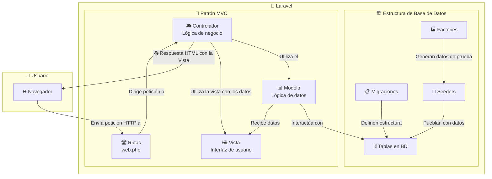

# 1.6. Anatomía de una Aplicación Laravel

La primera vez que se abre un proyecto Laravel, la cantidad de carpetas y archivos puede resultar intimidante. Sin embargo, la estructura es lógica y predecible. No es necesario conocer cada archivo para comenzar a desarrollar; con entender los directorios principales es suficiente.

## 6.1. El Corazón de la Aplicación: La Estructura de Directorios Esencial

Estas son las principales carpetas que se deben conocer:

* `app/`: **El Centro Neurálgico.** Aquí vive la mayor parte del código, la lógica de negocio de la aplicación.

  + `Http/Controllers`: Los **Controladores**, que actúan como "gestores de tráfico". Reciben las peticiones del usuario, procesan la lógica y deciden qué respuesta enviar.
  + `Models`: Los **Modelos**, que representan las tablas de la base de datos. Un modelo `User`, por ejemplo, se corresponde con la tabla `users` y permite interactuar con ella de forma sencilla.
* `routes/`: **El Mapa de Carreteras.** Aquí se definen todas las URLs (rutas) de la aplicación y a qué método de qué controlador deben llamar. El archivo principal para aplicaciones web es `web.php`.
* `resources/`: **La Fachada y los Activos.** Contiene todo lo que ve el usuario final.

  + `views`: Aquí se guardan las plantillas **Blade**, que son los archivos "HTML con superpoderes" de la aplicación.
  + `css`, `js`: Los archivos de estilos y JavaScript sin compilar.
* `database/`: **Los Cimientos.** Todo lo relacionado con la base de datos.

  + `migrations`: Son como "planos de construcción" para la base de datos. Cada archivo define la estructura de una tabla (columnas, tipos de datos, etc.).
  + `seeders`: Clases que permiten "poblar" la base de datos con datos de prueba o iniciales.
* `public/`: **La Puerta de Entrada.** Es la única carpeta públicamente accesible de la aplicación. Contiene el archivo `index.php`, que inicia todo el proceso, así como los recursos ya compilados (CSS, JS, imágenes).
* `.env`: **El Panel de Control Secreto.** Este es el archivo de configuración del entorno. Aquí se guarda información sensible que varía entre máquinas, como las credenciales de la base de datos o las claves de APIs externas. **¡Este archivo nunca debe subirse al control de versiones (Git)!**.

## 6.2. El Patrón MVC

La estructura básica de Laravel sigue el patrón de diseño **MVC (Modelo-Vista-Controlador)**, que separa la aplicación en tres componentes con responsabilidades bien definidas:

* **Modelo (Model)**: Maneja los datos y la lógica de negocio
* **Vista (View)**: Se encarga de la presentación (lo que ve el usuario)
* **Controlador (Controller)**: Actúa como intermediario entre el modelo y la vista

¿Qué muestra este diagrama?

Este diagrama ilustra tres aspectos fundamentales de Laravel:

1. **🏗️ Estructura de Base de Datos**: Cómo se construyen y pueblan las tablas (Migraciones → Tablas → Seeders/Factories)
2. **🎯 Patrón MVC**: Cómo interactúan Modelo, Vista y Controlador para procesar datos
3. **🌐 Flujo HTTP**: El camino completo desde la petición del usuario hasta la respuesta

**Conexión clave**: El diagrama muestra cómo una petición HTTP atraviesa el patrón MVC para acceder a datos estructurados en la base de datos.

