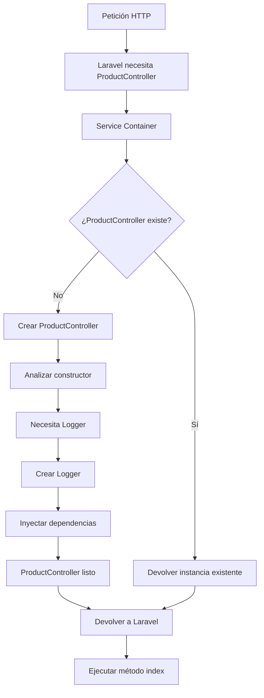
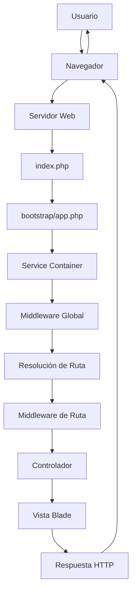

# 2.1 Viaje Interno de una Petición

En la **sesión 1** se sentaron las bases fundamentales del desarrollo web con Laravel. Se exploró la **arquitectura cliente-servidor**, comprendiendo cómo funciona el protocolo **HTTP/HTTPS**, los **métodos HTTP** (GET, POST, PUT, DELETE) que corresponden a operaciones **CRUD**, y el concepto de **stateless**. También se conocieron los **servidores web** (Nginx/Apache) que actúan como "porteros" de las aplicaciones y los diferentes **tipos de hosting** (Compartido, VPS, Dedicado, IaaS/Nube).

Se introdujo **Laravel** como framework "opinado" de PHP, explorando su ecosistema completo: **Artisan** (la CLI para generar componentes), **Tinker** (la consola interactiva REPL) y el **Service Container** (el cerebro organizador que resuelve dependencias automáticamente). Se configuró un **entorno de desarrollo profesional** con herramientas esenciales como **CLI/Terminal** (WSL2 en Windows), editores de código, gestores de dependencias (**Composer** y **npm**), control de versiones (**Git**), gestores de versiones (**NVM**) y contenerización con **Docker y Laravel Sail**. También se integraron herramientas de calidad de código (**PHPStan**, **PHP\_CodeSniffer**, **Laravel Pint**) y depuración (**Laravel Telescope**).

Además, se conocieron las herramientas modernas de frontend: **Vite** como compilador ultrarrápido (con sus modos de desarrollo y producción) y **Tailwind CSS** como framework "utility-first" con su proceso de **purge** para CSS ultra-optimizado. Finalmente, se exploró la **anatomía de Laravel**: su estructura de directorios (app/, routes/, resources/, database/, public/), archivos clave como **.env**, y el patrón **MVC** (Modelo-Vista-Controlador) con el flujo completo de petición-respuesta.

Ahora es momento de profundizar en el **ciclo de vida de las peticiones**. Se explorará en detalle cómo Laravel procesa cada petición HTTP desde que llega al servidor hasta que devuelve la respuesta al cliente, comprendiendo el **middleware**, profundizando en el **Service Container** y la **inyección de dependencias**, y analizando el flujo completo interno que transforma una simple URL en una página web dinámica.

## 1. El Flujo de una Petición HTTP en Laravel

Cuando un usuario accede a una URL en una aplicación Laravel, se inicia un proceso que transforma una simple petición HTTP en una respuesta HTML completa. Este proceso se conoce como el **ciclo de vida de una petición**.


### 1.1. Llegada de la petición

El proceso comienza cuando el navegador del usuario envía una petición HTTP al servidor web (Apache, Nginx, etc.). Esta petición contiene información crucial:

* **Método HTTP** (GET, POST, PUT, DELETE)
* **URL solicitada** (/news/123, /users/profile)
* **Headers** (User-Agent, Accept, Cookies)
* **Datos del cuerpo** (para peticiones POST/PUT)

### 1.2. El punto de entrada: `index.php`

Todas las peticiones HTTP en Laravel pasan por un único punto de entrada: el archivo `public/index.php`. Este archivo actúa como el "portero" de la aplicación:

```php
// public/index.php
<?php

// 1. Cargar el autoloader de Composer
require_once __DIR__.'/../vendor/autoload.php';

// 2. Crear la instancia de la aplicación Laravel
$app = require_once __DIR__.'/../bootstrap/app.php';

// 3. Procesar la petición y obtener la respuesta
$response = $app->handle(
    $request = Illuminate\Http\Request::capture()
);

// 4. Enviar la respuesta al navegador
$response->send();

// 5. Finalizar la petición
$app->terminate($request, $response);
```

> **A tener en cuenta**
> 
> El archivo `index.php` es el único archivo PHP accesible directamente desde el navegador. Todos los demás archivos de la aplicación están protegidos por estar fuera del directorio `public`, lo que añade una capa esencial de seguridad.

## 2. El Service Container y la inyección de dependencias

Una de las características más potentes de Laravel es su **Service Container**, también conocido como contenedor de dependencias. Este sistema gestiona automáticamente la creación y resolución de objetos en toda la aplicación.

### 2.1. ¿Qué es el Service Container?

En la **Sesión 1: Introducción a Laravel** se introdujo el concepto básico del Service Container como "asistente personal". Cuando Laravel necesita crear un objeto (como un controlador, un modelo, o cualquier clase), el contenedor se encarga de:

1. **Crear la instancia** del objeto.
2. **Resolver sus dependencias** automáticamente.
3. **Gestionar el ciclo de vida** del objeto.


```php
<?php
// Ejemplo: Laravel resuelve automáticamente las dependencias
class ProductController extends Controller
{
    public function __construct(
        private Logger $logger // Laravel crea e "inyecta" un objeto de tipo Logger
    ) {}
    
    public function index()
    {
        $this->logger->info('Accediendo a la lista de productos');
    }
}
```

Funcionamiento del Service Container:



### 2.2. El Bootstrap de la aplicación

Una vez que la petición llega a `index.php`, Laravel carga la aplicación desde `bootstrap/app.php`, que se encarga de configurar y procesar la petición. En este proceso, Laravel determina a qué ruta debe dirigirse la petición, si debe pasar por algún middleware y cómo manejar las excepciones.

## 3. Middleware: la capa de procesamiento

El **middleware** es una capa de software que procesa las peticiones HTTP antes de que lleguen a los controladores. Es como una serie de "filtros" que cada petición debe atravesar.


El middleware permite ejecutar código antes y después de que una petición sea procesada por la aplicación. Algunos ejemplos comunes incluyen:

Tipos de Middleware:

| Tipo | Propósito | Ejemplo |
| --- | --- | --- |
| **Autenticación** | Verificar identidad | `auth` |
| **Autorización** | Verificar permisos | `can:edit-posts` |
| **Validación** | Comprobar datos | `throttle:60,1` |
| **Logging** | Registrar actividad | `log` |
| **CORS** | Permitir dominios | `cors` |

### 3.3. El ciclo completo de una petición

A continuación se presenta el flujo completo de una petición HTTP en Laravel:

Diagrama del Flujo Completo



Este patrón, que separa las responsabilidades y procesa las peticiones a través de capas bien definidas, es la base del desarrollo web moderno y será el pilar sobre el que se construirán las aplicaciones.

