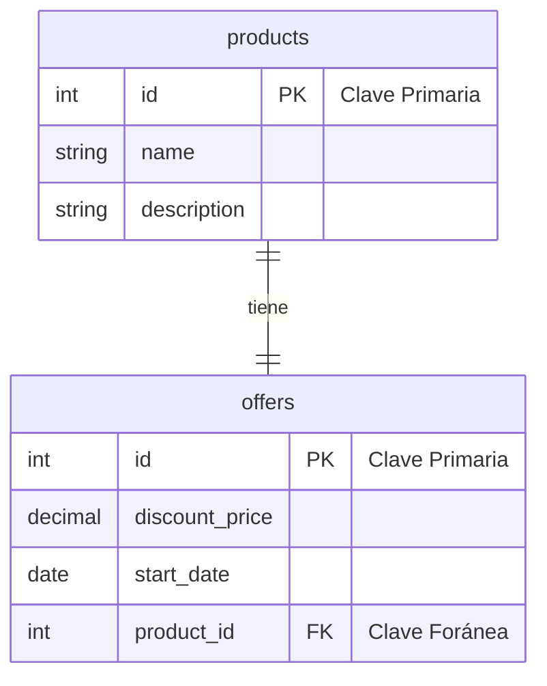
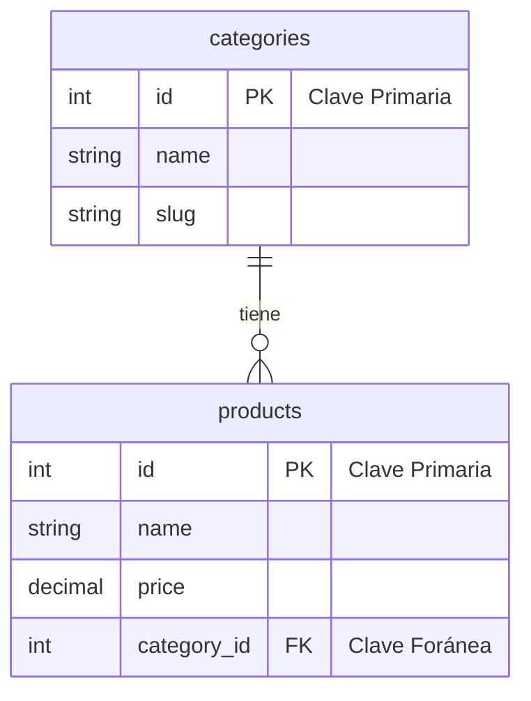
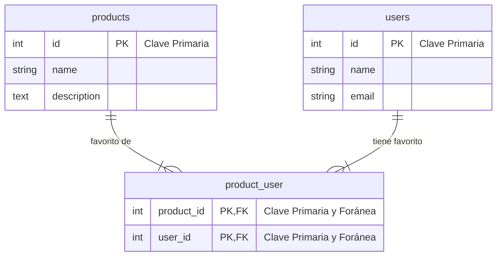

# 3.1. Migraciones y Estructura

Ahora que se ha introducido Laravel y su arquitectura MVC, es momento de profundizar en cómo gestionar la estructura de la base de datos utilizando migraciones y modelos Eloquent. En este apartado se exploran los conceptos fundamentales de las bases de datos relacionales y el sistema de migraciones de Laravel. Se aprende a diseñar, crear y modificar la estructura de las tablas, construyendo esquemas con relaciones definidas que garantizan la integridad de los datos.

## 1. Conceptos fundamentales de bases de datos relacionales

Para entender como se relacionan los datos en una aplicación Laravel, es crucial comprender los principios básicos de las bases de datos relacionales.

### 1.1. ¿Qué es una base de datos relacional?

Una **base de datos relacional** es un sistema de gestión de datos que organiza la información en tablas relacionadas entre sí. Cada tabla representa una entidad del mundo real y las relaciones entre tablas permiten navegar entre datos relacionados.


### 1.2. Tipos de relaciones

#### Uno a Uno (1:1)

Una entidad se relaciona con exactamente una entidad de otra tabla. Un producto tiene una única oferta especial y esa oferta pertenece a un único producto.




#### Uno a Muchos (1:N)

Una entidad se relaciona con múltiples entidades de otra tabla. Una categoría puede tener muchos productos, pero un producto pertenece a una sola categoría.


???+examplelaravel "Ejemplo"
    * Categoría "Electrónica" **→** Productos: "iPhone", "Samsung", "iPad"
    * Categoría "Ropa" **→** Productos: "Camiseta", "Pantalón", "Zapatos"

#### Muchos a Muchos (N:M)

Múltiples entidades se relacionan con múltiples entidades de otra tabla, a través de una **tabla pivote** intermedia. Un producto puede estar en la lista de favoritos de muchos usuarios y un usuario puede tener muchos productos favoritos.



???+examplelaravel "Ejemplo"
    * Usuario "Ana" → Favoritos: "Portátil", "Ratón Inalámbrico"
    * Producto "Portátil" → En favoritos de: "Ana", "Luis", "Carla"

## 2. Sistema de migraciones de Laravel

### 2.1. ¿Qué son las migraciones?

Las **migraciones** son archivos que definen en primer lugar la estructura de la base de datos y posteriormente los cambios que se realizan en ella de manera versionada y reversible. De este modo, permiten gestionar la evolución del esquema de la base de datos como código.


### 2.2. Estructura de una migración

Las migraciones son clases PHP que extienden `Migration` y contienen dos métodos principales: **`up()`** y **`down()`**.

El método **`up()`** define los cambios a aplicar (crear tablas, añadir columnas, etc.), mientras que **`down()`** especifica cómo revertir esos cambios (eliminar tablas, quitar columnas, etc.).

```php
<?php

use Illuminate\Database\Migrations\Migration;
use Illuminate\Database\Schema\Blueprint;
use Illuminate\Support\Facades\Schema;

return new class extends Migration
{
    /**
     * Run the migrations.
     */
    public function up(): void
    {
        // Definir cambios a aplicar
    }

    /**
     * Reverse the migrations.
     */
    public function down(): void
    {
        // Definir cómo deshacer los cambios
    }
};
```

## 3. Creando migraciones

### 3.1. Comando para crear migraciones

Para crear una nueva migración, se utiliza el comando Artisan **`make:migration`**:

```bash
# crear una migración básica
sail artisan make:migration create_products_table
```

> **Recuerda**
> 
> Laravel está diseñado para trabajar en **inglés**. Los nombres de tablas, columnas y modelos deben estar en inglés, respetando:
> 
> * **Tablas**: plural en inglés (`products`, `categories`, `users`)
> * **Modelos**: singular en inglés (`Product`, `Category`, `User`)
> * **Columnas**: snake\_case en inglés (`created_at`, `category_id`, `is_active`)
> 
> Esto permite que Laravel funcione automáticamente sin configuración adicional.

### 3.2. Migración para crear tabla

Cuando se crea una migración para una tabla, el archivo generado contendrá un esquema básico.

Aquí hay un ejemplo de una migración para crear una tabla `products` con varios tipos de columnas y una relación con la tabla `categories`.

```php
<?php

use Illuminate\Database\Migrations\Migration;
use Illuminate\Database\Schema\Blueprint;
use Illuminate\Support\Facades\Schema;

return new class extends Migration
{
    public function up(): void
    {
        Schema::create('products', function (Blueprint $table) {
            $table->id();                    // Clave primaria auto-incremental
            $table->string('name');          // Campo de texto
            $table->text('description');     // Campo de texto largo
            $table->decimal('price', 10, 2); // Campo decimal (10 dígitos, 2 decimales)
            $table->foreignId('category_id') // Clave foránea
                  ->constrained()            // Referencia a tabla categories
                  ->onDelete('cascade');     // Eliminar en cascada
            $table->timestamps();            // created_at y updated_at
        });
    }

    public function down(): void
    {
        Schema::dropIfExists('products');
    }
};
```

### 3.3. Tipos de columnas comunes

Esta es una tabla con los tipos de columnas más comunes en migraciones:

| Tipo | Descripción | Ejemplo |
| --- | --- | --- |
| `id()` | Clave primaria auto-incremental | `$table->id()` |
| `string('name')` | Campo de texto (255 caracteres) | `$table->string('name')` |
| `text('description')` | Campo de texto largo | `$table->text('description')` |
| `integer('quantity')` | Número entero | `$table->integer('quantity')` |
| `decimal('price', 8, 2)` | Número decimal | `$table->decimal('price', 8, 2)` |
| `boolean('is_active')` | Valor booleano | `$table->boolean('is_active')` |
| `date('birth_date')` | Fecha | `$table->date('birth_date')` |
| `timestamp('deleted_at')` | Fecha y hora | `$table->timestamp('deleted_at')` |


> **Importante**
> 
> `id()` es un atajo para `$table->bigIncrements('id')`, que crea una columna de clave primaria auto-incremental de tipo BIGINT. Los BIGINT permiten un rango mucho mayor de valores que INT, lo cual es útil para tablas con muchos registros. Esto afecta a todas las claves primarias y foráneas que uses en tus tablas.
> 
> Además, los tipos de columnas pueden tener modificadores adicionales como **`nullable()`**, **`default()`**, **`unique()`**, etc.
> 
> !!! example "Ejemplo"
>     ```php
>     $table->string('email')->unique(); // crea una columna de texto única.
>     ```


## 4. Relaciones en migraciones

Para definir relaciones entre tablas, se utilizan claves foráneas y tablas pivote.

### 4.1. Claves foráneas
Las claves foráneas se definen usando **`foreignId()`** o **`foreign()`**. 

Aquí hay dos métodos para hacerlo:

- Método 1: Usando `foreignId` (**recomendado**).
```php
<?php

$table->foreignId('category_id')
      ->constrained()           // Referencia a tabla categories
      ->onDelete('cascade');    // Eliminar en cascada
```
- Método 2: Usando `foreign` (más control).
```php
<?php
$table->unsignedBigInteger('category_id');
$table->foreign('category_id')
      ->references('id')
      ->on('categories')
      ->onDelete('cascade');
```

Es mejor usar **`foreignId()`** por su simplicidad y legibilidad. Pero si necesitas más control (como referenciar una columna diferente o una tabla distinta), `foreign()` es la opción adecuada.

> **Importante**
> 
> Laravel busca automáticamente la tabla relacionada asumiendo que el nombre de la columna foránea sigue la convención `{tabla_singular}_id`. 
> 
> Por ejemplo, `category_id` se asume que referencia a la tabla `categories`. Si tu columna no sigue esta convención, debes especificar la tabla y columna manualmente usando el método 2 `foreign()` con `references()` y `on()`.

### 4.2. Tabla pivote para relaciones Muchos a Muchos

Como se mencionó antes, las relaciones muchos a muchos requieren una tabla pivote intermedia que contenga las claves foráneas de ambas tablas relacionadas.

```php
<?php

use Illuminate\Database\Migrations\Migration;
use Illuminate\Database\Schema\Blueprint;
use Illuminate\Support\Facades\Schema;

return new class extends Migration
{
    public function up(): void
    {
        Schema::create('product_user', function (Blueprint $table) {
            $table->id();
            $table->foreignId('product_id')
                  ->constrained()
                  ->onDelete('cascade');
            $table->foreignId('user_id')
                  ->constrained()
                  ->onDelete('cascade');
            $table->timestamps();
            
            // Evitar duplicados
            $table->unique(['product_id', 'user_id']);
        });
    }

    public function down(): void
    {
        Schema::dropIfExists('product_user');
    }
};
```

> **Importante**
> 
> La tabla pivote debe tener un nombre que combine ambas tablas **en orden alfabético**, separadas por un guion bajo **`_`**. 
> 
> En este caso, `product_user` es correcto porque "product" viene antes que "user" alfabéticamente. Esto permite que Laravel reconozca automáticamente la tabla pivote al definir las relaciones en los modelos.

## 5. Ejecutando migraciones

Para aplicar las migraciones y crear o modificar la estructura de la base de datos, se utilizan comandos Artisan específicos.

### 5.1. Comandos de migración

```bash
# Ejecutar todas las migraciones pendientes
sail artisan migrate
```
```bash
# Ver el estado de las migraciones
sail artisan migrate:status
```
```bash
# Revertir la última migración
sail artisan migrate:rollback
```
```bash
# Revertir todas las migraciones
sail artisan migrate:reset
```
```bash
# Revertir y volver a ejecutar
sail artisan migrate:refresh
```
```bash
# Revertir, ejecutar y poblar con seeders (★ MUY USADO EN DESARROLLO)
sail artisan migrate:refresh --seed
```

**migrate:refresh vs migrate:fresh**

**`migrate:refresh`** (recomendado para desarrollo):

* Ejecuta el método `down()` de todas las migraciones en orden inverso.
* Luego ejecuta el método `up()` de todas las migraciones.
* Respeta las definiciones de `down()` y `up()`.
* Preserva la lógica de reversión.

**`migrate:fresh`** (más drástico):

* Elimina TODAS las tablas directamente (DROP).
* Crea todo desde cero.
* NO ejecuta los métodos `down()`.
* Más rápido pero menos preciso.

**`migrate:refresh --seed`** (★ el más usado en desarrollo):

* Hace refresh de la base de datos.
* Ejecuta automáticamente todos los seeders al finalizar.
* Ideal para resetear el estado de desarrollo con datos de prueba.
* comando usado constantemente durante el desarrollo.

## 6. Actualizando migraciones

A medida que la aplicación evoluciona, es común necesitar modificar la estructura de la base de datos. En lugar de editar migraciones antiguas (lo cual es una mala práctica), se crean nuevas migraciones que describen los cambios.

Si necesitas añadir una nueva columna `stock` a la tabla `products`, se crea una nueva migración así:

```bash
# crear una nueva migración para añadir una columna
sail artisan make:migration add_stock_to_products_table --table=products
```

En esta migración, se define el cambio en el método `up()` y cómo revertirlo en `down()`. Por tanto, los metodos solo contienen la modificación:

```php
<?php
use Illuminate\Database\Migrations\Migration;
use Illuminate\Database\Schema\Blueprint;
use Illuminate\Support\Facades\Schema;
return new class extends Migration
{
    public function up(): void
    {
        Schema::table('products', function (Blueprint $table) {
            $table->integer('stock')->default(0); // Nueva columna stock
        });
    }

    public function down(): void
    {
        Schema::table('products', function (Blueprint $table) {
            $table->dropColumn('stock'); // Eliminar columna stock
        });
    }
};
```

> **Regla de Oro de las migraciones**
> 
> **NUNCA** modifiques una migración que ya ha sido ejecutada en producción. Si necesitas hacer cambios, crea una nueva migración.

