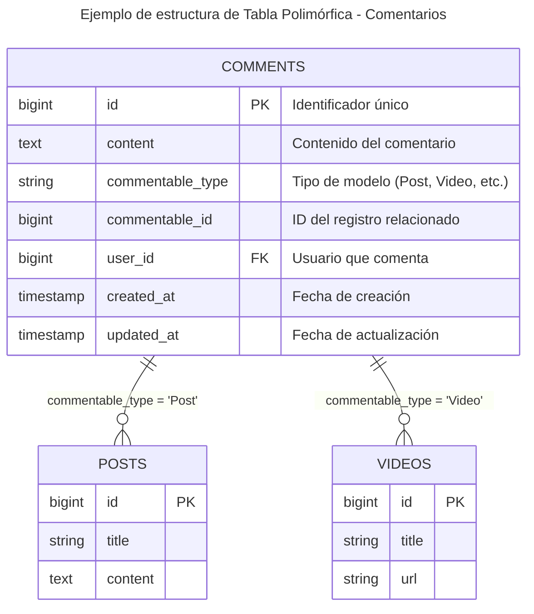

# 3.4. Relaciones Eloquent

Como se vio en el primer apartado se implementan relaciones entre modelos (uno a uno, uno a muchos, muchos a muchos), aprendiendo a navegar entre datos relacionados de manera elegante y eficiente.

Eloquent ORM facilita la definición y gestión de relaciones entre modelos, permitiendo acceder a datos relacionados con una sintaxis intuitiva y expresiva.

## 4.1. ¿Qué son las relaciones en Eloquent?

Las **relaciones** en Eloquent definen cómo los modelos están conectados entre sí, permitiendo navegar entre datos relacionados de manera elegante y eficiente sin escribir SQL complejo.


¡Las relaciones Eloquent son como el sistema de referencias cruzadas que conecta toda la información de la biblioteca!

---

**Relaciones polimórficas**

Además de las relaciones básicas, Eloquent también soporta **relaciones polimórficas**. Estas permiten que un modelo se relacione con múltiples tipos de modelos (ej: Comentarios → Posts/Videos). Para ello utiliza una estructura especial en la base de datos con campos `*_type` y `*_id` para identificar el modelo relacionado y su identificador.




Este tipo de relación es mas compleja y durante el curso no se verá en detalle. Pero es bueno saber que existe.

## 4.2. Relación Uno a Uno (1:1)

Para definir una relación uno a uno, se utilizan los métodos **`hasOne()`** y **`belongsTo()`** en los modelos correspondientes.

Se añadirá `hasOne()` en el modelo que "tiene" la relación y `belongsTo()` en el modelo que "pertenece" a otro.

```php
<?php

namespace App\Models;

use Illuminate\Database\Eloquent\Model;

class Product extends Model
{
    // Un producto tiene una oferta
    public function offer()
    {
        return $this->hasOne(Offer::class);
    }
}
```

```php
<?php

namespace App\Models;

use Illuminate\Database\Eloquent\Model;

class Offer extends Model
{
    // Una oferta pertenece a un producto
    public function product()
    {
        return $this->belongsTo(Product::class);
    }
}
```

## 4.3. Relación Uno a Muchos (1:N)

La relación uno a muchos es una de las más comunes. Un registro en una tabla puede estar relacionado con múltiples registros en otra tabla.

Para definir una relación uno a muchos, se utilizan los métodos **`hasMany()`** y **`belongsTo()`** en los modelos correspondientes.

Como en la relación uno a uno, se añade `hasMany()` en el modelo que "tiene" la relación y `belongsTo()` en el modelo que "pertenece" a otro.

```php
<?php

namespace App\Models;

use Illuminate\Database\Eloquent\Model;

class Category extends Model
{
    // Una categoría tiene muchos productos
    public function products()
    {
        return $this->hasMany(Product::class);
    }
}
```

```php
<?php

namespace App\Models;

use Illuminate\Database\Eloquent\Model;

class Product extends Model
{
    // Un producto pertenece a una categoría
    public function category()
    {
        return $this->belongsTo(Category::class);
    }
}
```

## 4.4. Relación Muchos a Muchos (N:N)

La relación muchos a muchos permite que múltiples registros en una tabla estén relacionados con múltiples registros en otra tabla.

Para definir una relación muchos a muchos, se utilizan los métodos **`belongsToMany()`** en ambos modelos.

```php
<?php

namespace App\Models;

use Illuminate\Database\Eloquent\Model;

class Product extends Model
{
    // Un producto puede estar en el carrito de muchos usuarios
    public function users()
    {
        return $this->belongsToMany(User::class);
    }
}
```

```php
<?php

namespace App\Models;

use Illuminate\Database\Eloquent\Model;

class User extends Model
{
    // Un usuario puede tener muchos productos en su carrito/favoritos
    public function products()
    {
        return $this->belongsToMany(Product::class);
    }
}
```

Si no se especifica, Eloquent asume que la tabla pivot se llama con los nombres de las tablas en orden alfabético (ej: `product_user`). Si la tabla tiene un nombre diferente, se puede pasar como segundo parámetro a `belongsToMany()`.

```php
<?php
return $this->belongsToMany(Product::class, 'cart_items');
```

### 4.4.1. Tabla pivote con campos adicionales

Frecuentemente, las tablas pivot necesitan almacenar información adicional más allá de las claves foráneas. Por ejemplo, en un carrito de compras, se necesita saber la **cantidad** de cada producto.

Para ello, se pueden definir campos adicionales en la migración de la tabla pivot y luego acceder a ellos usando el método `withPivot()` en la definición de la relación.

```php
<?php
// Modelo User con acceso a campos pivot
class User extends Model
{
    public function products()
    {
        return $this->belongsToMany(Product::class, 'product_user')
            ->withPivot('quantity')      // Incluir campo quantity
            ->withTimestamps();          // Incluir created_at y updated_at
    }
}
```

```php
<?php

namespace App\Models;

use Illuminate\Database\Eloquent\Model;

// Modelo Product (relación inversa)
class Product extends Model
{
    public function users()
    {
        return $this->belongsToMany(User::class, 'product_user')
            ->withPivot('quantity')
            ->withTimestamps();
    }
}
```

### 4.4.4. Acceder a datos pivot en controladores y vistas

Una vez definida la relación con `withPivot()`, se puede acceder a los datos adicionales de la tabla pivot a través del objeto `pivot`.

```php
<?php
{{ -- Mostrar productos del carrito con cantidad -- }}
@foreach($cartProducts as $product)
    <div class="cart-item">
        <h3>{{ $product->name }}</h3>
        <p>Precio: €{{ $product->price }}</p>
        
        {{  -- Acceder al campo quantity de la tabla pivot --  }}
        <p>Cantidad: {{ $product->pivot->quantity }}</p>
        
        {{  -- Calcular subtotal --  }}
        @php
            $subtotal = $product->price * $product->pivot->quantity;
        @endphp
        <p>Subtotal: €{{ number_format($subtotal, 2) }}</p>
        
        {{  -- Fecha de añadido (timestamps) --  }}
        <small>Añadido: {{ $product->pivot->created_at->format('d/m/Y') }}</small>
    </div>
@endforeach
```

### 4.5. Usar relaciones

Para obtener datos de las relaciones solo hay que llamarla como si fuese una propiedad más.

```php
<?php
$category = Category::find(1); // Se obtiene la categoría con ID 1
$products = $category->products; // Llama a la relación 1:N

$product = $products::first(); // Se obtiene el primer producto de la categoría
$offer = $product->offer; // Llama a la relación 1:1

$users = $product->users; // Llama a la relación N:N
```

Si se quiere filtrar la consulta de la relación, se puede llamar como un método (con paréntesis) para obtener el constructor de consultas y aplicar condiciones.

```php
<?php
$category = Category::find(1);
$products = $category->products()->where('price', '>', 100)->get(); // Necesita el parentesis
```

Si se quiere modificar la información de los datos relacionados, con las relaciones 1:1 y 1:N se puede usar el método **`save()`** o **`create()`** en la relación. Pero con las relaciones N:N se usan los métodos **`attach()`**, **`detach()`** y **`sync()`**.

```php
<?php
// Añadir productos a la pivot (product_user)
$user = User::find(1);
$user->products()->attach([1, 2, 3]); // Se añaden productos con ID 1, 2 y 3 al usuario

// Sincronizar carrito (elimina los que no están en el array). Si no existe, lo añade.
$user->products()->sync([1, 2, 3]);

// Añadir producto con datos adicionales (cantidad)
$user->products()->attach(1, ['quantity' => 2]);

// Añadir productos con datos adicionales (cantidad)
$user->products()->attach([
    2 => ['quantity' => 1],
    3 => ['quantity' => 5]
]);

// Actualizar la cantidad de un producto en el carrito
$user->products()->updateExistingPivot($productId, [
    'quantity' => 3
]);
```

**Actualizar datos pivot**

El método `updateExistingPivot()` solo actualiza los datos adicionales en la tabla pivot. No sincroniza la existencia del registro. Si el registro no existe, no se crea.

