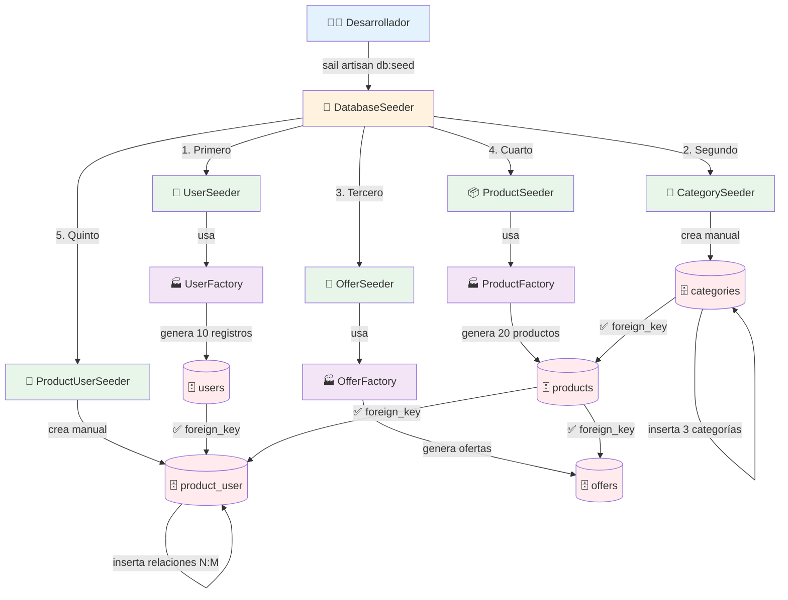

# 3.5. Seeders y Factories

Una vez que se ha aprendido a gestionar la estructura de la base de datos con migraciones y a interactuar con los datos mediante Eloquent ORM, el siguiente paso es poblar la base de datos con datos iniciales y de prueba. Esto se logra utilizando **seeders** y **factories**, herramientas que permiten automatizar la creación de grandes cantidades de datos realistas para facilitar el desarrollo y las pruebas.

## 5.1. ¿Qué son los Seeders?

Los **seeders** son clases que definen datos iniciales para poblar la base de datos con información fija o de prueba. Permiten establecer un estado inicial consistente de la base de datos para desarrollo y testing.

???examplelaravel "Analogía: La Colección Inicial de la Biblioteca"

    **¡Imagina que acabas de inaugurar una nueva biblioteca y necesitas llenarla con libros esenciales!**

    * 📚 **Biblioteca vacía** = Estanterías vacías esperando ser llenadas
    * 📖 **Seeders = La colección fundamental** Los libros esenciales que toda biblioteca debe tener desde el primer día: Enciclopedias, diccionarios, clásicos universales (Quijote, Shakespeare...)
    * 🎯 **Datos iniciales bien definidos** No son libros aleatorios, son los pilares fundamentales perfectamente seleccionados
    * ⚡ **Un comando para inicializar**`sail artisan db:seed` → ¡La biblioteca se llena con su colección base al instante!

    **Sin seeders** 😓: Catalogarías manualmente cada libro esencial uno por uno, cada vez que reinicies la biblioteca **Con seeders** 🚀: Un comando y tu biblioteca tiene toda su colección fundamental lista para funcionar

¡Los seeders son como el plan de adquisición inicial que asegura que tu biblioteca tenga todo lo esencial desde el día uno!

## 5.2. Creando Seeders

### 5.2.1. Comando para Crear Seeders

Para crear un seeder, se utiliza el comando Artisan `make:seeder` seguido del nombre del seeder.

```bash
# Crear un seeder básico
sail artisan make:seeder CategorySeeder
```

### 5.2.2. Estructura Básica de un Seeder
Una vez creado, un seeder tiene una estructura básica con un método `run()` donde se define la lógica para insertar datos en la base de datos.

```php
<?php

namespace Database\Seeders;

use Illuminate\Database\Seeder;
use App\Models\Category;

class CategorySeeder extends Seeder
{
    /**
     * Run the database seeds.
     */
    public function run(): void
    {
        // Lógica para poblar la base de datos
    }
}
```

### 5.2.3. Seeder Básico con Datos Estáticos

Dentro del método `run()`, se pueden insertar datos manualmente utilizando los modelos Eloquent. Para ello lo mas conveniente es tener un arreglo con los datos y luego iterar sobre él para crear los registros.

```php
<?php

namespace Database\Seeders;

use Illuminate\Database\Seeder;
use App\Models\Category;

class CategorySeeder extends Seeder
{
    public function run(): void
    {
        $categories = [
            [
                'name' => 'Electrónica',
                'slug' => 'electronica',
                'description' => 'Dispositivos electrónicos de última generación'
            ],
            [
                'name' => 'Ropa',
                'slug' => 'ropa',
                'description' => 'Moda y accesorios para todas las estaciones'
            ],
            [
                'name' => 'Hogar',
                'slug' => 'hogar',
                'description' => 'Artículos para el hogar y decoración'
            ]
        ];

        foreach ($categories as $category) {
            Category::create($category);
        }
    }
}
```

### 5.2.4. Seeder con Relaciones
Los seeders también pueden crear datos que dependan de otros registros, respetando las relaciones definidas en la base de datos.

Por ejemplo, un `ProductSeeder` que crea productos asociados a categorías y ofertas existentes. Se muestra a continuación un ejemplo de un seeder que crea categorías, productos y ofertas, respetando las relaciones entre ellos.

```php
<?php

namespace Database\Seeders;

use Illuminate\Database\Seeder;
use App\Models\Category;
use App\Models\Product;
use App\Models\Offer;

class ProductSeeder extends Seeder
{
    public function run(): void
    {
        // Crear categorías
        $electronics = Category::create([
            'name' => 'Electrónica',
            'slug' => 'electronica'
        ]);

        $clothing = Category::create([
            'name' => 'Ropa',
            'slug' => 'ropa'
        ]);

        // Crear productos
        $iphone = Product::create([
            'name' => 'iPhone 15',
            'description' => 'Último modelo de iPhone',
            'price' => 999.99,
            'category_id' => $electronics->id
        ]);
        
        // Crear oferta para el iPhone
        Offer::create([
            'product_id' => $iphone->id,
            'discount_price' => 799.99,
            'start_date' => now(),
            'end_date' => now()->addDays(7)
        ]);

        $shirt = Product::create([
            'name' => 'Camiseta Premium',
            'description' => 'Camiseta de algodón orgánico',
            'price' => 29.99,
            'category_id' => $clothing->id
        ]);
    }
}
```

> **Atención**
> 
> Este seeder crea multiples entidades en un mismo seeder. En aplicaciones reales, es recomendable separar cada entidad en su propio seeder para mantener el código limpio y modular.

## 5.3. ¿Qué son las Factories?

Cuando los seeders necesitan crear grandes cantidades de datos que no son fijos, las factories son la herramienta ideal para generar estos datos ya que permiten definir patrones y variaciones en los datos generados.

Las **factories** son clases que generan datos de prueba realistas de forma automatizada. Utilizan la librería Faker para crear datos variados y creíbles para desarrollo y testing.

???examplelaravel "Analogía: El Generador Automático de Manuscritos"

    **¡Imagina que necesitas llenar la biblioteca con miles de libros para hacer pruebas del sistema de catalogación!**

    * 🖨️ **Factory = La máquina generadora de manuscritos realistas** Le das una plantilla base de "Libro de Ficción" y ella crea 1000 libros DIFERENTES y creíbles automáticamente
    * 🎨 **Faker = El generador de contenido variado** Cada libro tiene título único, autor diferente, año aleatorio, sinopsis distinta ¡Nunca genera dos libros exactamente iguales!
    * � **Libros generados = Datos de prueba realistas** "El Jardín Secreto de las Estrellas", "Crónicas del Tiempo Perdido", "El Último Guardián"... Todos parecen libros reales y creíbles
    * ⚡ **Línea de producción literaria automática**`Book::factory(50)->create()` → ¡50 libros únicos catalogados al instante!

    **Sin factories** 😓: Escribirías manualmente "Libro 1", "Libro 2", "Libro 3"... (¡aburrido, repetitivo y poco realista!) **Con factories** 🚀: La máquina genera títulos realistas, autores variados, argumentos únicos... (¡creíble y profesional!)

    * 📖 **Perfectos para pruebas del sistema** Necesitas probar el buscador, los filtros, la paginación... Las factories te dan datos realistas sin esfuerzo

¡Las factories son tu imprenta automática que llena la biblioteca con contenido realista para probar todo el sistema!

## 5.4. Creando Factories

### 5.4.1. Comando para Crear Factories

Para crear una factory, se utiliza el comando Artisan `make:factory` seguido del nombre de la factory y opcionalmente el modelo asociado.

Si se especifica el modelo, la factory se vincula automáticamente a ese modelo, facilitando la creación de instancias del mismo.

```bash
# Crear un factory básico
sail artisan make:factory ProductFactory

# Crear factory con modelo especificado
sail artisan make:factory ProductFactory --model=Product
```

### 5.4.2. Estructura Básica de una Factory

Los factories tienen una estructura básica que incluye un método `definition()` donde se definen los atributos del modelo y cómo se generan sus valores utilizando Faker.

```php
<?php

namespace Database\Factories;

use Illuminate\Database\Eloquent\Factories\Factory;
use App\Models\Category;

class ProductFactory extends Factory
{
    /**
     * Define the model's default state.
     */
    public function definition(): array
    {
        // Definir los atributos con datos generados por Faker
    }
}
```

### 5.4.3. Factory Básico con Datos Realistas

Los factories deben definir atributos con datos generados por Faker para crear registros variados y realistas.

Por ejemplo, una factory para el modelo `Product` podría verse así:

```php
<?php

namespace Database\Factories;

use Illuminate\Database\Eloquent\Factories\Factory;
use App\Models\Category;

class ProductFactory extends Factory
{
    public function definition(): array
    {
        return [
            'name' => $this->faker->randomElement([
                'iPhone 15 Pro',
                'Samsung Galaxy S24',
                'MacBook Air M3',
                'iPad Pro 12.9"',
                'AirPods Pro',
                'Apple Watch Series 9'
            ]),
            'description' => $this->faker->paragraph(3),
            'price' => $this->faker->randomFloat(2, 99, 1999),
            'category_id' => Category::factory(),
            'image' => $this->faker->imageUrl(400, 300, 'products'),
            'is_active' => $this->faker->boolean(90), // 90% activos
        ];
    }
}
```

**Faker**

Faker es una librería que genera datos falsos pero realistas, como nombres, direcciones, textos, números, fechas, etc. Laravel la integra para facilitar la creación de datos de prueba.

Más info: [Faker PHP](https://fakerphp.github.io/)

## 5.5. Usando Factories

Se pueden crear registros individuales o múltiples utilizando las factories. A continuación se muestran ejemplos de cómo utilizar las factories.

```php
// Crear un producto
$product = Product::factory()->create();

// Crear un producto con datos específicos
$product = Product::factory()->create([
    'name' => 'iPhone 15',
    'price' => 999.99
]);

// Crear 10 productos
$products = Product::factory(10)->create();

// Crear productos con datos específicos
$products = Product::factory(5)->create([
    'category_id' => 1
]);

// Crear productos sin guardar en base de datos
$products = Product::factory(10)->make();
```

### 5.5.3. Factories en Seeders

Las factories se utilizan dentro de los seeders para crear registros en la base de datos. Por tanto lo más común es ver su uso dentro del método `run()` de los seeders.

En este ejemplo se muestra un seeder que utiliza factories para crear categorías, productos, ofertas y asignar productos a usuarios.

```php
<?php

namespace Database\Seeders;

use Illuminate\Database\Seeder;
use App\Models\Product;
use App\Models\Category;
use App\Models\Offer;
use App\Models\User;

class ProductSeeder extends Seeder
{
    public function run(): void
    {
        // Crear categorías
        $categories = Category::factory(5)->create();

        // Crear productos
        $products = Product::factory(50)->create();

        // Crear ofertas para algunos productos
        $products->random(10)->each(function ($product) {
            Offer::factory()->create([
                'product_id' => $product->id
            ]);
        });

        // Asignar productos a usuarios (carrito/favoritos)
        $users = User::factory(10)->create();
        $users->each(function ($user) use ($products) {
            $user->products()->attach(
                $products->random(rand(1, 5))->pluck('id')->toArray(),
                ['quantity' => rand(1, 3)]
            );
        });
    }
}
```

**Funciones Avanzadas**

La función `each()` permite iterar sobre una colección y aplicar una función a cada elemento, facilitando la creación de relaciones y datos adicionales de forma dinámica.

Por otro lado, `pluck()` extrae un array con los valores de una columna específica de la colección, útil para obtener IDs u otros atributos.

## 5.6. Seeder Principal

Cuando se trabaja con bases de datos relacionales con claves foráneas, **el orden de ejecución de los seeders es crucial**. Se deben crear primero las entidades "padre" antes que las entidades "hijo" que dependen de ellas.

???examplelaravel "Analogía: Protocolo de Montaje Oficial de BiblioTech S.A."

    **¡Imagina que estás montando una biblioteca entera desde cero con los kits de BiblioTech S.A.! No puedes añadir un libro si la estantería no está montada.**

    * **Paso 1: Estanterías (Tablas sin dependencias)** Primero, elegimos las `Categorías` ("Ciencia Ficción", "Drama") y montamos las estanterías. También podemos empezar a dar de alta `Usuarios`. Son independientes.
    * **Paso 2: Libros (Tablas con dependencias)** Una vez tienes las categorías y autores, puedes empezar a catalogar los `Libros`. Cada libro necesita una categoría (`category_id`). No se podría catalogar en ninguna estantería si no están ya montadas.
    * **Paso 3: Conexiones y Detalles (Tablas pivote)** Con los libros y los usuarios ya en el sistema, puedes gestionar los `Préstamos` (tabla `book_user`). Esta tabla conecta un `user_id` con un `book_id`, y no tendría sentido sin que ambos existan previamente.

    **El orden es crucial: no puedes hacer un préstamo de un libro que aún no has catalogado, ni asignar un libro a un usuario que no has registrado. El `DatabaseSeeder` es tu plan de montaje que garantiza que todo se construya en la secuencia correcta.**

Para ello hay que asegurarse de que las tablas que no tengan claves foráneas deben ejecutarse primero, y las tablas que dependan de otras (por ejemplo, productos que dependen de categorías) deben ejecutarse después.

Para ejecutar los seeders y poblar la base de datos, se utiliza el seeder principal `DatabaseSeeder`, que a su vez llama a los demás seeders en el orden definido.

```php
<?php
namespace Database\Seeders;
use Illuminate\Database\Seeder;
class DatabaseSeeder extends Seeder
{
    public function run(): void
    {
        $this->call([
            UserSeeder::class,
            CategorySeeder::class,
            OfferSeeder::class,
            ProductSeeder::class,
            ProductUserSeeder::class,
        ]);
    }
}
```

En el siguiente diagrama se muestra un ejemplo de cómo los seeders y factories trabajan juntos para poblar la base de datos. Estos deben ejecutarse en un orden específico para respetar las relaciones de claves foráneas entre tablas.


