# 4.1. Formularios seguros

En la **sesión 2** se aprendió a crear vistas dinámicas con Blade y a manejar datos desde los controladores. En la **sesión 3** se dominó Eloquent para persistir datos en la base de datos. Ahora es momento de conectar estas piezas: los **formularios** son el puente que permite a los usuarios enviar información que tu aplicación procesará y almacenará de forma segura.

Los formularios web son la puerta de entrada de datos en las aplicaciones, pero también representan un **vector de ataque crítico**. Laravel proporciona herramientas robustas para crear formularios seguros que protegen contra vulnerabilidades comunes como CSRF, inyección de código y manipulación de datos.

## 1. Fundamentos de los formularios web

### 1.1. ¿Qué es un formulario web?

Un formulario web es un elemento HTML que permite a los usuarios enviar datos al servidor de manera estructurada. Los formularios son esenciales para la interacción usuario-aplicación, pero requieren implementación cuidadosa para mantener la seguridad.


### 1.2. Componentes de un formulario seguro

Un formulario seguro en Laravel está compuesto por varios elementos que trabajan en conjunto para garantizar la integridad y seguridad de los datos:

| Componente | Descripción | Propósito de Seguridad |
| --- | --- | --- |
| **Método HTTP** | GET, POST, PUT, DELETE | Especificar el tipo de operación |
| **Acción (Action)** | URL de destino | Definir dónde se envían los datos |
| **Campos de entrada** | Input, textarea, select... | Capturar datos del usuario |
| **Protección CSRF** | Token único | Prevenir ataques Cross-Site Request Forgery |
| **Validación** | Reglas de datos | Asegurar integridad y formato correcto |
| **Sanitización** | Limpieza de datos | Prevenir inyección de código |

## 2. Protección CSRF en Laravel

La protección CSRF es la primera línea de defensa contra ataques de falsificación de peticiones. Laravel incluye esta protección de forma automática y solo requiere una directiva simple en tus formularios.

### 2.1. ¿Qué es CSRF?

**Cross-Site Request Forgery (CSRF)** es un ataque que explota la confianza de un sitio web en un usuario autenticado. Un atacante puede hacer que el navegador del usuario envíe peticiones no deseadas a un sitio web en el que el usuario está autenticado, sin que el usuario lo sepa.

### 2.2. Cómo funciona la protección CSRF

Laravel genera automáticamente un token CSRF único para cada sesión de usuario:

```php
<?php
// Laravel genera automáticamente el token CSRF
@csrf

// Esto equivale a:
<input type="hidden" name="_token" value="{{ csrf_token() }}">
```

**Flujo de protección CSRF:**

```mermaid
sequenceDiagram
    participant U as 👤 Usuario
    participant B as 🌐 Navegador
    participant L as ⚡ Laravel
    participant D as 🗄️ Base de Datos

    U->>B: Visita formulario de compra
    B->>L: GET /products/create
    L->>L: Genera token CSRF único
    Note over L: Token: abc123xyz789
    L->>B: Renderiza formulario con token
    Note over B: <input name="_token" value="abc123xyz789">
    
    U->>B: Rellena y envía formulario
    B->>L: POST /products (con token)
    Note over B,L: _token: abc123xyz789
    
    L->>L: Verifica token CSRF
    alt Token válido ✅
        L->>D: Guarda producto
        D->>L: Producto guardado
        L->>B: Redirige a producto creado
        B->>U: Muestra confirmación
    else Token inválido ❌
        L->>B: Error 419 (CSRF Token Mismatch)
        B->>U: Muestra error de seguridad
    end
```



> **Token CSRF obligatorio**
> 
> Todos los formularios que usan POST, PUT, PATCH o DELETE deben incluir el token CSRF **`@csrf`**.
> 
> Sin **`@csrf`**, Laravel rechazará la petición con error **419 (Page Expired)**.
> 
> === "❌ Sin protección"
>     ```html
>     <!-- ❌ Sin protección - Error 419 -->
> 
>     <form method="POST" action="/products">
>         <button>Enviar</button>
>     </form>
>     ```
> === "✅ Con protección"
>     ```html
>     <!-- ✅ Con protección - Funciona -->
> 
>     <form method="POST" action="/products">
>         @csrf
>         <button>Enviar</button>
>     </form>
>     ```

### 2.3. Implementación de protección CSRF

Implementar la protección CSRF en Laravel es muy sencillo.

#### En formularios Blade

La forma más simple y común de proteger un formulario es añadiendo la directiva **`@csrf`** dentro del elemento `<form>` (después de la etiqueta `<form>` es un buen lugar). Laravel generará automáticamente un campo hidden con el token.

```html
<form action="{{ route('products.store') }}" method="POST">
    @csrf
    <!-- Campos del formulario -->
    <input type="text" name="name" required>
    <button type="submit">Enviar</button>
</form>
```

#### En formularios AJAX

Para peticiones AJAX (usando fetch, axios, o jQuery), necesitas incluir el token CSRF en los headers de la petición. El token se obtiene de una meta tag que Laravel incluye automáticamente en el layout.

```javascript
// Obtener el token CSRF
const token = document.querySelector('meta[name="csrf-token"]').getAttribute('content');

// Incluir en peticiones AJAX
fetch('/products', {
    method: 'POST',
    headers: {
        'X-CSRF-TOKEN': token,
        'Content-Type': 'application/json',
    },
    body: JSON.stringify(data)
});
```

## 3. Mejores prácticas de seguridad

La protección CSRF es solo el primer paso. Para crear formularios verdaderamente seguros, debes implementar múltiples capas de seguridad que trabajen en conjunto.

### 3.1. Validación de datos
La validación es el proceso fundamental de verificar que todos los datos enviados por el usuario cumplan con los criterios y reglas que has definido. 

Antes de guardar cualquier información en la base de datos o procesarla en tu aplicación, debes asegurarte de que sea del tipo correcto, tenga el formato esperado y cumpla con las restricciones de negocio.

```php
<?php
// Validación completa de formulario de producto
$request->validate([
    'name' => 'required|string|max:255',        // Nombre obligatorio, texto, máx 255 caracteres
    'email' => 'required|email|unique:users',   // Email obligatorio, formato válido, único
    'password' => 'required|min:8|confirmed',   // Contraseña mínimo 8 caracteres, con confirmación
    'price' => 'required|numeric|min:0',        // Precio obligatorio, numérico, positivo
    'category_id' => 'required|exists:categories,id', // Categoría debe existir en BD
]);
```

> La validación se cubrirá en detalle en el **apartado 2 (Sistema de Validación)** de esta sesión, donde verás todas las reglas disponibles, validación personalizada y manejo de errores.

### 3.2. Sanitización de datos

La sanitización es el proceso de limpiar y normalizar los datos recibidos para eliminar cualquier código potencialmente peligroso o caracteres no deseados. Esto previene ataques de inyección de código (XSS) donde un usuario malicioso intenta insertar JavaScript o HTML que se ejecutaría en el navegador de otros usuarios.

```php
<?php
// ✅ Laravel sanitiza automáticamente los datos de entrada
$name = $request->input('name'); // Automáticamente escapado

// ✅ Remover etiquetas HTML si es necesario
$description = strip_tags($request->input('description'));

// ✅ Limpiar espacios en blanco
$username = trim($request->input('username'));
```

**Peligro: XSS (Cross-Site Scripting)**

Sin sanitización, un atacante podría inyectar código JavaScript malicioso:

```html
<!-- Usuario malicioso envía en el campo "name": -->
<script>alert('Hackeado!'); document.location='http://sitio-malicioso.com';</script>
```

**Si muestras este dato sin escapar**, el script se ejecutará en el navegador de todos los usuarios.

**Protección de Laravel:**

```php
<?php
<!-- ✅ Blade escapa automáticamente -->
{{ $product->name }}  
<!-- Muestra: &lt;script&gt;alert('Hackeado!')&lt;/script&gt; -->

<!-- ❌ PELIGROSO: No escapar -->
{!! $product->name !!}  
<!-- Ejecuta el script malicioso -->
```

### 3.3. Protección de rutas

No todos los usuarios deben tener acceso a todos los formularios. Usa el middleware **`auth`** para restringir el acceso a rutas sensibles:

```php
<?php
// Proteger rutas de administración
Route::middleware('auth')->group(function () {
    Route::post('/products', [ProductController::class, 'store']);
    Route::put('/products/{product}', [ProductController::class, 'update']);
    Route::delete('/products/{product}', [ProductController::class, 'destroy']);
});

// Rutas públicas
Route::get('/products', [ProductController::class, 'index']);
```

> El sistema de autenticación y protección de rutas se cubre en profundidad en el **apartado 4 (Autenticación Básica)**.

### 3.4. Rate Limiting (limitación de peticiones)

El *rate limiting* controla cuántas veces un usuario puede enviar un formulario en un período de tiempo determinado, previniendo ataques de fuerza bruta y spam.

```php
<?php
// Limitar formulario de login
Route::post('/login', [AuthController::class, 'login'])
    ->middleware('throttle:5,1'); // 5 intentos por minuto

// Limitar creación de productos
Route::post('/products', [ProductController::class, 'store'])
    ->middleware('throttle:10,1'); // 10 productos por minuto
```

> El rate limiting personalizado con lógica compleja se cubre en detalle en el **apartado 5 (Middleware Personalizado)**, donde aprenderás a crear rate limiting diferenciado por roles, recursos específicos, y más.

## 4. Tipos de formularios comunes

Laravel gestiona diferentes tipos de formularios según la operación CRUD que realizan. Cada tipo tiene características específicas de seguridad y métodos HTTP apropiados.

### 4.1. Formularios de creación

Los formularios de creación usan el método POST para enviar nuevos datos al servidor. Son la base de cualquier aplicación que permita a los usuarios añadir contenido.

```html
<form action="{{ route('products.store') }}" method="POST">
    @csrf
    <div>
    <label for="name">Nombre del Producto</label>
    <input type="text" id="name" name="name" required>
    </div>
    <div>
    <label for="description">Descripción</label>
    <textarea id="description" name="description" required></textarea>
    </div>
    <button type="submit">Crear Producto</button>
</form>
```

### 4.2. Formularios de edición

Los formularios de edición actualizan datos existentes usando el método PUT (spoofed mediante `@method('PUT')`). Deben pre-cargar los valores actuales para que el usuario vea qué está modificando.

```html
<form action="{{ route('products.update', $product->id) }}" method="POST">
    @csrf
    @method('PUT')
    <div>
        <label for="name">Nombre del Producto</label>
    <input type="text" id="name" name="name" value="{{ $product->name }}" required>
    </div>
    <button type="submit">Actualizar Producto</button>
</form>
```

### 4.3. Formularios de eliminación

Los formularios de eliminación usan el método DELETE para borrar recursos. Por seguridad, siempre deben requerir confirmación del usuario antes de ejecutarse.

```html
<form action="{{ route('products.destroy', $product->id) }}" method="POST">
    @csrf
    @method('DELETE')
    <button type="submit" onclick="return confirm('¿Estás seguro?')">
        Eliminar Producto
    </button>
</form>
```

## 5. Formularios avanzados

Los formularios no solo envían texto simple. A menudo necesitan manejar archivos, múltiples opciones (checkboxes) o selecciones de listas. Cada caso requiere configuración específica.

### 5.1. Formularios con archivos

Para subir archivos, el formulario requiere el atributo `enctype="multipart/form-data"`:

```html
<form action="{{ route('products.store') }}" method="POST" enctype="multipart/form-data">
    @csrf
    <input type="file" name="image" accept="image/*">
</form>
```

> El flujo completo de subida de archivos (validación, almacenamiento, actualización, eliminación y mejores prácticas) se cubre en el **apartado 7 (Sistema de Almacenamiento de Archivos)**.

### 5.2. Formularios con Checkboxes
Los checkboxes permiten seleccionar múltiples opciones. Laravel recibe estos valores como un array si usas la notación `name="campo[]"`.

```html
<div>
<label>Etiquetas</label>
    @foreach($tags as $item)
    <label>
        <input type="checkbox" name="tags[]" value="{{ $item->id }}"> {{ $item->name }}
    </label>
    @endforeach
</div>
```

### 5.3. Formularios con Selects

Los elementos `<select>` permiten elegir una opción de una lista desplegable. Son ideales para campos con opciones limitadas y predefinidas como categorías, países o roles.

```html
<div>
    <label for="category_id">Categoría</label>
    <select id="category_id" name="category_id" required>
        <option value="">Selecciona una categoría</option>
        @foreach($categories as $item)
            <option value="{{ $item->id }}">{{ $item->name }}</option>
        @endforeach
    </select>
</div>
```
