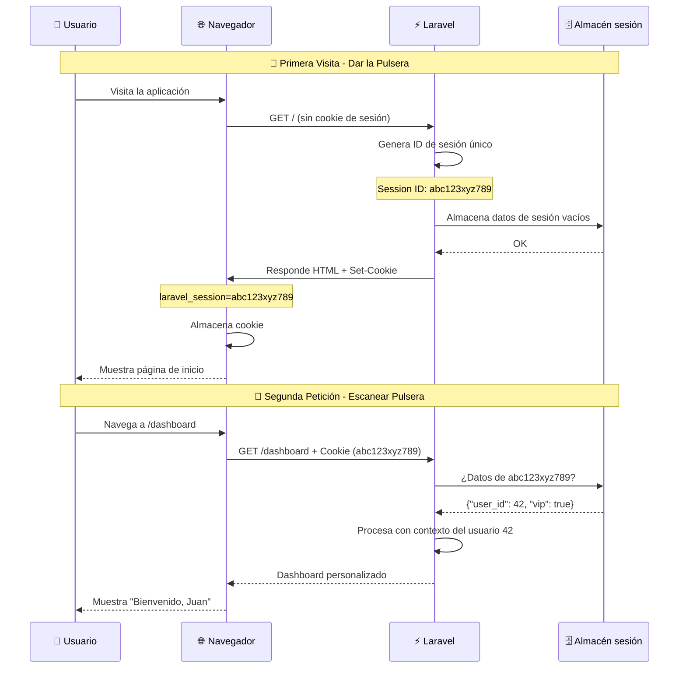

# 4.3. Manejo de sesiones y estado

En el **apartado 2** dominaste la validación de datos de formularios. Pero hay un problema fundamental: **HTTP es un protocolo stateless** (sin estado), lo que significa que el servidor no recuerda quién eres entre peticiones.

Las sesiones son un mecanismo fundamental para mantener información del usuario entre múltiples peticiones HTTP. Permiten que las aplicaciones web mantengan el contexto del usuario, como el estado de login, preferencias, carritos de compra y otros datos temporales.

## 1. Fundamentos de las sesiones

### 1.1. ¿Qué es una sesión?

Una sesión es un mecanismo que permite almacenar información del usuario en el servidor y asociarla con un identificador único que se envía al cliente. Esta información persiste entre múltiples peticiones HTTP.

### 1.2. ¿Por qué son necesarias las sesiones?

HTTP es un protocolo **stateless** (sin estado), lo que significa que cada petición es independiente y el servidor no recuerda peticiones anteriores. Las sesiones resuelven este problema:

| Problema sin Sesiones | Solución con Sesiones |
| --- | --- |
| ❌ No se recuerda el login | ✅ Estado de autenticación persistente |
| ❌ No se mantiene el carrito | ✅ Carrito de compra persistente |
| ❌ No se recuerdan preferencias | ✅ Configuraciones del usuario |
| ❌ No se puede personalizar | ✅ Experiencia personalizada |

### 1.3. Flujo de una sesión

A continuación se visualiza cómo funciona una sesión desde que el usuario entra hasta que navega por la aplicación:




**El Session ID** (ejemplo: `abc123xyz789`) es el **único vínculo** entre el navegador del usuario y sus datos en el servidor.

* **Se envía como cookie** en cada petición HTTP.
* **Laravel lo verifica** automáticamente en cada request.
* **Si la cookie se pierde o expira**, el usuario pierde su sesión.
* **Si alguien roba tu cookie de sesión** → puede suplantar tu identidad.

**Por eso Laravel protege las sesiones:**

- ✅ Tokens largos y aleatorios (imposible adivinar).
- ✅ Cookies `HttpOnly` (JavaScript no puede leerlas).
- ✅ Cookies `Secure` en HTTPS (solo conexión segura).
- ✅ Regenera el ID después del login (previene *session fixation*).

## 2. Configuración de sesiones en Laravel

Laravel permite configurar cómo y dónde se almacenan las sesiones. La configuración se encuentra en el archivo **`config/session.php`**.

### 2.1. Configuración básica

El archivo de configuración de sesiones contiene múltiples opciones que controlan el comportamiento de las sesiones en tu aplicación.

```php
<?php
// config/session.php
return [
    'driver' => env('SESSION_DRIVER', 'file'),
    'lifetime' => env('SESSION_LIFETIME', 120),
    'expire_on_close' => false,
    'encrypt' => false,
    'files' => storage_path('framework/sessions'),
    'connection' => env('SESSION_CONNECTION'),
    'table' => 'sessions',
    'store' => env('SESSION_STORE'),
    'lottery' => [2, 100],
    'cookie' => env('SESSION_COOKIE', Str::slug(env('APP_NAME', 'laravel'), '_').'_session'),
    'path' => '/',
    'domain' => env('SESSION_DOMAIN'),
    'secure' => env('SESSION_SECURE_COOKIE'),
    'http_only' => true,
    'same_site' => 'lax',
];
```

### 2.2. Drivers de sesión

Laravel soporta múltiples drivers para almacenar sesiones. Cada uno tiene ventajas específicas según el tamaño y necesidades de tu aplicación.

| Driver | Descripción | Uso Recomendado |
| --- | --- | --- |
| **file** | Almacena en archivos | Desarrollo, aplicaciones pequeñas |
| **cookie** | Almacena en cookies | Aplicaciones simples |
| **database** | Almacena en base de datos | Aplicaciones medianas |
| **memcached** | Almacena en Memcached | Aplicaciones de alto rendimiento |
| **redis** | Almacena en Redis | Aplicaciones de alto rendimiento |

### 2.3. Configurar sesiones en base de datos

Para aplicaciones en producción con múltiples servidores, almacenar sesiones en base de datos es más confiable que archivos. Laravel proporciona un comando para crear la tabla necesaria.

```bash
# Crear tabla de sesiones
php artisan session:table
php artisan migrate
```

```php
<?php
// .env
SESSION_DRIVER=database
SESSION_CONNECTION=mysql
```

## 3. Uso de sesiones en Laravel

Laravel proporciona una API simple e intuitiva para trabajar con sesiones. Puedes almacenar, recuperar, verificar y eliminar datos fácilmente.

### 3.1. Almacenar datos en la sesión

Hay múltiples formas de guardar datos en la sesión. Todas son equivalentes, elige la que prefieras según tu estilo de código.

```php
<?php
// Almacenar datos en la sesión
session(['key' => 'value']);
session(['user_id' => 123, 'username' => 'juan']);
```

```php
<?php
// Usando el helper session()
session()->put('cart', $cartItems);
session()->put('user.preferences.theme', 'dark');
```

```php
<?php
// Usando la facade Session
Session::put('last_visited', now());
Session::put('user.settings', $settings);
```

### 3.2. Recuperar datos de la sesión

Para leer los datos almacenados en la sesión, puedes usar el helper **`session()`** o la facade **`Session`**. Ambos métodos permiten especificar un valor por defecto si la clave no existe.

```php
<?php
// Recuperar datos de la sesión
$value = session('key');
$userId = session('user_id');
```

```php
<?php
// Con valor por defecto
$theme = session('theme', 'light');
$cart = session('cart', []);
```

```php
<?php
// Usando el helper session()
$user = session()->get('user');
$preferences = session()->get('user.preferences', []);
```

```php
<?php
// Usando la facade Session
$lastVisit = Session::get('last_visited');
$settings = Session::get('user.settings', []);
```

### 3.3. Verificar y eliminar datos

Es importante poder verificar si un dato existe en la sesión antes de usarlo, y poder eliminar datos cuando ya no sean necesarios para mantener la sesión limpia.

```php
<?php
// Verificar si existe
if (session()->has('user_id')) {
    // Usuario autenticado
}
```

```php
<?php
// Verificar si existe y no está vacío
if (session()->exists('cart')) {
    // Carrito existe
}
```

```php
<?php
// Eliminar datos específicos
session()->forget('cart');
session()->forget(['user_id', 'username']);
```

```php
<?php
// Eliminar todos los datos
session()->flush();
```

```php
<?php
// Eliminar datos específicos usando la facade
Session::forget('last_visited');
Session::flush();
```

## 4. Casos de uso comunes

### 4.1. Carrito de compras

Un carrito de compras es uno de los usos más comunes de las sesiones en aplicaciones web. Permite a los usuarios navegar por el sitio añadiendo productos sin necesidad de crear una cuenta inmediatamente, manteniendo su selección entre páginas hasta que decidan finalizar la compra.

```php
<?php
// Agregar producto al carrito
public function addToCart(Request $request, $productId)
{
    $product = Product::findOrFail($productId);
    $cart = session()->get('cart', []);
    
    if (isset($cart[$productId])) {
        $cart[$productId]['quantity']++;
    } else {
        $cart[$productId] = [
            'name' => $product->name,
            'price' => $product->price,
            'quantity' => 1,
            'image' => $product->image,
        ];
    }
    
    session()->put('cart', $cart);
    
    return redirect()->back()->with('success', 'Producto añadido al carrito');
}

// Ver carrito
public function viewCart()
{
    $cart = session()->get('cart', []);
    $total = 0;
    
    foreach ($cart as $item) {
        $total += $item['price'] * $item['quantity'];
    }
    
    return view('cart.index', compact('cart', 'total'));
}

// Eliminar del carrito
public function removeFromCart($productId)
{
    $cart = session()->get('cart', []);
    
    if (isset($cart[$productId])) {
        unset($cart[$productId]);
        session()->put('cart', $cart);
    }
    
    return redirect()->back()->with('success', 'Producto eliminado del carrito');
}
```

### 4.2. Preferencias del usuario

Las sesiones son ideales para almacenar preferencias temporales del usuario como el idioma seleccionado, tema visual (modo oscuro/claro), o configuraciones de visualización. Estas preferencias persisten durante la navegación sin necesidad de consultarlas constantemente en la base de datos.

```php
<?php
// Guardar preferencias
public function savePreferences(Request $request)
{
    $preferences = [
        'theme' => $request->theme,
        'language' => $request->language,
        'notifications' => $request->notifications,
        'items_per_page' => $request->items_per_page,
    ];
    
    session()->put('user.preferences', $preferences);
    
    return redirect()->back()->with('success', 'Preferencias guardadas');
}

// Aplicar preferencias
public function applyPreferences()
{
    $preferences = session()->get('user.preferences', []);
    
    // Aplicar tema
    if (isset($preferences['theme'])) {
        // Lógica para aplicar tema
    }
    
    // Aplicar idioma
    if (isset($preferences['language'])) {
        app()->setLocale($preferences['language']);
    }
}
```

### 4.3. Historial de navegación

Guardar un historial de las páginas que el usuario ha visitado puede mejorar significativamente la experiencia de usuario, permitiendo funcionalidades como "volver atrás", "productos vistos recientemente", o mostrar sugerencias basadas en su navegación reciente.

```php
<?php
// Agregar página al historial
public function addToHistory($page)
{
    $history = session()->get('navigation.history', []);
    
    // Evitar duplicados consecutivos
    if (empty($history) || end($history) !== $page) {
        $history[] = $page;
        
        // Limitar historial a 10 páginas
        if (count($history) > 10) {
            $history = array_slice($history, -10);
        }
        
        session()->put('navigation.history', $history);
    }
}

// Obtener historial
public function getHistory()
{
    return session()->get('navigation.history', []);
}
```

## 5. Notificaciones y mensajes flash

### 5.1. Mensajes flash

Los *flash messages* son datos de sesión que solo persisten para la siguiente petición HTTP. Son perfectos para mostrar mensajes de confirmación después de acciones como "Producto creado exitosamente" o "Usuario eliminado", que deben aparecer una sola vez y luego desaparecer.

```php
<?php
// En el controlador
return redirect()->route('products.index')
    ->with('success', 'Producto creado exitosamente');

return redirect()->back()
    ->with('error', 'Error al procesar la solicitud');

return redirect()->route('home')
    ->with('warning', 'Producto con stock bajo')
    ->with('info', 'Nuevos productos disponibles');
```

### 5.2. Mostrar mensajes en la vista

```html
<!-- Mostrar mensajes flash -->
@if(session('success'))
    <div class="alert alert-success">
        {{ session('success') }}
    </div>
@endif

@if(session('error'))
    <div class="alert alert-danger">
        {{ session('error') }}
    </div>
@endif

@if(session('warning'))
    <div class="alert alert-warning">
        {{ session('warning') }}
    </div>
@endif

@if(session('info'))
    <div class="alert alert-info">
        {{ session('info') }}
    </div>
@endif

<!-- Mostrar todos los mensajes -->
@foreach(['success', 'error', 'warning', 'info'] as $type)
    @if(session($type))
        <div class="alert alert-{{ $type }}">
            {{ session($type) }}
        </div>
    @endif
@endforeach
```

### 5.3. Notificaciones personalizadas

Para sistemas de notificaciones más complejos, puedes crear tus propios métodos que encapsulen la lógica de mostrar mensajes flash con diferentes tipos y estilos.

```php
<?php
// Crear notificación personalizada
public function showNotification($message, $type = 'info')
{
    session()->flash('notification', [
        'message' => $message,
        'type' => $type,
        'timestamp' => now(),
    ]);
}
```

```php
<?php
// En la vista
@if(session('notification'))
    @php $notification = session('notification'); @endphp
    <div class="alert alert-{{ $notification['type'] }}">
        <strong>{{ $notification['timestamp']->format('H:i') }}</strong>
        {{ $notification['message'] }}
    </div>
@endif
```

## 6. Cookies y sesiones

Las cookies y sesiones trabajan juntas: las cookies almacenan el ID de sesión en el navegador del usuario, mientras que los datos reales están en el servidor. Es importante entender cómo configurarlas correctamente para seguridad.

### 6.1. Configuración de cookies

Laravel permite configurar cómo se comportan las cookies de sesión a través del archivo de configuración. Estas opciones afectan la seguridad y el alcance de las sesiones.

```php
<?php
// config/session.php
'cookie' => env('SESSION_COOKIE', 'laravel_session'),
'path' => '/',
'domain' => env('SESSION_DOMAIN'),
'secure' => env('SESSION_SECURE_COOKIE', false),
'http_only' => true,
'same_site' => 'lax',
```

### 6.2. Trabajar con cookies

Además de las cookies de sesión automáticas, puedes crear tus propias cookies para almacenar pequeñas cantidades de datos en el navegador del usuario (preferencias, temas, etc.).

```php
<?php
// Crear cookie
Cookie::queue('user_preference', 'dark_theme', 60); // 60 minutos

// Recuperar cookie
$preference = Cookie::get('user_preference');

// Eliminar cookie
Cookie::queue(Cookie::forget('user_preference'));
```

### 6.3. Cookies vs sesiones

Aunque cookies y sesiones trabajan juntas, tienen diferencias importantes en términos de almacenamiento, seguridad y uso. Conocer estas diferencias te ayuda a elegir la herramienta correcta para cada situación.

| Aspecto | Cookies | Sesiones |
| --- | --- | --- |
| **Almacenamiento** | Cliente | Servidor |
| **Seguridad** | Menor | Mayor |
| **Tamaño** | Limitado (4KB) | Ilimitado |
| **Persistencia** | Configurable | Temporal |
| **Acceso** | JavaScript | Solo servidor |

## 7. Seguridad de sesiones

La seguridad de las sesiones es crítica porque un atacante que robe un ID de sesión puede suplantar la identidad del usuario. Laravel proporciona herramientas para proteger las sesiones contra los ataques más comunes.

### 7.1. Regeneración de ID de sesión

Regenerar el ID de sesión después de operaciones críticas (como login) previene ataques de fijación de sesión donde un atacante intenta forzar un ID de sesión específico.

```php
<?php
// Regenerar ID de sesión
session()->regenerate();

// Regenerar y eliminar datos antiguos
session()->regenerate(true);
```

### 7.2. Configuración de seguridad

Laravel proporciona múltiples opciones de configuración para endurecer la seguridad de las sesiones. Estas configuraciones deben ajustarse especialmente en entornos de producción.

```php
<?php
// config/session.php
'secure' => env('SESSION_SECURE_COOKIE', true), // Solo HTTPS
'http_only' => true, // No accesible desde JavaScript
'same_site' => 'strict', // Protección CSRF
```

### 7.3. Timeout de sesión

Las sesiones no deben durar indefinidamente. Configurar un timeout automático cierra sesiones inactivas, reduciendo el riesgo de que alguien use una sesión abandonada.

```php
<?php
// Configurar timeout
'lifetime' => 120, // 2 horas en minutos

// Verificar sesión expirada
if (session()->has('last_activity')) {
    $lastActivity = session('last_activity');
    if (now()->diffInMinutes($lastActivity) > 120) {
        session()->flush();
        return redirect()->route('login');
    }
}

session()->put('last_activity', now());
```

## 8. Optimización de sesiones

En aplicaciones con muchos usuarios, las sesiones pueden acumularse y afectar el rendimiento. Laravel incluye mecanismos para optimizar y limpiar sesiones automáticamente.

### 8.1. Limpieza automática

Laravel puede limpiar sesiones expiradas automáticamente usando un sistema de "lotería" que se ejecuta ocasionalmente durante peticiones normales.

```php
<?php
// config/session.php
'lottery' => [2, 100], // 2% de probabilidad de limpieza
```

### 8.2. Almacenamiento eficiente

Almacena solo los datos estrictamente necesarios en la sesión. Evita guardar objetos completos o datos grandes que puedas recuperar fácilmente de la base de datos.

```php
<?php
// Almacenar solo datos necesarios
session()->put('user.id', $user->id);
session()->put('user.name', $user->name);
// No almacenar objetos completos
```

### 8.3. Cache de sesiones

Para aplicaciones de alto tráfico, usar Redis o Memcached como driver de sesiones proporciona mejor rendimiento que archivos o base de datos relacional.

```php
<?php
// Usar Redis para sesiones
SESSION_DRIVER=redis
REDIS_HOST=127.0.0.1
REDIS_PASSWORD=null
REDIS_PORT=6379
```
