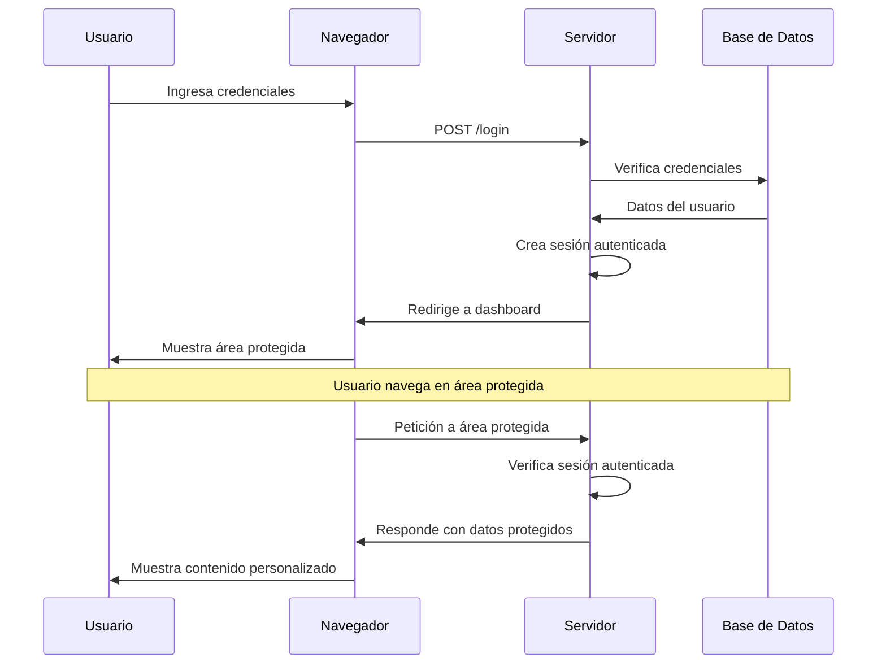

# 4.4. Autenticación básica

En el **apartado 3** aprendiste cómo las sesiones mantienen el estado del usuario entre peticiones. Ahora es momento de entender cómo **verificar la identidad** del usuario antes de darle acceso a áreas protegidas.

La autenticación es el proceso de verificar la identidad de un usuario, confirmando que es quien dice ser. En aplicaciones web, esto típicamente involucra un sistema de login y logout que permite a los usuarios acceder a áreas protegidas y mantener su sesión activa. Laravel proporciona un sistema de autenticación robusto y flexible con **Laravel Breeze**.

## 1. Fundamentos de la autenticación

### 1.1. ¿Qué es la autenticación?

La autenticación es el proceso de verificar la identidad de un usuario mediante credenciales como nombre de usuario y contraseña. Es diferente de la **autorización**, que determina qué acciones puede realizar un usuario autenticado.


### 1.2. Autenticación vs autorización

| Concepto | Descripción | Ejemplo |
| --- | --- | --- |
| **Autenticación** | Verificar "quién eres" | Login con email y contraseña |
| **Autorización** | Determinar "qué puedes hacer" | Acceso a panel de administración |


**Ejemplo práctico:**

```php
<?php
// Autenticación: ¿Quién eres?
if (Auth::attempt(['email' => $email, 'password' => $password])) {
    // Usuario autenticado exitosamente
    
    // autorización: ¿Puedes hacer esto?
    if (Auth::user()->isAdmin()) {
        // Puede acceder al panel de administración
    }
}
```

**En resumen:**

* Primero te **autentican** (demuestras quién eres).
* Después te **autorizan** (verifican qué puedes hacer).

### 1.3. Flujo de autenticación



## 2. Sistema de autenticación de Laravel

### 2.1. Laravel Breeze

Laravel Breeze es un *starter kit* oficial que proporciona una implementación completa y minimalista del sistema de autenticación. Incluye login, registro, recuperación de contraseña, verificación de email y gestión de perfil, todo listo para usar y personalizar.

```bash
# Instalar Laravel Breeze
composer require laravel/breeze --dev
php artisan breeze:install blade
npm install
npm run build
php artisan migrate
```

### 2.2. Estructura de autenticación

Laravel Breeze crea la siguiente estructura:

```text
app/
├── Http/Controllers/Auth/
│   ├── AuthenticatedSessionController.php
│   ├── ConfirmablePasswordController.php
│   ├── EmailVerificationNotificationController.php
│   ├── NewPasswordController.php
│   ├── PasswordController.php
│   ├── PasswordResetLinkController.php
│   └── RegisteredUserController.php
├── Http/Middleware/
│   └── RedirectIfAuthenticated.php
├── Models/
│   └── User.php
resources/views/auth/
├── login.blade.php
├── register.blade.php
├── forgot-password.blade.php
└── reset-password.blade.php
```

### 2.3. Modelo User

El modelo `User` es el corazón del sistema de autenticación. Extiende de `Authenticatable` y define qué campos son rellenables, ocultos y cómo se deben castear.

```php
<?php

namespace App\Models;

use Illuminate\Contracts\Auth\MustVerifyEmail;
use Illuminate\Database\Eloquent\Factories\HasFactory;
use Illuminate\Foundation\Auth\User as Authenticatable;
use Illuminate\Notifications\Notifiable;

class User extends Authenticatable
{
    use HasFactory, Notifiable;

    protected $fillable = [
        'name',
        'email',
        'password',
    ];

    protected $hidden = [
        'password',
        'remember_token',
    ];

    protected function casts(): array
    {
        return [
            'email_verified_at' => 'datetime',
            'password' => 'hashed',
        ];
    }
}
```

## 3. Implementación de Login y Logout

El proceso de login y logout es fundamental en cualquier sistema de autenticación. Laravel Breeze proporciona controladores y vistas predefinidos que puedes usar directamente o personalizar según tus necesidades.

### 3.1. Controlador de autenticación

El **`AuthenticatedSessionController`** maneja las peticiones de login, verificación de credenciales, regeneración de sesión y logout. Este controlador trabaja en conjunto con **`LoginRequest`** para validar las credenciales.

```php
<?php

namespace App\Http\Controllers\Auth;

use App\Http\Controllers\Controller;
use App\Http\Requests\Auth\LoginRequest;
use Illuminate\Http\Request;
use Illuminate\Http\Response;
use Illuminate\Support\Facades\Auth;

class AuthenticatedSessionController extends Controller
{
    /**
     * Display the login view.
     */
    public function create(): View
    {
        return view('auth.login');
    }

    /**
     * Handle an incoming authentication request.
     */
    public function store(LoginRequest $request): RedirectResponse
    {
        $request->authenticate();

        $request->session()->regenerate();

        return redirect()->intended(route('dashboard', absolute: false));
    }

    /**
     * Destroy an authenticated session.
     */
    public function destroy(Request $request): RedirectResponse
    {
        Auth::guard('web')->logout();

        $request->session()->invalidate();

        $request->session()->regenerateToken();

        return redirect('/');
    }
}
```

### 3.2. Formulario de Login

El formulario de login solicita email y contraseña del usuario. Incluye protección CSRF, opción de "recordarme" y un enlace para recuperar contraseña.

```html
<!-- resources/views/auth/login.blade.php -->
<form method="POST" action="{{ route('login') }}">
    @csrf

    <!-- Email Address -->
    <div>
        <label for="email">Email</label>
        <input id="email" type="email" name="email" value="{{ old('email') }}" required autofocus>
        @error('email')
            <span class="text-red-600">{{ $message }}</span>
        @enderror
    </div>

    <!-- Password -->
    <div>
        <label for="password">Contraseña</label>
        <input id="password" type="password" name="password" required>
        @error('password')
            <span class="text-red-600">{{ $message }}</span>
        @enderror
    </div>

    <!-- Remember Me -->
    <div>
        <label for="remember_me">
            <input id="remember_me" type="checkbox" name="remember">
            Recordarme
        </label>
    </div>

    <div>
        <button type="submit">Iniciar Sesión</button>
    </div>
</form>
```

### 3.3. Formulario de registro

El formulario de registro permite crear nuevos usuarios. Solicita nombre, email, contraseña y confirmación de contraseña. La validación asegura que todos los campos sean correctos.

```html
<!-- resources/views/auth/register.blade.php -->
<form method="POST" action="{{ route('register') }}">
    @csrf

    <!-- Name -->
    <div>
        <label for="name">Nombre</label>
        <input id="name" type="text" name="name" value="{{ old('name') }}" required autofocus>
        @error('name')
            <span class="text-red-600">{{ $message }}</span>
        @enderror
    </div>

    <!-- Email Address -->
    <div>
        <label for="email">Email</label>
        <input id="email" type="email" name="email" value="{{ old('email') }}" required>
        @error('email')
            <span class="text-red-600">{{ $message }}</span>
        @enderror
    </div>

    <!-- Password -->
    <div>
        <label for="password">Contraseña</label>
        <input id="password" type="password" name="password" required>
        @error('password')
            <span class="text-red-600">{{ $message }}</span>
        @enderror
    </div>

    <!-- Confirm Password -->
    <div>
        <label for="password_confirmation">Confirmar Contraseña</label>
        <input id="password_confirmation" type="password" name="password_confirmation" required>
    </div>

    <div>
        <button type="submit">Registrarse</button>
    </div>
</form>
```

## 4. Protección de rutas

### 4.1. Middleware de autenticación

El middleware **`auth`** es la forma principal de proteger rutas en Laravel, asegurando que solo usuarios autenticados puedan acceder a ciertas páginas o recursos. Si un usuario no autenticado intenta acceder, será redirigido automáticamente a la página de login.

```php
<?php
// Rutas protegidas
Route::middleware('auth')->group(function () {
    Route::get('/dashboard', [DashboardController::class, 'index']);
    Route::get('/profile', [ProfileController::class, 'edit']);
    Route::patch('/profile', [ProfileController::class, 'update']);
    Route::delete('/profile', [ProfileController::class, 'destroy']);
});

// Rutas públicas
Route::get('/', [HomeController::class, 'index']);
Route::get('/products', [ProductController::class, 'index']);
Route::get('/products/{id}', [ProductController::class, 'show']);
```

### 4.2. Verificar autenticación en controladores

Además de proteger rutas con middleware, puedes verificar la autenticación directamente en el controlador usando el constructor o métodos individuales. Esto te da más flexibilidad para aplicar lógica condicional.

```php
<?php

namespace App\Http\Controllers;

use Illuminate\Http\Request;
use Illuminate\Support\Facades\Auth;

class ProductController extends Controller
{
    public function __construct()
    {
        // Proteger todas las rutas excepto index y show
        $this->middleware('auth')->except(['index', 'show']);
    }

    public function index()
    {
        // Público - no requiere autenticación
        $products = Product::all();
        return view('products.index', compact('products'));
    }

    public function create()
    {
        // Protegido - requiere autenticación
        if (!Auth::check()) {
            return redirect()->route('login');
        }
        
        return view('products.create');
    }

    public function store(Request $request)
    {
        // Protegido - requiere autenticación
        $user = Auth::user();
        
        // ✅ IMPORTANTE: Siempre validar datos antes de guardar
        $validated = $request->validate([
            'name' => 'required|string|max:255',
            'description' => 'required|string',
        ]);
        
        // Crear producto con datos validados
        $product = Product::create($validated + ['user_id' => $user->id]);
        
        return redirect()->route('products.show', $product);
    }
}
```

### 4.3. Verificar autenticación en vistas

Blade proporciona directivas como **`@auth`** y **`@guest`** para mostrar contenido diferente dependiendo del estado de autenticación del usuario. Esto te permite personalizar la interfaz de forma reactiva.

```html
<!-- Verificar si el usuario está autenticado -->
@auth
    <p>Bienvenido, {{ Auth::user()->name }}!</p>
    <a href="{{ route('dashboard') }}">Dashboard</a>
    <form method="POST" action="{{ route('logout') }}">
        @csrf
        <button type="submit">Cerrar Sesión</button>
    </form>
@else
    <a href="{{ route('login') }}">Iniciar Sesión</a>
    <a href="{{ route('register') }}">Registrarse</a>
@endauth

<!-- Verificar si el usuario es invitado -->
@guest
    <p>Por favor, inicia sesión para continuar.</p>
    <a href="{{ route('login') }}">Iniciar Sesión</a>
@endguest
```

## 5. Gestión de usuarios

Laravel proporciona múltiples formas de:

- interactuar con el usuario autenticado, 
- autenticar manualmente y 
- gestionar sesiones de usuario. 

Estas herramientas te dan control total sobre el proceso de autenticación.

### 5.1. Obtener usuario autenticado

Una vez que un usuario se ha autenticado, puedes acceder a sus datos en cualquier parte de tu aplicación usando la facade `Auth`.

```php
<?php
// Obtener usuario autenticado
$user = Auth::user();
$userId = Auth::id();
$userName = Auth::user()->name;

// Verificar si está autenticado
if (Auth::check()) {
    // Usuario autenticado
}

// Verificar si es invitado
if (Auth::guest()) {
    // Usuario no autenticado
}
```

### 5.2. Autenticación manual

Si estás creando tu propio formulario de login o necesitas autenticar usuarios de forma programática, puedes usar `Auth::attempt()` para verificar credenciales y autenticar usuarios manualmente.

```php
<?php
// Autenticación manual
if (Auth::attempt(['email' => $email, 'password' => $password])) {
    // ✅ CRÍTICO: Regenerar sesión para prevenir Session Fixation
    $request->session()->regenerate();
    
    // Autenticación exitosa
    return redirect()->intended('/dashboard');
} else {
    // Autenticación fallida
    return back()->withErrors(['email' => 'Credenciales incorrectas']);
}

// Autenticación con "recordarme"
if (Auth::attempt(['email' => $email, 'password' => $password], $remember)) {
    $request->session()->regenerate(); // Siempre regenerar
    // Usuario será recordado
}

// Autenticación de un usuario específico
Auth::login($user);
$request->session()->regenerate(); // Siempre regenerar después de login

Auth::loginUsingId($userId);
$request->session()->regenerate(); // Siempre regenerar después de login
```

> Session Fixation Attack
> 
> **SIEMPRE** debes regenerar el ID de sesión después de autenticar un usuario con **`$request->session()->regenerate()`**.
> 
> Sin regeneración, un atacante podría:
> 
> 1. Obtener un ID de sesión válido.
> 2. Hacer que la víctima use ese ID (por ejemplo, vía link malicioso).
> 3. Cuando la víctima inicia sesión, el atacante tiene acceso a la sesión autenticada.
> 
> Laravel Breeze incluye esto automáticamente, pero si implementas login manual, **no lo olvides**.

### 5.3. Cerrar sesión

Cerrar sesión es un paso crítico de seguridad. Este paso debe:

- invalidar la sesión actual, 
- regenerar el token CSRF y 
- limpiar cualquier información relacionada con el usuario.

```php
<?php
// Cerrar sesión
Auth::logout();

// Cerrar sesión y limpiar sesión
Auth::logout();
request()->session()->invalidate();
request()->session()->regenerateToken();
```

## 6. Recuperación de contraseña

Laravel Breeze incluye un sistema completo de recuperación de contraseñas. Los usuarios pueden solicitar un enlace de recuperación por email y establecer una nueva contraseña de forma segura.

### 6.1. Configuración de email

Para enviar emails de recuperación de contraseña, necesitas configurar tu servicio de correo en el archivo `.env`. Puedes usar SMTP, Mailgun, SendGrid u otros proveedores.

```php
<?php
// .env
MAIL_MAILER=smtp
MAIL_HOST=smtp.gmail.com
MAIL_PORT=587
MAIL_USERNAME=tu-email@gmail.com
MAIL_PASSWORD=tu-contraseña
MAIL_ENCRYPTION=tls
MAIL_FROM_ADDRESS=tu-email@gmail.com
MAIL_FROM_NAME="${APP_NAME}"
```

### 6.2. Formulario de recuperación

El formulario de recuperación solicita el email del usuario. Laravel enviará automáticamente un enlace seguro con un token temporal para restablecer la contraseña.

```html
<!-- resources/views/auth/forgot-password.blade.php -->
<form method="POST" action="{{ route('password.email') }}">
    @csrf

    <div>
        <label for="email">Email</label>
        <input id="email" type="email" name="email" value="{{ old('email') }}" required>
        @error('email')
            <span class="text-red-600">{{ $message }}</span>
        @enderror
    </div>

    <div>
        <button type="submit">Enviar Enlace de Recuperación</button>
    </div>
</form>
```

### 6.3. Formulario de restablecimiento

Una vez que el usuario accede al enlace del email, se muestra este formulario donde podrá ingresar su nueva contraseña. El token temporal verifica que la solicitud sea válida.

```html
<!-- resources/views/auth/reset-password.blade.php -->
<form method="POST" action="{{ route('password.store') }}">
    @csrf
    <input type="hidden" name="token" value="{{ $request->route('token') }}">

    <div>
        <label for="email">Email</label>
        <input id="email" type="email" name="email" value="{{ old('email', $request->email) }}" required>
    </div>

    <div>
        <label for="password">Nueva Contraseña</label>
        <input id="password" type="password" name="password" required>
    </div>

    <div>
        <label for="password_confirmation">Confirmar Nueva Contraseña</label>
        <input id="password_confirmation" type="password" name="password_confirmation" required>
    </div>

    <div>
        <button type="submit">Restablecer Contraseña</button>
    </div>
</form>
```

## 7. Verificación de email

La verificación de email asegura que los usuarios proporcionan una dirección de correo válida. Laravel facilita este proceso con funcionalidad integrada para enviar emails de verificación y proteger rutas.

### 7.1. Configurar verificación

Para activar la verificación de email, el modelo `User` debe implementar la interfaz **`MustVerifyEmail`**. Esto habilita automáticamente todas las funcionalidades de verificación.

```php
<?php
// app/Models/User.php
use Illuminate\Contracts\Auth\MustVerifyEmail;

class User extends Authenticatable implements MustVerifyEmail
{
    // ...
}
```

### 7.2. Middleware de verificación

El middleware **`verified`** restringe el acceso solo a usuarios con email verificado. Si intentan acceder sin verificar, serán redirigidos a una página de aviso.

```php
<?php

// Proteger rutas que requieren email verificado
Route::middleware(['auth', 'verified'])->group(function () {
    Route::get('/dashboard', [DashboardController::class, 'index']);
    Route::get('/profile', [ProfileController::class, 'edit']);
});
```

### 7.3. Verificar email en vistas

Puedes mostrar diferentes mensajes o botones según si el email del usuario ha sido verificado o no y permitirles reenviar el email de verificación si lo necesitan.

```html
@if(Auth::user()->hasVerifiedEmail())
    <p>Tu email ha sido verificado.</p>
@else
    <p>Por favor, verifica tu email.</p>
    <form method="POST" action="{{ route('verification.send') }}">
        @csrf
        <button type="submit">Reenviar Email de Verificación</button>
    </form>
@endif
```

## 8. Personalización de autenticación

Aunque Laravel Breeze proporciona una base sólida, puedes personalizar casi cualquier aspecto del sistema de autenticación: redirecciones, validaciones, middleware y más.

### 8.1. Personalizar redirecciones

Puedes redirigir usuarios a diferentes páginas según su rol o cualquier otra condición después del login. Esto es especialmente útil en aplicaciones con múltiples tipos de usuarios.

```php
<?php
// app/Http/Controllers/Auth/AuthenticatedSessionController.php
public function store(LoginRequest $request): RedirectResponse
{
    $request->authenticate();
    $request->session()->regenerate();

    // Redirección personalizada
    if (Auth::user()->is_admin) {
        return redirect()->intended('/admin');
    }
    
    return redirect()->intended('/dashboard');
}
```

### 8.2. Personalizar validación

Puedes modificar las reglas de validación del login y registro según las necesidades de tu aplicación, añadiendo validaciones adicionales o personalizando los mensajes de error.

```php
<?php
// app/Http/Requests/Auth/LoginRequest.php
public function rules(): array
{
    return [
        'email' => ['required', 'string', 'email'],
        'password' => ['required', 'string'],
    ];
}

public function messages(): array
{
    return [
        'email.required' => 'El email es obligatorio.',
        'password.required' => 'La contraseña es obligatoria.',
    ];
}
```

### 8.3. Personalizar Middleware

El middleware **`RedirectIfAuthenticated`** controla qué pasa cuando un usuario autenticado intenta acceder a páginas públicas como login o registro. Puedes personalizarlo para redirigir según roles.

```php
<?php
// app/Http/Middleware/RedirectIfAuthenticated.php
public function handle(Request $request, Closure $next, string ...$guards): Response
{
    $guards = empty($guards) ? [null] : $guards;

    foreach ($guards as $guard) {
        if (Auth::guard($guard)->check()) {
            // Redirección personalizada para usuarios autenticados
            if (Auth::user()->is_admin) {
                return redirect('/admin');
            }
            return redirect('/dashboard');
        }
    }

    return $next($request);
}
```

## 9. Seguridad de autenticación

La seguridad debe ser una prioridad en cualquier sistema de autenticación. Laravel incluye protecciones contra ataques comunes, pero es importante configurarlas correctamente y seguir buenas prácticas.

### 9.1. Contraseñas seguras

Enforza políticas de contraseñas fuertes mediante validaciones que requieran longitud mínima, mayúsculas, minúsculas, números y caracteres especiales.

```php
<?php
// Validación de contraseña segura
'password' => [
    'required',
    'string',
    'min:8',
    'regex:/^(?=.*[a-z])(?=.*[A-Z])(?=.*\d)(?=.*[@$!%*?&])[A-Za-z\d@$!%*?&]/',
    'confirmed',
],
```

### 9.2. Logs de seguridad

Registrar intentos de login exitosos y fallidos te permite detectar patrones sospechosos y responder rápidamente a posibles amenazas de seguridad.

```php
<?php
// Log de intentos de login
Log::info('Login attempt', [
    'email' => $request->email,
    'ip' => $request->ip(),
    'user_agent' => $request->userAgent(),
    'success' => Auth::attempt($credentials),
]);
```
