# 4.5. Middleware personalizado

En el **apartado 4** aprendiste cómo autenticar usuarios con Laravel Breeze. Pero ¿qué pasa si necesitas aplicar **lógica común** a múltiples rutas antes de que lleguen al controlador?

El middleware personalizado permite aplicar lógica común a múltiples rutas, manteniendo el código organizado y reutilizable. Laravel proporciona un sistema de middleware flexible que permite crear, registrar y aplicar middleware personalizado para diferentes propósitos como logging, rate limiting, validaciones específicas y transformación de respuestas.

## 1. Fundamentos del Middleware

### 1.1. ¿Qué es el Middleware?

El middleware es una capa de software que procesa las peticiones HTTP **antes** de que lleguen a los controladores y **después** de que se genere la respuesta. Actúa como un filtro que puede modificar, validar o interceptar las peticiones y respuestas.

???examplelaravel "Analogía: Controles de Seguridad en Cascada del Festival"

    **¡Imagina que el middleware son los múltiples controles de seguridad que atraviesas en un festival de música!**

    🎫 **Control 1 - Entrada Principal (Middleware Global):**

    * **TODOS** los asistentes deben pasar por aquí
    * Escanean tu ticket y verifican que sea válido
    * Dan una pulsera básica de identificación
    * **En Laravel**: `StartSession`, `CSRF Token Verification`

    🔍 **Control 2 - Detector de Metales (Middleware de Grupo):**

    * Solo para ciertos grupos (ej: los que van a zona de escenario)
    * Revisan equipaje y pasan detector de metales
    * Verifican que no lleves objetos prohibidos
    * **En Laravel**: Middleware del grupo `web` o `api`

    🌟 **Control 3 - Acceso VIP (Middleware de Ruta):**

    * Solo para acceder a zonas específicas (VIP, backstage)
    * Verifican tu pulsera especial y acreditación
    * Si no tienes acceso VIP → rechazado
    * **En Laravel**: `auth`, `can:admin`, middleware personalizado

    📊 **Control 4 - Registro de Actividad (Middleware After):**

    * **Después** de salir de cada zona, registran tu actividad
    * Cuentan cuántos asistentes pasaron
    * Guardan logs de seguridad
    * **En Laravel**: Middleware que procesa la respuesta antes de enviarla

    **Flujo completo:**

    1. Llegas → Control 1 (ticket)
    2. Pasas → Control 2 (detector)
    3. Entras a zona VIP → Control 3 (acreditación)
    4. Disfrutas del concierto → **Controlador** (tu destino final)
    5. Sales → Control 4 (registro de salida)
    6. Vuelves a Control 2 y 1 → **Respuesta HTTP**

    **¡Cada middleware es un checkpoint que debe aprobar tu petición antes de continuar!**

### 1.2. Flujo del Middleware

El middleware opera en capas: la petición atraviesa cada middleware hasta llegar al controlador, y luego la respuesta atraviesa los mismos middleware en orden inverso. Este flujo bidireccional permite procesar tanto las peticiones entrantes como las respuestas salientes.

```mermaid
graph TD
    A[Petición HTTP] --> B[Middleware 1]
    B --> C[Middleware 2]
    C --> D[Middleware 3]
    D --> E[Controlador]
    E --> F[Respuesta]
    F --> G[Middleware 3]
    G --> H[Middleware 2]
    H --> I[Middleware 1]
    I --> J[Respuesta Final]
```



### 1.3. Tipos de Middleware

Laravel organiza el middleware en diferentes categorías según su alcance y aplicación. Conocer estos tipos te ayuda a decidir dónde y cómo registrar tu middleware personalizado.

| Tipo | Descripción | Ejemplo |
| --- | --- | --- |
| **Global** | Se aplica a todas las peticiones | CORS, Logging |
| **Grupo** | Se aplica a grupos de rutas | Web, API |
| **Ruta** | Se aplica a rutas específicas | Auth, Rate Limiting |
| **Personalizado** | Lógica específica de la aplicación | Validación, Transformación |

## 2. Crear Middleware Personalizado

Laravel facilita la creación de middleware personalizado mediante Artisan. Puedes crear middleware para cualquier lógica específica de tu aplicación: logging, validación, transformación de datos, control de acceso, y más.

### 2.1. Generar Middleware

El primer paso para crear middleware personalizado es generarlo usando Artisan. Esto creará una clase base con la estructura necesaria que podrás personalizar según tus necesidades.

```bash
# Crear middleware personalizado
php artisan make:middleware LogUserActivity
```

### 2.2. Estructura del Middleware

Un middleware típico tiene un método `handle()` que recibe la petición y una función `$next()`. Puedes ejecutar lógica antes de llamar a `$next()` (antes del controlador) y después (después del controlador).

```php
<?php

namespace App\Http\Middleware;

use Closure;
use Illuminate\Http\Request;
use Illuminate\Support\Facades\Log;
use Symfony\Component\HttpFoundation\Response;

class LogUserActivity
{
    /**
     * Handle an incoming request.
     */
    public function handle(Request $request, Closure $next): Response
    {
        // Lógica antes de procesar la petición
        $startTime = microtime(true);
        
        // Procesar la petición
        $response = $next($request);
        
        // Lógica después de procesar la petición
        $endTime = microtime(true);
        $duration = round(($endTime - $startTime) * 1000, 2);
        
        // Log de la actividad
        Log::info('User activity', [
            'user_id' => auth()->id(),
            'user_name' => auth()->user()?->name,
            'method' => $request->method(),
            'url' => $request->fullUrl(),
            'ip' => $request->ip(),
            'user_agent' => $request->userAgent(),
            'duration_ms' => $duration,
            'status_code' => $response->getStatusCode(),
            'timestamp' => now(),
        ]);
        
        return $response;
    }
}
```

### 2.3. Middleware con Parámetros

Los middleware pueden aceptar parámetros adicionales para hacerlos más flexibles y reutilizables. Esto te permite crear un solo middleware que se comporta diferente según los parámetros que reciba.

```php
<?php

namespace App\Http\Middleware;

use Closure;
use Illuminate\Http\Request;
use Symfony\Component\HttpFoundation\Response;

class CheckUserRole
{
    /**
     * Handle an incoming request.
     */
    public function handle(Request $request, Closure $next, string $role): Response
    {
        if (!auth()->check()) {
            return redirect()->route('login');
        }
        
        if (!auth()->user()->hasRole($role)) {
            abort(403, 'No tienes permisos para acceder a esta página');
        }
        
        return $next($request);
    }
}
```

## 3. Registrar Middleware

Después de crear el middleware, necesitas registrarlo para que Laravel sepa cuándo y cómo aplicarlo. El registro determina si el middleware es global, de grupo o de ruta.

### 3.1. Registro en bootstrap/app.php

Una vez creado el middleware, debes registrarlo en tu aplicación para que Laravel lo reconozca y pueda aplicarlo. El registro se realiza en el archivo `bootstrap/app.php` y determina su alcance (global, grupo o ruta específica).

```php
<?php
// bootstrap/app.php
->withMiddleware(function (Middleware $middleware) {
    // Middleware global
    $middleware->web(append: [
        \App\Http\Middleware\LogUserActivity::class,
    ]);
    
    // Middleware de grupo
    $middleware->group('admin', [
        \App\Http\Middleware\CheckUserRole::class,
    ]);
    
    // Alias de middleware
    $middleware->alias([
        'role' => \App\Http\Middleware\CheckUserRole::class,
        'log.activity' => \App\Http\Middleware\LogUserActivity::class,
    ]);
})
```

### 3.2. Aplicar Middleware a Rutas

Una vez registrado con un alias, puedes aplicar el middleware a rutas individuales o grupos de rutas usando el método `middleware()`. También puedes combinar múltiples middleware.

```php
<?php
// Aplicar middleware a rutas específicas
Route::get('/admin', [AdminController::class, 'index'])
    ->middleware('role:admin');

Route::post('/products', [ProductController::class, 'store'])
    ->middleware(['auth', 'log.activity']);

// Aplicar middleware a grupos de rutas
Route::middleware(['auth', 'role:admin'])->group(function () {
    Route::get('/admin/users', [UserController::class, 'index']);
    Route::post('/admin/users', [UserController::class, 'store']);
    Route::delete('/admin/users/{user}', [UserController::class, 'destroy']);
});
```

## 4. Casos de Uso Comunes
El middleware personalizado puede resolver muchos problemas comunes en aplicaciones web: rate limiting, validación de API, transformación de respuestas, logging, y más. Estos ejemplos te muestran patrones útiles que puedes adaptar.

### 4.1. Rate Limiting Personalizado

El rate limiting controla cuántas peticiones puede hacer un usuario en un período de tiempo. Crear rate limiting personalizado te permite aplicar diferentes límites según el tipo de usuario, la acción que realiza, o el recurso al que accede.


```php
<?php

namespace App\Http\Middleware;

use Closure;
use Illuminate\Http\Request;
use Illuminate\Support\Facades\Cache;
use Symfony\Component\HttpFoundation\Response;

class RateLimitProductCreation
{
    /**
     * Handle an incoming request.
     */
    public function handle(Request $request, Closure $next): Response
    {
        $userId = auth()->id();
        $key = 'product_creation_' . $userId;
        $attempts = Cache::get($key, 0);
        $limit = auth()->user()->is_premium ? 20 : 5; // Límite diferente para usuarios premium
        
        if ($attempts >= $limit) {
            return response()->json([
                'error' => 'Has alcanzado el límite de productos que puedes crear por hora.',
                'limit' => $limit,
                'reset_time' => Cache::get($key . '_reset')
            ], 429);
        }
        
        $response = $next($request);
        
        // Incrementar contador solo si la petición fue exitosa
        if ($request->isMethod('POST') && $request->routeIs('products.store') && $response->getStatusCode() === 200) {
            Cache::put($key, $attempts + 1, 3600); // 1 hora
            Cache::put($key . '_reset', now()->addHour(), 3600);
        }
        
        return $response;
    }
}
```

### 4.2. Middleware de Validación de API

En APIs REST es común requerir formatos específicos en las peticiones (headers, estructura JSON, autenticación por tokens). Un middleware de validación de API verifica estos requisitos antes de que la petición llegue al controlador.


```php
<?php

namespace App\Http\Middleware;

use Closure;
use Illuminate\Http\Request;
use Symfony\Component\HttpFoundation\Response;

class ValidateApiRequest
{
    /**
     * Handle an incoming request.
     */
    public function handle(Request $request, Closure $next): Response
    {
        // Verificar header de API
        if (!$request->hasHeader('X-API-Key')) {
            return response()->json(['error' => 'API Key requerida'], 401);
        }
        
        // Verificar formato de API Key
        $apiKey = $request->header('X-API-Key');
        if (!preg_match('/^[a-zA-Z0-9]{32}$/', $apiKey)) {
            return response()->json(['error' => 'Formato de API Key inválido'], 401);
        }
        
        // Verificar que la API Key existe en la base de datos
        $user = \App\Models\User::where('api_key', $apiKey)->first();
        if (!$user) {
            return response()->json(['error' => 'API Key no válida'], 401);
        }
        
        // Añadir usuario a la petición
        $request->merge(['authenticated_user' => $user]);
        
        return $next($request);
    }
}
```

### 4.3. Middleware de Transformación de Respuesta

A veces necesitas transformar todas las respuestas de ciertas rutas a un formato específico, como envolver los datos en una estructura estándar de API o añadir metadatos adicionales. Este middleware actúa después de que el controlador genera la respuesta.


```php
<?php

namespace App\Http\Middleware;

use Closure;
use Illuminate\Http\Request;
use Symfony\Component\HttpFoundation\Response;

class TransformResponse
{
    /**
     * Handle an incoming request.
     */
    public function handle(Request $request, Closure $next): Response
    {
        $response = $next($request);
        
        // Solo transformar respuestas JSON
        if ($response->headers->get('Content-Type') === 'application/json') {
            $content = json_decode($response->getContent(), true);
            
            // Añadir metadatos
            $transformedContent = [
                'data' => $content,
                'meta' => [
                    'timestamp' => now()->toISOString(),
                    'version' => '1.0',
                    'request_id' => $request->header('X-Request-ID', uniqid()),
                ]
            ];
            
            $response->setContent(json_encode($transformedContent));
        }
        
        return $response;
    }
}
```

## 5. Middleware Avanzado

Los middleware avanzados implementan patrones más complejos como caching de respuestas, logging de errores con contexto detallado, y sanitización automática de inputs. Estos ejemplos muestran técnicas profesionales de producción.

### 5.1. Middleware de Cache

El caching de respuestas puede mejorar drásticamente el rendimiento de tu aplicación al almacenar respuestas completas y servirlas directamente sin ejecutar el controlador. Este middleware verifica si existe una respuesta en caché antes de procesarla.


```php
<?php

namespace App\Http\Middleware;

use Closure;
use Illuminate\Http\Request;
use Illuminate\Support\Facades\Cache;
use Symfony\Component\HttpFoundation\Response;

class CacheResponse
{
    /**
     * Handle an incoming request.
     */
    public function handle(Request $request, Closure $next, int $minutes = 60): Response
    {
        // Generar clave de cache
        $cacheKey = 'response_' . md5($request->fullUrl() . serialize($request->all()));
        
        // Verificar si existe en cache
        if (Cache::has($cacheKey)) {
            $cachedResponse = Cache::get($cacheKey);
            return response($cachedResponse['content'])
                ->withHeaders($cachedResponse['headers']);
        }
        
        // Procesar petición
        $response = $next($request);
        
        // Cachear respuesta si es exitosa
        if ($response->getStatusCode() === 200) {
            Cache::put($cacheKey, [
                'content' => $response->getContent(),
                'headers' => $response->headers->all(),
            ], $minutes * 60);
        }
        
        return $response;
    }
}
```

### 5.2. Middleware de Logging de Errores

Capturar y registrar errores de forma centralizada es crucial para el mantenimiento de aplicaciones. Este middleware intercepta excepciones y las registra con contexto adicional antes de que Laravel las maneje.

```php
<?php

namespace App\Http\Middleware;

use Closure;
use Illuminate\Http\Request;
use Illuminate\Support\Facades\Log;
use Symfony\Component\HttpFoundation\Response;

class LogErrors
{
    /**
     * Handle an incoming request.
     */
    public function handle(Request $request, Closure $next): Response
    {
        $response = $next($request);
        
        // Log errores del servidor
        if ($response->getStatusCode() >= 500) {
            Log::error('Server error occurred', [
                'status_code' => $response->getStatusCode(),
                'url' => $request->fullUrl(),
                'method' => $request->method(),
                'ip' => $request->ip(),
                'user_agent' => $request->userAgent(),
                'user_id' => auth()->id(),
                'request_data' => $request->except(['password', 'password_confirmation']),
                'timestamp' => now(),
            ]);
        }
        
        // Log errores del cliente
        if ($response->getStatusCode() >= 400 && $response->getStatusCode() < 500) {
            Log::warning('Client error occurred', [
                'status_code' => $response->getStatusCode(),
                'url' => $request->fullUrl(),
                'method' => $request->method(),
                'ip' => $request->ip(),
                'user_id' => auth()->id(),
                'timestamp' => now(),
            ]);
        }
        
        return $response;
    }
}
```

### 5.3. Middleware de Normalización de Entrada

La normalización de datos de entrada mejora la consistencia (trim de espacios, normalización de formato). Este middleware limpia y normaliza inputs antes de que lleguen al controlador.

```php
<?php

namespace App\Http\Middleware;

use Closure;
use Illuminate\Http\Request;
use Symfony\Component\HttpFoundation\Response;

class NormalizeInput
{
    /**
     * Handle an incoming request.
     */
    public function handle(Request $request, Closure $next): Response
    {
        // Normalizar datos de entrada
        $input = $request->all();
        
        foreach ($input as $key => $value) {
            if (is_string($value)) {
                // ✅ Trim espacios en blanco al inicio y final
                $input[$key] = trim($value);
                
                // ✅ Normalizar múltiples espacios en blanco a uno solo
                $input[$key] = preg_replace('/\s+/', ' ', $input[$key]);
            }
        }
        
        // Reemplazar datos de la petición
        $request->merge($input);
        
        return $next($request);
    }
}
```

⚠️ Antipatrón: NO Uses htmlspecialchars() en la Entrada

**NUNCA** uses `htmlspecialchars()`, `strip_tags()` o similar en los datos de **entrada** antes de guardarlos en la base de datos.

**❌ MAL (Antipatrón):**

```php
<?php
// NO HACER: Escapar HTML en la entrada
$input[$key] = htmlspecialchars($value, ENT_QUOTES, 'UTF-8');
$user->name = $input['name']; // Guardas "&lt;script&gt;" en lugar de "<script>"
```

**Problemas:**

1. **Pérdida de datos**: Si guardas `htmlspecialchars("Café & Copas")`, se convierte en `"Caf&eacute; &amp; Copas"`
2. **Doble escaping**: Cuando lo muestres con Blade `{ { } }`, se verá mal: `"Caf&amp;eacute; &amp;amp; Copas"`
3. **Datos corruptos**: No puedes buscar, ordenar o comparar correctamente

**✅ CORRECTO:**

```php
<?php
// ✅ GUARDAR: Datos limpios sin escapar
$user->name = $request->input('name'); // Guardas "<script>" tal cual

// ✅ MOSTRAR: Blade escapa automáticamente en la salida
{{ $user->name }}  // Muestra "&lt;script&gt;" (seguro)
```

**Regla de oro:**

* **Entrada**: Valida y normaliza (trim, formato), pero **NO escapes HTML**
* **Salida**: Blade  escapa automáticamente (protección XSS)
* **Almacenamiento**: Guarda los datos originales sin modificar

## 6. Testing de Middleware

Testear middleware es esencial para asegurar que las capas de seguridad y lógica funcionan correctamente. Laravel proporciona herramientas para simular peticiones y verificar respuestas fácilmente.

### 6.1. Test Básico

Los tests básicos de middleware verifican que las peticiones autorizadas pasen y las no autorizadas sean bloqueadas o redirigidas correctamente.

```php
<?php

namespace Tests\Feature;

use Tests\TestCase;
use Illuminate\Foundation\Testing\RefreshDatabase;
use App\Http\Middleware\CheckUserRole;

class CheckUserRoleTest extends TestCase
{
    use RefreshDatabase;

    public function test_middleware_allows_admin_access()
    {
        $user = \App\Models\User::factory()->create(['role' => 'admin']);
        
        $response = $this->actingAs($user)
            ->get('/admin')
            ->assertStatus(200);
    }

    public function test_middleware_denies_non_admin_access()
    {
        $user = \App\Models\User::factory()->create(['role' => 'user']);
        
        $response = $this->actingAs($user)
            ->get('/admin')
            ->assertStatus(403);
    }

    public function test_middleware_redirects_guests()
    {
        $response = $this->get('/admin')
            ->assertRedirect('/login');
    }
}
```

### 6.2. Test de Rate Limiting

Los tests de rate limiting verifican que los límites se apliquen correctamente, contando peticiones y rechazando las que excedan el límite establecido.

```php
<?php

namespace Tests\Feature;

use Tests\TestCase;
use Illuminate\Foundation\Testing\RefreshDatabase;
use Illuminate\Support\Facades\Cache;

class RateLimitProductCreationTest extends TestCase
{
    use RefreshDatabase;

    public function test_rate_limiting_works()
    {
        $user = \App\Models\User::factory()->create();
        
        // Crear 5 productos (límite para usuario normal)
        for ($i = 0; $i < 5; $i++) {
            $response = $this->actingAs($user)
                ->post('/products', [
                    'name' => 'Product ' . $i,
                    'description' => 'Description',
                    'price' => 100,
                ]);
            
            $this->assertEquals(200, $response->getStatusCode());
        }
        
        // El sexto producto debe ser rechazado
        $response = $this->actingAs($user)
            ->post('/products', [
                'name' => 'Product 6',
                'description' => 'Description',
                'price' => 100,
            ]);
        
        $this->assertEquals(429, $response->getStatusCode());
    }
}
```

## 7. Mejores Prácticas

Seguir buenas prácticas en la organización, documentación y configuración de middleware mejora la mantenibilidad del código y facilita el trabajo en equipo.

### 7.1. Organización del Código

Organiza tu middleware en carpetas según su propósito (Auth, API, Logging, Security). Esto facilita encontrar y mantener el código a medida que crece tu aplicación.

```php
<?php
// Agrupar middleware relacionado
app/Http/Middleware/
├── Auth/
│   ├── CheckUserRole.php
│   ├── CheckUserPermission.php
│   └── RedirectIfAuthenticated.php
├── Api/
│   ├── ValidateApiRequest.php
│   ├── TransformResponse.php
│   └── RateLimitApi.php
├── Logging/
│   ├── LogUserActivity.php
│   ├── LogErrors.php
│   └── LogApiRequests.php
└── Security/
    ├── SanitizeInput.php
    ├── PreventXSS.php
    └── ValidateCSRF.php
```

### 7.2. Documentación del Middleware

Documenta tus middleware con PHPDoc detallado explicando qué hace, qué parámetros acepta, y cómo usarlo. Esto es especialmente útil para middleware complejos o con parámetros.

```php
<?php

namespace App\Http\Middleware;

use Closure;
use Illuminate\Http\Request;
use Symfony\Component\HttpFoundation\Response;

/**
 * Middleware para verificar el rol del usuario
 * 
 * @param string $role Rol requerido (admin, user, moderator)
 * 
 * Uso:
 * Route::get('/admin', [AdminController::class, 'index'])
 *     ->middleware('role:admin');
 */
class CheckUserRole
{
    /**
     * Handle an incoming request.
     */
    public function handle(Request $request, Closure $next, string $role): Response
    {
        // Implementación...
    }
}
```

### 7.3. Configuración Flexible

Diseña middleware que acepte configuración mediante parámetros. Esto aumenta la reutilización y evita crear múltiples middleware similares para casos ligeramente diferentes.


```php
<?php
// Configurar middleware con opciones
Route::get('/products', [ProductController::class, 'index'])
    ->middleware('cache:30'); // Cache por 30 minutos

Route::get('/admin', [AdminController::class, 'index'])
    ->middleware('role:admin,moderator'); // Múltiples roles
```
